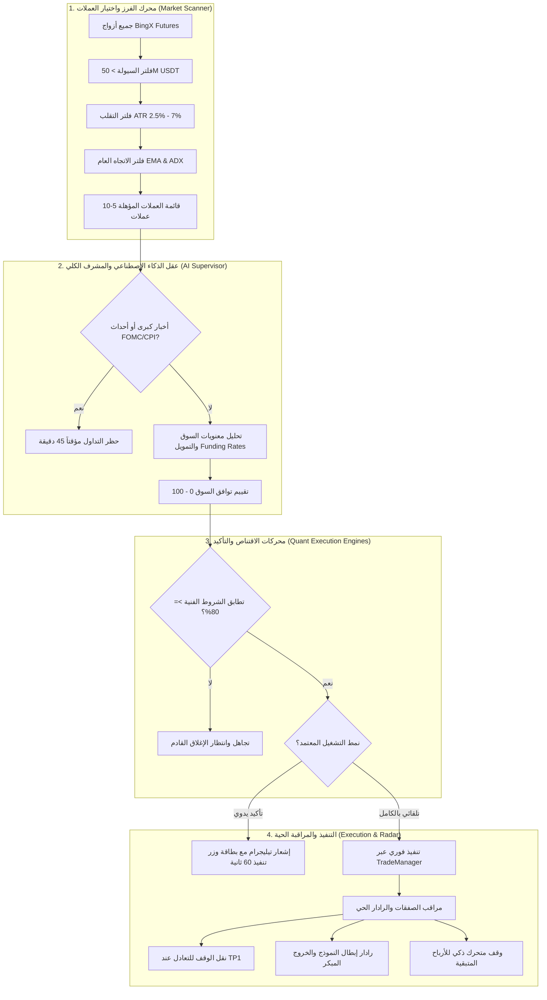
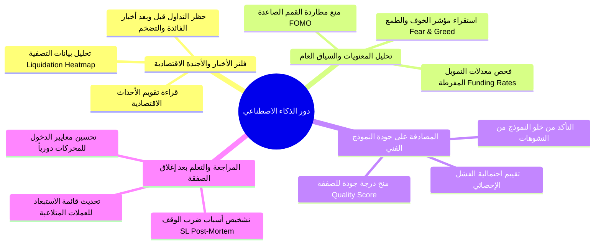
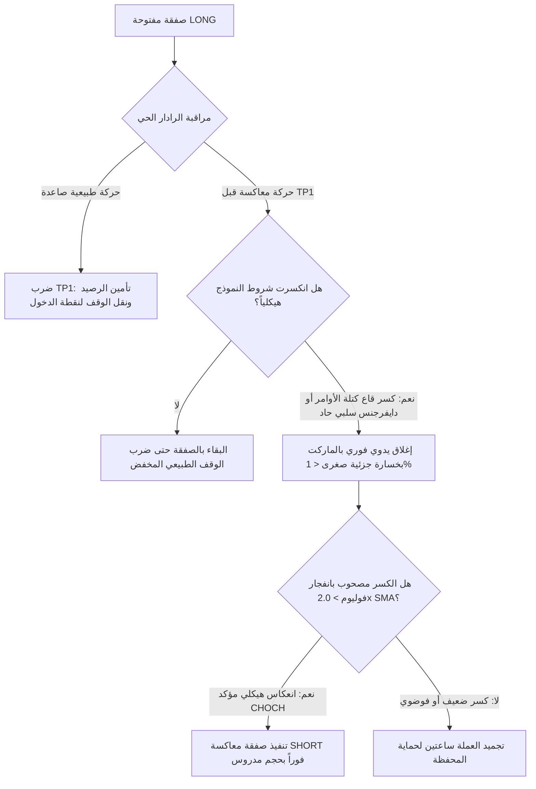

# 💎 الدليل التشغيلي للتداول الآلي وخطة تحقيق الأرباح الحقيقية
## (Autonomous Trading & Profit Generation Master Plan)
> وثيقة استراتيجية وهندسية تفصيلية لتحويل مشروع البوت من نظام أدوات تحليلية إلى منظومة تداول كمية آلية ذات ميزة إحصائية رابحة (Positive Expectancy & Mathematical Edge).

---

## 🧭 الإجابة المباشرة: هل يمكن لهذا المشروع أن يجني أموالاً حقيقية؟

**نعم، وبشكل مؤكد رياضياً، ولكن بشرط هندسي صارم:**
البرمجيات لا تجني الأموال بمجرد كثرة المؤشرات الفنية، بل تجنيها من خلال **ثلاثية الميزة الكمية (The Quantitative Trinity)**:
1. **الميزة الإحصائية (Positive Expectancy):** نسبة ربح إلى خسارة (RRR) لا تقل عن $1:2$ مع نسبة فوز (Win Rate) تتراوح بين $55\% - 65\%$.
2. **فلترة السوق الصارمة (Market Regime Filter):** منع البوت من التداول في أوقات الأخبار العاصفة، أو عند تذبذب السيولة العشوائي.
3. **حماية رأس المال والمحفظة (Capital Preservation):** ألا تتجاوز أقصى مخاطرة في الصفقة الواحدة $1.5\%$ من رأس المال، مع وقف خسارة حقيقي لا يمكن تجاوزه.

المشروع يحتوي بالفعل على بنية تحتية استثنائية (16 محركاً كمياً، نظام فحص واختيار العملات Picker، رادار المراقبة الحية Radar، ومدير الصفقات TradeManager). ما ينقصه للعمل التلقائي الكامل وجني الأرباح هو **منظومة التنسيق الأوتوماتيكي والفلترة (The Master Orchestrator)** الموضحة في هذا الدليل.

---



---

## 1. محرك فرز واختيار العملات (Coin Screening & Picker Engine)

التداول على أي عملة عشوائياً هو السبب الأول للخسارة. يقوم محرك الفرز بالعمل كل **ساعة** لتحديث قائمة المراقبة التلقائية (Top 8 Watchlist) وفق الشروط التالية:

### أ) شروط السيولة والحجم (Liquidity & Volume Guard)
* **حجم التداول اليومي:** $\text{Volume}_{24h} \ge \$50,000,000\text{ USDT}$ (استبعاد العملات الميتة ذات الانزلاق السعري العالي).
* **عمق دفتر الأوامر (Spread & Depth):** الفارق بين سعر العرض والطلب (Bid-Ask Spread) لا يتجاوز $0.05\%$ لتفادي تكلفة الدخول المرتفعة.

### ب) شروط التقلب الحركي الصحي (Healthy Volatility Filter)
* استخدام مؤشر $\text{ATR}\%$ على فريم الـ 4 ساعات:
  $$\text{ATR}\% = \frac{\text{ATR}_{14}}{\text{Close}} \times 100$$
* **الشرط:** أن تكون القيمة محصورة بين **$2.5\%$ و $7.5\%$**.
  - إذا كانت أقل من $2.5\%$: العملة ميتة وبطيئة وتضيع الوقت والفرص.
  - إذا كانت أعلى من $7.5\%$: العملة مفرطة الخطورة (High-Risk Meme/Dump) وتعرض الحساب للانزلاق.

### ج) اتجاه وقوة الزخم (Trend Strength via ADX)
* مؤشر متوسط الحركة الاتجاهية $\text{ADX}_{14} \ge 22$: تأكيد أن الأصل يمر بمسار اتجاهي واضح وليس تذبذباً عرضياً خانقاً.

---

## 2. الدور الدقيق للذكاء الاصطناعي (The Sovereign Role of AI)

الذكاء الاصطناعي **ليس مؤشراً لحظياً** لحساب الماكد أو الآر إس آي (لأن المؤشرات الرياضية أسرع وأدق منه بآلاف المرات)، بل يمثل **المشرف العام ومدير المخاطر (The Chief Risk Officer)** من خلال أربعة أدوار محددة:



1. **فلتر الأحداث الاقتصادية الكبرى (Macro-Event Blackout):**
   - فحص يومي لمواعيد صدور بيانات: (الفائدة الأمريكية FOMC، مؤشر التضخم CPI، مؤشر الوظائف NFP).
   - إصدار أمر برمجياً بتجميد فتح صفقات جديدة قبل الخبر بـ **30 دقيقة** وبعده بـ **45 دقيقة**.
2. **محلل مشاعر السوق والسيولة العاطفية (Market Sentiment & Heat):**
   - قراءة معدلات التمويل (Funding Rates): إذا كان التمويل إيجابياً بشكل مفرط ($> +0.05\%$)، يحظر الذكاء الاصطناعي صفقات الـ Long لمنع الوقوع في فخ مصائد التصفية (Long Squeeze).
3. **التدقيق والمصادقة على إشارة المحرك (Sanity Check):**
   - قبل إرسال الصفقة للتنفيذ، يتلقى الـ AI ملخصاً رياضياً: (الرمز، نوع المحرك، نسبة RRR، تشبع المؤشرات).
   - إذا وجد تناقضاً صارخاً مع حركة البيتكوين العامة (BTC Correlation Divergence)، يرفض الصفقة فوراً.
4. **المستشار الذكي بعد الصفقة (Post-Mortem Self-Correction):**
   - تحليل الصفقات المنتهية وتحديث قائمة سوداء مؤقتة للعملات التي تشهد تلاعباً في الذيول (Wick Manipulation).

---

## 3. شروط اختيار الصفقة، الدخول، الأهداف، والاستوب

لا يتم الدخول بناءً على محرك واحد منفرد، بل عبر **نظام التوافق التراكمي (Confluence Scoring System)**:

### أ) شروط الدخول الإلزامية (Entry Matrix)
1. **تطابق هيكل السوق (Market Structure):**
   - تأكيد كسر هيكلي (BOS/CHOCH) أو وصول السعر لمنطقة طلب/عرض مؤسساتية (Order Block / FVG) مدعومة بمحركات (V3 أو V12 أو V13).
   - أو اكتمال نموذج هارمونيك رقمي دقيق داخل منطقة الـ PRZ (عبر منظومة الهارمونيك المضافة).
2. **شرط إغلاق الشمعة (Candle Close Confirmation):**
   - **ممنوع نهائياً الدخول أثناء شمعة مفتوحة وغير مغلقة** لحل مشكلة إعادة الرسم (Repainting).
   - الدخول يتم في أول ثانية بعد إغلاق الشمعة وتأكيد الإشارة.
3. **معدل العائد إلى المخاطرة (Risk-to-Reward Ratio):**
   $$\text{RRR} = \frac{|\text{TP1} - \text{Entry}|}{|\text{Entry} - \text{Stop Loss}|} \ge 1.5$$
   أي صفقة يقل عائدها المحتمل للهدف الأول عن $1.5$ ضعف المخاطرة **تُرفض تلقائياً**.

---

### ب) هندسة وقف الخسارة والأهداف المجزأة (SL & Multi-TP Architecture)

* **وقف الخسارة الديناميكي (Dynamic Stop Loss):**
  - لا يُوضع كرقم عشوائي، بل يوضع خلف القاع/القمة الهيكلية المعتمدة (Swing Low / Swing High) مع إضافة هامش أمان تقلب:
    $$\text{SL (Long)} = \text{Swing Low} - (0.5 \times \text{ATR}_{14})$$
* **أهداف جني الأرباح المتدرجة (Scale-Out Profit Taking):**
  | الهدف | المستوى السعري | نسبة إغلاق العقد | الإجراء التلقائي المرافق |
  | :--- | :--- | :--- | :--- |
  | **TP1** | ارتداد فيبوناتشي 38.2% أو أول قمة محلية ($1:1.5\text{ RRR}$) | **50%** | **نقل وقف الخسارة فوراً إلى سعر الدخول (Break-Even) وتأمين الصفقة بالكامل.** |
  | **TP2** | النسبة الذهبية 61.8% أو قمة النطاق ($1:2.5\text{ RRR}$) | **25%** | جني أرباح إضافية وتفعيل الوقف المتحرك (Trailing Stop). |
  | **TP3** | امتداد فيبوناتشي 100% أو الهدف المؤسساتي ($1:4.0\text{ RRR}$) | **25% (المتبقي)** | ملاحقة أقصى قمة بحجز الأرباح خلف قيعان الشموع الصاعدة. |

---

## 4. السيناريو المعاكس ومناطق الانعكاس (The Invalidation & Flip Protocol)

أحد أهم الفوارق بين البوتات الاحترافية والبوتات الهاوية هو امتلاك **خطة محكمة للسيناريو المعاكس**:



1. **الخروج المبكر الذكي (Radar Early Invalidation):**
   - إذا كان المركز `LONG`، وأغلقت شمعة 15M بجسم كامل أسفل قاع كتلة الأوامر (OB Low) مع تراجع حاد في السيولة، يتدخل نظام الرادار بإغلاق الصفقة بسعر السوق فوراً. النتيجة: **الخروج بخسارة $0.6\%$ بدلاً من الانتظار لضرب الوقف الكامل $1.5\%$**.
2. **بروتوكول عكس الصفقة (The Flip Mechanism):**
   - إذا كان سبب الخروج كسر هيكلي عنيف مصحوباً بكتل بيعية هائلة في دفتر الأوامر (Aggressive Market Sells)، يقوم البوت بفتح صفقة عكسية `SHORT` للاستفادة من موجة الهبوط الناتجة، بشرط ألا تتجاوز المخاطرة $1\%$.
3. **التجميد التلقائي للرمز (Symbol Cooldown):**
   - أي عملة تخرج بوقف خسارة أو خروج راداري تُدرج تلقائياً في قائمة التجميد لمدة **120 دقيقة** لمنع التداول الانتقامي (Revenge Trading).

---

## 5. إدارة المحفظة ووتيرة اتخاذ القرار (Cadence & Portfolio Rules)

### أ) متى يتم التحليل واتخاذ القرار؟ (Decision Cadence)
* **دورة الفحص السريع (Fast Scan):** كل **15 دقيقة** متزامنة تماماً مع الثواني الأولى بعد إغلاق شمعة الـ 15M (الدقائق: 00، 15، 30، 45).
* **دورة الفحص الاتجاهي (Trend Alignment):** كل **ساعة** و **4 ساعات** لتأكيد الاتجاه الأكبر.
* تجنب اتخاذ أي قرارات تداول في منتصف الشموع لمنع التشويش العشوائي.

### ب) حدود وقواعد المحفظة الصارمة (Strict Portfolio Limits)
1. **الحد الأقصى للصفقات المتزامنة (Max Concurrent Trades):**
   - **3 صفقات كحد أقصى مطلق** مفتوحة في نفس اللحظة عبر المحفظة كاملة.
2. **سقف المخاطرة للصفقة الواحدة:**
   - من **$1.0\%$ إلى $1.5\%$** فقط من إجمالي رصيد المحفظة.
3. **حرارة المحفظة القصوى (Max Portfolio Heat):**
   - مجموع مخاطر الصفقات الثلاث المفتوحة معاً لا يتجاوز **$4.5\%$**.
4. **سقف الصفقات اليومي (Daily Trade Cap):**
   - أقصى عدد صفقات في اليوم الواحد: **5 صفقات**. عند الوصول للحد، يتوقف البوت حتى اليوم التالي لمنع الإفراط في التداول (Overtrading).
5. **قاطع الدائرة اليومي (Max Daily Drawdown Circuit Breaker):**
   - إذا سجل الحساب خسائر متتالية بلغت **-3.5%** خلال نفس اليوم، يُغلق البوت أنظمة التداول التلقائي بالكامل لمدة 24 ساعة.

---

## 6. تفعيل نمطي التداول: (التلقائي الخالص vs التأكيد اليدوي)

يتيح النظام للمستخدم في ملف الإعدادات أو عبر التيليجرام اختيار نمط العمل المفضل:

```
⚙️ خيارات نمط التشغيل في إعدادات البوت:
[ 🟢 تداول تلقائي كامل (Full Autonomous) ]  أو  [ 🟡 شبه تلقائي مع تأكيد (Semi-Auto) ]
```

### النمط الأول: شبه التلقائي (Semi-Autonomous with Telegram Confirmation) - [موصى به للمبتدئين]
* يقوم البوت بكامل عمليات الفحص، الفلترة، استخراج الصفقة، وحساب حجم العقد والوقف والهدف.
* يرسل للمستخدم في تيليجرام رسالة تفاعلية تحتوي:
  - بطاقة فنية أنيقة: (العملة، الاتجاه، المحرك المكتشف، RRR، نقاط الدخول والوقف).
  - زران تفاعليان:
    - `[ 🚀 تنفيذ فوري للصفقة ]`
    - `[ ❌ تجاهل الإشارة ]`
  - مؤقت زمني (Countdown): تنتهي صلاحية الزر خلال 90 ثانية لمنع الدخول المتأخر إذا تغير السعر.

### النمط الثاني: التلقائي الخالص (Full Autonomous Execution)
* تنفذ الصفقة فوراً عبر API المنصة بمجرد استيفاء شروط الدخول وتجاوز تقييم الجودة من الذكاء الاصطناعي بنسبة $\ge 85\%$.
* يرسل البوت إشعاراً فورياً للمستخدم: *"تم فتح صفقة تلقائية ناجحة على BTC/USDT وفق شروط المحرك V15"*.

---

## 7. وحدة الاختبار والتحقق الإلزامي المسبق (Pre-Flight Sandbox & Paper Trading)

> [!CAUTION]
> **قاعدة ذهبية:** يحظر تشغيل البوت على حساب بأموال حقيقية قبل اجتياز بيئة المحاكاة الافتراضية بنجاح مثبت بالأرقام.

### أ) بيئة التداول الافتراضي الحي (Paper Trading / Dry-Run Mode)
* بناء وحدة `PaperTradingSimulator.ts`:
  - تستقبل نفس أسعار وتدفقات السوق الحية.
  - تسجل أوامر الشراء والبيع والوقف والأرباح في قاعدة البيانات برصيد وهمي (مثلاً 1,000 USDT).
  - تخصم عمولات المنصة الحقيقية (Maker 0.02% / Taker 0.05%) وتخصم انزلاقاً سعرياً بنسبة 0.04%.

### ب) مؤشرات الأداء الإلزامية للمرور للحساب الحقيقي (Gatekeeper KPIs)
يجب تشغيل المحاكي لمدة **أسبوعين كاملين أو تنفيذ ما لا يقل عن 60 صفقة افتراضية**، ويشترط تحقيق النتائج التالية لفتح التداول الحقيقي برمجياً:

| المقياس المالي | الحد الأدنى للمرور (Pass Criteria) | الشرح والأهمية |
| :--- | :--- | :--- |
| **معدل الفوز (Win Rate)** | $\ge 52\%$ | مع الحفاظ على معدل RRR لا يقل عن $1:1.5$. |
| **عامل الربحية (Profit Factor)** | $\ge 1.65$ | إجمالي الأرباح مقسوماً على إجمالي الخسائر. |
| **أقصى تراجع للمحفظة (Max DD)** | $\le 5.0\%$ | أقصى هبوط تسجله المحفظة من أعلى قمة رصيد. |
| **معامل شارب (Sharpe Ratio)** | $\ge 1.5$ | قياس جودة واستقرار العائد مقارنة بالمخاطرة. |

إذا فشل النظام في تحقيق أي من هذه الشروط، يتم تنبيه المستخدم ويقوم البوت تلقائياً بتعديل أوزان المحركات وضبط حساسيات الدخول قبل إعادة الاختبار.

---

## 8. الخطة التنفيذية لبناء وتشغيل المنظومة التلقائية

| المرحلة | اسم المرحلة | المخرجات البرمجية | المدة المقدرة |
| :--- | :--- | :--- | :--- |
| **المرحلة 1** | **وحدة الفحص والاختيار الآلي** | تطوير `AutomatedMarketScanner.ts` لفلترة أفضل 8 عملات دورياً. | 3 - 4 أيام |
| **المرحلة 2** | **طبقة تنسيق الدخول والمخاطر** | بناء `AutonomousOrchestrator.ts` لربط محركات V1-V16 وتطبيق حاسبة Confluence $\ge 80\%$. | 4 - 5 أيام |
| **المرحلة 3** | **مشرف الذكاء الاصطناعي الكلي** | ربط `AiMacroSupervisor.ts` لفحص مواعيد الأخبار الحساسة ومشاعر التمويل. | 3 أيام |
| **المرحلة 4** | **نظام الوقف والتعادل والرادار** | ربط `PositionMonitor` بنظام الوقف المتحرك Chandelier والسيناريو المعاكس (Flip/Cooldown). | 3 أيام |
| **المرحلة 5** | **وحدة المحاكاة الافتراضية (Sandbox)** | تشغيل البوت في نمط `DRY_RUN=true` وتسجيل إحصائيات 60 صفقة حية بدون أموال حقيقية. | أسبوعان (مراقبة) |
| **المرحلة 6** | **الإطلاق الحقيقي برأس مال متدرج** | بدء التداول الحقيقي بمبلغ أولي صغير (مثلاً 100 - 300 دولار) مع مراقبة أسبوعية للأداء. | الإنتاج الحي |

---
*تم إعداد هذا الدليل كمرجع تشغيلي واستثماري ملزم لتحقيق أعلى درجات الأمان والربحية في التداول الخوارزمي.*
