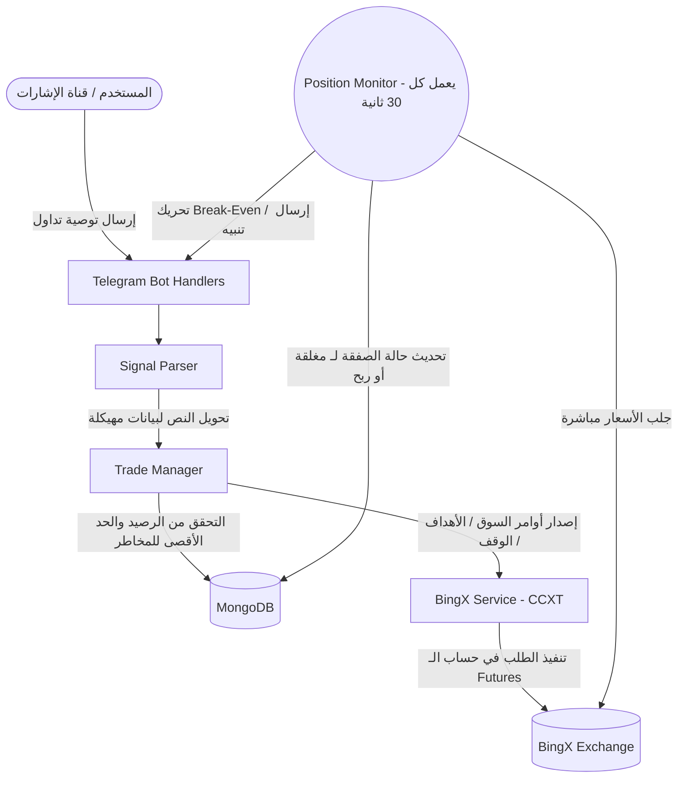

# الدليل الشامل: بوت تداول العملات الرقمية (BingX Trading Bot)

## 1. كيف يعمل البوت (Architecture & Workflow)

### أ. التقنيات والمكتبات المستخدمة
- **لغة البرمجة:** TypeScript / Node.js
- **التواصل مع التيليجرام:** `telegraf` (إطار عمل قوي لبناء بوتات تيليجرام).
- **التواصل مع المنصة (BingX):** `ccxt` (مكتبة قياسية وموحدة للتواصل مع محافظ ومنصات التداول وتدعم أكثر من 100 منصة).
- **قاعدة البيانات:** `mongoose` و MongoDB للوصول وتخزين بيانات المستخدمين وسجلات الصفقات التاريخية.
- **المهام المجدولة:** `node-cron` لإرسال التقارير الدورية (أسبوعية/شهرية).

### ب. تقسيم الملفات والترابط بينها (File Structure & Relations)
تم بناء المشروع على هندسة برمجية نظيفة (Modular Architecture) تفصل واجهة المستخدم (تيليجرام) تماماً عن أوامر الربط مع المنصة:
```text
src/
 ├── bot/                    # 1. طبقة الواجهة (Telegram Layer)
 │    ├── handlers/          # أوامر أزرار التيليجرام وإدارة استجابتها (رسائل، تقارير، استعلامات).
 │    ├── keyboards/         # بناء وتصميم أزرار واجهة المستخدم (الرد أو الأزرار الشفافة).
 │    ├── middlewares/       # جدار الحماية للتحقق من هوية المستخدم (Whitelist).
 │    └── utils/             # أدوات مساعدة لتنسيق النصوص والرسائل (HTML/Markdown).
 ├── models/                 # 2. طبقة قواعد البيانات (Database Models) لوصف هياكل الصفقات للمتداول والمستخدم.
 ├── services/               # 3. طبقة الخدمات والأعمال (Business Layer)
 │    ├── BingXService.ts    # يتحدث مباشرة مع منصة BingX عبر ccxt لتكوين الأوامر والمبيعات.
 │    ├── TradeManager.ts    # يأخذ القرار المالي (حساب المخاطرة، الانكشاف)، ويتواصل مع BingXService و DB.
 │    ├── SignalParser.ts    # يحلل نصوص رسائل التوصيات لفهم (رقم الدخول، الأهداف المتعاقبة، وقف الخسارة).
 │    ├── PositionMonitor.ts # работает في الخلفية لجلب الأسعار ومراقبة الصفقات المفتوحة وتحريك الوقف (Break-Even).
 │    └── ReportingService.ts# يقوم باستخراج تقارير الأرباح وإرسالها آلياً.
 ├── utils/
 └── index.ts                # نقطة الانطلاق لتشغيل السيرفر وربط الخدمات معاً.
```

### ج. مخطط عمل البوت (Workflow Diagram)
يوضح هذا المخطط تسلسل تدفق البيانات، من لحظة استلام التوصية وحتى إرسالها للمنصة والمراقبة في الخلفية:


---

## 2. دليل الاستخدام (كيف تستخدم البوت)

### أ. رسائل الصفقات (Signals Format)
لكي يفهم البوت الصفقة ويدخلها تلقائياً، يمكنك نسخ توصيات التداول وإرسالها للبوت. إليك التنسيق المعتمد والذي يفهمه المترجم:
```text
#BTC/USDT SHORT
Entry: 65000
Target 1: 64000
Target 2: 63000
Stop Loss: 67000
Leverage: 10x
```

### ب. شرح أزرار واجهة التيليجرام بالتفصيل
- 💰 **رصيدي وملخص الأرباح:**
  يستعلم هذا الزر عن رصيدك المتاح للتداول (بالدولار)، ويقوم بجمع الأرباح والخسائر الوهمية (العائمة حالياً) في كافة الصفقات المفتوحة وعرضها كملخص سريع.
  
- 💼 **صفقاتي المفتوحة:**
  يصدر تقريراً تفصيلياً لكل عملة (صفقة) نشطة في المنصة. يعرض السعر الحالي لها، نسبة العائد الاستثماري (ROE)، وحجم المال (Margin) المستثمر فيها نسبة للحساب. ويظهر الأهداف المتوقعة والوقف.

- 📊 **التقارير:**
  يتيح لك عرض ملخصات صفقاتك السابقة سواء الرابحة منها أو الخاسرة. يظهر فيه إجمالي الصفقات المغلقة، معدل الفوز (Win Rate)، والتغيير التقريبي في رأس المال. يمكنك تصفية النتائج إلى (تقرير يومي، شهري، سنوي، أو بطلب محدد لتاريخ معين معطى في صندوق الدردشة).

- ⚙️ **إعدادات التنبيهات:**
  يحتوي على أزرار تفاعلية (Inline Keyboards) لتمكين أو تعطيل التنبيهات وإشعارات البوت عند وصول صفقة للـ (Stop Loss) أو (Take Profit). يمكنك اختيار إشعار البالغ لـ 70% أو غير ذلك من المسافة.

- 🔍 **الاستعلام عن صفقة محددة:**
  يخرج لك قائمة مُصغرة للعملات النشطة لتضغط على إحداها، ومن ثم يستعلم ويجيبك بحالة تلك العملة لوحدها على انفراد.

- ❌ **إلغاء صفقة محددة:**
  يخرج لك نفس قائمة القطع المفتوحة لتختار إحداها فيقوم بتصفيتها (إغلاق بسعر السوق الحالي Market Order) وإبطال المعاملة.

- 🛑 **إلغاء كل الصفقات المفتوحة:**
  زر الحالات الحرجة. يقوم بإرسال أمر ماركت عاجل لتصفية وإغلاق كافة العملات النشطة فوراً لإنقاذ الأرباح. البوت سيطلب منك التأكيد لتفادي الضغط بالخطأ.

- 🛡 **حماية رأس المال (6% SL):**
  هذا الزر يعمل بمثابة (قفل/فتح) لسياسة المخاطرة الصارمة. في حال فُتح، فإن البوت قسراً سيقوم بتقليص عدد العملات المطلوبة للصفقة إذا لاحظ أن مسافة وقف الخسارة ستكلف الحساب (أكثر من 6%) عند الإغلاق التلقائي. يحمي حسابك من الانزلاق العنيف.

---

## 3. هندسة بوت مماثل لمنصات أخرى (Binance, Bybit) وموجهة (Prompt)

استخدام تقنيتي المعمارية المفككة (Modular Architecture) ومكتبة المهام المفتوحة (`CCXT`) يجعل عملية شحن البوت ليعمل مع منصات حديثة (كـ Binance و Bybit) مَهمة يسيرة؛ ولن يتوجب عليك إلا استبدال ملف `BingXService` بـ `BinanceService` مثلاً مع الحفاظ على كل المكونات الأخرى كما هي.

### النص البرمجي التوجيهي (Prompt Engineering) للذكاء الاصطناعي
بدلًا من كتابة ملفات عشوائية، انسخ النص الشامل التالي وألصقه في منصة الذكاء الاصطناعي (مثل ChatGPT, Claude, Gemini) وسيبني لك بوت متكامل من الصفر.

> أريد بناء بوت تداول آلي ومتكامل للعملات الرقمية يعمل على منصة [Bybit] بنظام العقود الآجلة (USDT Perpetual Futures)، باستخدام بيئة Node.js ولغة TypeScript. سيدار هذا البوت عبر واجهة تطبيق Telegram (باستخدام مكتبة Telegraf)، ويجب أن يحتوي على قاعدة بيانات MongoDB باستخدام Mongoose لتخزين سجلات الصفقات المفتوحة والمستخدمين.
> 
> يرجى الالتزام بالتقنيات وهيكلية الملفات التالية (Architecture & Modular Structure):
> 
> 1. **التقسيمات المعمارية (File Structure):**
>    - افصل منطق واجهة التيليجرام ومتحكماتها بشكل كامل في مجلد `src/bot/handlers`. يجب أن لا يوجد أي كود لتواصل المنصات بيع/شراء هنا. ستكون وظيفة المجلد إدارة ازرار المستخدم وعرض الرسائل المنسقة.
>    - ضع الطبقة الاستثمارية ومعالجات واجهة برمجة التطبيقات (API) في مجلد `src/services/`.
> 
> 2. **الخدمات الرئيسية المفككة (Services):**
>    - `ExchangeService.ts`: أرجو أن تستخدم مكتبة `ccxt` فقط للاتصال بالمنصة وتنفيذ الأوامر (Market و Limit مع بناء قيم SL/TP) وتغيير الرفع المالي وطلب الرصيد الحر للـ Futures.
>    - `TradeManager.ts`: طبقة صنع القرار. مسؤولة عن استلام الأوامر، فحص توافر الرصيد، والموازنة لحساب المقدار المالي الآمن للصفقة لضمان عدم تجاوز المخاطرة (5% من إجمالي حساب العميل)، ثم تأمر ExchangeService بالتنفيذ.
>    - `PositionMonitor.ts`: حلقة زمنية (Interval Polling) تمر على أزواج العملات المفتوحة، وترسل تنبيهاً لتيليجرام عند قرب تحقيق الربح أو الخسارة، والأهم هو تحريك وقف الخسارة تلقائيا لنقطة الأصل (Break-Even) عند تحقيق الهدف الأول.
>    - `SignalParser.ts`: كلاس يعتمد على الـ Regex لاستخراج معلومات النص المُرسل من التليجرام مثل (العملة، نقاط الدخول، الأهداف المتعاقبة، الـ Stop Loss).
> 
> 3. **واجهة التيليجرام والأزرار المتوقعة:**
>    - وفّر أزرار عرض للأرصدة (الرصيد الكلي والربح والنزيف العائم).
>    - خيارات إغلاق صفقة معينة بسعر السوق العاجل.
>    - التفاعل المباشر بالرفض في حالة عدم وجود المستخدم ضمن (Whitelist Middleware) للتحكم الأمني.
>    
> اعتمد على معايير الكود النظيف (Clean Code) والفصل التام למסؤوليات (SRP). صمم الواجهات (Interfaces) بوضوح لـ TypeScript ولا تستخدم متغيرات التهرب 'any' مطلقاً، وطوق الاتصالات بـ `try/catch` لاحتواء أخطاء الشبكة والرد للمستخدم. 
> أريد منك كخطوة أولى، ترتيب وتوضيح خطة ومحتوى نظام وهيكلة الملفات والمجلدات المطلوبة قبل أن نبدأ التنفيذ وكتابة الأكواد معاً.
# الدليل الشامل: بوت تداول العملات الرقمية

هذا الملف يشرح بالتفصيل كيفية عمل البوت، بنيته البرمجية (Architecture)، وكيفية استخدامه لتنفيذ الصفقات وإدارتها.

---

## 1. كيف يعمل البوت وهيكلته (Architecture & Workflow)

البوت عبارة عن نظام تداول آلي يربط بين منصة التيليجرام (لإدارة المستخدمين واستقبال الإشارات) ومنصة التداول (لتنفيذ الأوامر في سوق العقود الآجلة Futures).

### أ. التقنيات الأساسية:
- **لغة البرمجة:** TypeScript و Node.js
- **التفاعل مع المستخدم:** مكتبة `telegraf` لبرمجة بوت التيليجرام.
- **التداول والمنصات:** مكتبة `ccxt` (مكتبة عالمية لربط واجهات برمجة التطبيقات API الخاصة بالمنصات مثل Binance و BingX وغيرها).
- **قواعد البيانات:** `MongoDB` و `mongoose` لحفظ إعدادات المستخدمين وسجلات الصفقات النشطة والمغلقة.
- **المهام المجدولة:** `node-cron` لإصدار تقارير الأرباح الدورية.

### ب. هيكلة المشروع (Modular Architecture):
تم بناء المشروع بشكل مفكك (Modular) ليفصل واجهة التفاعل عن المنطق المالي:
1. **طبقة الواجهة (Telegram Layer):** متواجدة في مجلد `src/bot/`. تحتوي على أوامر الأزرار (`handlers`)، تصميم الأزرار (`keyboards`)، والجدار الأمني (`middlewares`).
2. **طبقة الخدمات (Business & Services Layer):** متواجدة في `src/services/` وتشمل:
   - **`BinanceService / BingXService`**: مسؤولة حصرياً عن الاتصال بالمنصة عبر API (جلب رصيد، فتح وإغلاق صفقات، تعديل الرافعة).
   - **`TradeManager`**: عقل البوت. يتخذ القرارات المالية ويحسب حجم الدخول الآمن بناءً على نسبة المخاطرة المسموحة والرصيد الحالي، ثم يوجه خدمة المنصة بالتنفيذ.
   - **`SignalParser`**: يحلل نصوص التوصيات (رسائل التيليجرام) بذكاء ليستخرج منها: اسم العملة، نقطة الدخول، الأهداف، ووقف الخسارة.
   - **`PositionMonitor`**: حارس يعمل في الخلفية كل 30 ثانية؛ يراقب الأسعار والصفقات المفتوحة، ويقوم بتأمين الصفقة تلقائياً (نقل وقف الخسارة إلى نقطة الدخول - Break Even) عند ضرب الهدف الأول.
   - **`ReportingService`**: تجمع البيانات لاحتساب نسبة النجاح وإصدار تقارير الأرباح.

### ج. دورة حياة الصفقة (Workflow):
1. يرسل المتداول رسالة توصية (Signal) في التيليجرام.
2. يستقبل `SignalParser` النص ويحوله إلى بيانات مفهومة.
3. يقوم `TradeManager` بفحص الرصيد وحساب المخاطرة وتجهيز حجم العقد.
4. تُرسل الأوامر عبر `Service API` لمنصة التداول (دخول ماركت أو ليميت).
5. تُسجل الصفقة في قاعدة البيانات، ويبدأ `PositionMonitor` بمراقبتها.

---

## 2. كيفية استخدام البوت وتنفيذ الصفقات

### أ. كيفية إرسال الصفقات:
لتنفيذ صفقة، كل ما عليك هو إرسال التوصية بصيغة نصية واضحة إلى البوت في التيليجرام. المترجم الذكي سيتعرف عليها فوراً.
**مثال على صيغة التوصية المدعومة:**
```text
#BTC/USDT SHORT
Entry: 65000
Target 1: 64000
Target 2: 63000
Stop Loss: 67000
Leverage: 10x
```

### ب. إدارة الصفقات عبر واجهة التيليجرام:
يمتلك البوت واجهة أزرار (Reply Keyboards) تسهل لك الإدارة الكاملة دون الحاجة لفتح تطبيق المنصة:

- 💰 **رصيدي وملخص الأرباح:** يعرض الرصيد المتاح للتداول، ويسحب الأرباح/الخسائر غير المحققة (Floating PNL) من الصفقات النشطة.
- 💼 **صفقاتي المفتوحة:** يعطيك تقرير تفصيلي لكل عملة نشطة، نسبة العائد (ROE)، الهامش المستخدم، وسعر الدخول الحالي مقابل السوق.
- 📊 **التقارير:** يتيح عرض ملخص الصفقات السابقة، معدل الفوز (Win Rate)، والتغيير التقريبي في رأس المال (يومي، شهري، أو مخصص).
- ⚙️ **إعدادات التنبيهات وإدارة المخاطر:** للتحكم في (حماية رأس المال)، تمكين/تعطيل التنبيهات، والتحكم في إعدادات الرافعة المالية الثابتة (Fixed Leverage).
- 🔍 **الاستعلام وإلغاء صفقة محددة:** لاختيار صفقة معينة من القائمة ومعرفة حالتها بدقة أو إغلاقها فوراً بسعر السوق (Market Close).
- 🛑 **إلغاء كل الصفقات المفتوحة:** زر طوارئ لتصفية جميع الصفقات المفتوحة وإغلاقها بسعر السوق فوراً لحماية الأرباح.

---
هذا الدليل يمنحك نظرة شاملة عن آلية العمل والتحكم. البنية المفككة تجعل البوت قابلاً للتطوير والتوسعة لأي منصة تداول أخرى بأقل التعديلات الممكنة.
