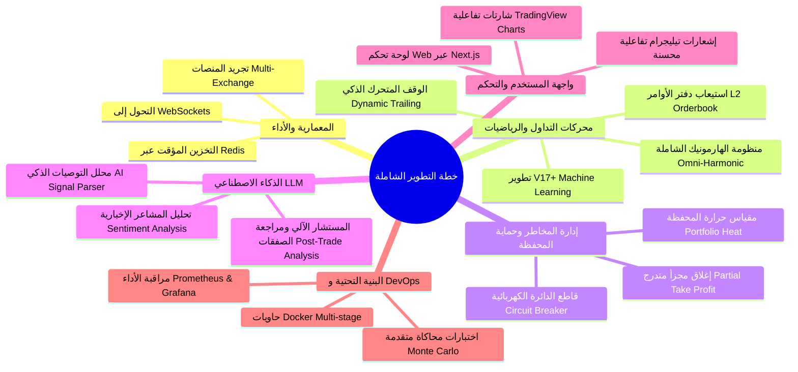

# 🚀 خطة التطوير الشاملة والترقية المؤسساتية (Comprehensive Development Plan)
> خارطة طريق هندسية وتقنية متكاملة لتطوير بوت التداول الآلي من كافة النواحي (المعمارية، المالية، الرياضية، الذكاء الاصطناعي، الأمان، وواجهة المستخدم).

---

## 🎯 الأهداف الاستراتيجية للتطوير
تحويل البوت من مجرد أداة تداول فردية إلى **منصة تداول كمية ومؤسساتية متكاملة (Institutional Quant Trading Platform)** تتميز بـ:
1. زمن استجابة فائق الصغر (Sub-second Execution Latency).
2. استراتيجيات تداول كمية مدعومة بالذكاء الاصطناعي (AI & Machine Learning Alphas).
3. نظام حماية ومخاطر ثلاثي الطبقات يمنع التراجعات الحادة (Triple-Layer Risk Management).
4. دعم التداول عبر منصات متعددة في وقت واحد (Multi-Exchange Routing).
5. لوحة تحكم ويب تفاعلية في الوقت الحقيقي (Real-Time Web Dashboard).

---

## 🧭 محاور خطة التطوير الشاملة



---

## 1. الناحية المعمارية وهندسة البرمجيات (Architecture & Performance)

### 1.1 الانتقال من أسلوب السحب الدوري (REST Polling) إلى الاتصال الحي (WebSockets)
* **الوضع الحالي:** يقوم `PositionMonitor` بفحص أسعار ومراكز الحساب كل 30-60 ثانية عبر REST API، مما يسبب تأخيراً في كشف مستويات TP/SL وضغطاً على الـ Rate Limits.
* **التطوير المطلوب:**
  - بناء خدمة اتصالات حية عبر الـ WebSocket (`BingXWebSocketService`) للاشتراك في قنوات:
    - `listenKey / userStream`: للاستماع اللحظي الفوري لأي تغيير في الرصيد، فتح وإغلاق المراكز، أو ضرب الأوامر خلال أجزاء من الثانية.
    - `ticker / orderbook`: للحصول على التغير السعري الحقيقي في زمن حقيقي (Real-time Price Ticks).
  - تقليل زمن اكتشاف كسر شروط الرادار أو ضرب الأهداف من 30 ثانية إلى **أقل من 200 ميلي ثانية**.

### 1.2 تجريد واجهة التداول (Multi-Exchange Abstraction Layer)
* **التطوير المطلوب:**
  - تحويل `BingXService` إلى تطبيق لواجهة عامة موحدة `IExchangeService`:
    ```typescript
    export interface IExchangeService {
      name: string;
      getBalance(): Promise<AccountBalance>;
      setLeverage(symbol: string, leverage: number): Promise<void>;
      createOrder(params: TradeOrderParams): Promise<OrderResult>;
      getOpenPositions(): Promise<Position[]>;
      closePosition(symbol: string, amount?: number): Promise<void>;
      subscribeToUserStream(callback: (event: ExchangeEvent) => void): Promise<void>;
    }
    ```
  - بناء محولات جاهزة للمنصات الكبرى:
    - `BinanceFuturesService.ts`
    - `BybitFuturesService.ts`
    - `MexcFuturesService.ts`
  - إمكانية التبديل بين المنصات أو تشغيل استراتيجيات موزعة عبر إعدادات البوت بضغطة زر.

### 1.3 إدارة التزامن والأقفال الموزعة (Redis Distributed Locks)
* **المشكلة الحالية:** في حال تشغيل أكثر من نسخة للبوت أو حدوث تدفق سريع للأوامر، قد يحدث تضارب (Race Condition) يؤدي لفتح صفقتين متطابقتين لنفس الإشارة.
* **الحل:** استخدام Redis مع مكتبة `redlock` لقفل مفتاح الرمز (مثل `lock:trade:BTCUSDT`) أثناء معالجة الصفقة، وتخزين الأسعار اللحظية في الذاكرة السريعة (In-Memory Cache) لتخفيف الحمل على قاعدة البيانات.

---

## 2. محركات التداول والخوارزميات الكمية (Quant & Algorithmic Layer)

### 2.1 تطوير محركات التعلم الآلي والتنبؤ الاحتمالي (V17 & V18 Machine Learning Alphas)
* **محرك V17 (Dynamic Volatility Regime Switching):**
  - استخدام نموذج كشف حالة السوق (Markov Regime Switching / GARCH Model) لتصنيف حالة السوق اللحظية إلى: (اتجاهي صاعد، اتجاهي هابط، تذبذب عشوائي متسع، أو انكماش سيولة).
  - تفعيل الاستراتيجيات المتوافقة تلقائياً (مثلاً تعطيل استراتيجيات الكسر V5 أثناء التذبذب، وتفعيل استراتيجيات الانعكاس المتوسط V4).
* **محرك V18 (Microstructure Order Flow & L2 Imbalance):**
  - قراءة عمق السوق الفعلي (Level 2 Order Book Depth 20/50).
  - حساب نسبة عدم التوازن بين قوى الشراء والبيع اللحظية (Bid-Ask Imbalance):
    $$I_{\text{depth}} = \frac{\sum \text{BidSize}_i - \sum \text{AskSize}_i}{\sum \text{BidSize}_i + \sum \text{AskSize}_i}$$
  - منع الدخول في صفقات Long إذا كانت كتل البيع الجدارية (Ask Walls) تفوق قوى الشراء بنسبة 3:1.

### 2.2 نظام التتبع والوقف المتحرك الذكي (Dynamic Trailing Stop)
* **التطوير المطلوب:**
  - عدم الاكتفاء بنقل الوقف لنقطة التعادل (Break-Even) عند الهدف الأول، بل تطبيق خوارزمية وقف متحرك تعتمد على تقلب الشموع (Chandelier Exit / ATR Trailing):
    $$\text{Trailing SL} = \text{Highest High} - (2.0 \times \text{ATR}_{14})$$
  - تأمين الأرباح المكتسبة تصاعدياً كلما تقدم السعر نحو الأهداف المتقدمة (TP2, TP3).

### 2.3 الخروج الجزئي الذكي (Scale-Out Partial Execution)
* تقسيم جني الأرباح تلقائياً وفق نسب مدروسة رياضياً:
  - إغلاق 50% من حجم المركز عند TP1 (لتأمين تكلفة الصفقة وإخراج أصل المخاطرة).
  - إغلاق 25% عند TP2.
  - ترك الـ 25% المتبقية مع تفعيل الـ Trailing Stop لحصد قمم وقيعان الموجات الكبرى (Home-Run Trades).

---

### 2.4 المنظومة الشاملة لمحرك تحليل نماذج الهارمونيك الرقمية (Omni-Harmonic Pattern Engine Suite)

تطوير محرك تداول كمي متخصص ومستقل يغطي **كافة نماذج التداول التوافقي (Harmonic Trading Patterns)**، مع كشف خوارزمي دقيق لنسب فيبوناتشي، ومناطق الانعكاس المحتملة (PRZ)، والتأكيد التلقائي عبر الزخم وحجم التداول.

#### أ) جدول مصفوفة نسب النماذج التوافقية المستهدفة (Harmonic Matrix)

سيدعم المحرك كافة النماذج الصاعدة (Bullish) والهابطة (Bearish) وفق النسب الرياضية الدقيقة للرائد سكوت كارني (Scott Carney):

| اسم النموذج | ارتداد/امتداد النقطة B | ارتداد النقطة C | منطقة الانعكاس للنقطة D (PRZ) | امتداد الضلع BC عند D |
| :--- | :--- | :--- | :--- | :--- |
| **Gartley (جارتلي)** | $0.618 \times XA$ | $0.382 - 0.886 \times AB$ | **$0.786 \times XA$** (الهدف الرئيسي) | $1.13 - 1.618 \times BC$ |
| **Bat (الخفاش)** | $0.382 - 0.500 \times XA$ | $0.382 - 0.886 \times AB$ | **$0.886 \times XA$** | $1.618 - 2.618 \times BC$ |
| **Alt Bat (الخفاش البديل)** | $0.382 \times XA$ | $0.382 - 0.886 \times AB$ | **$1.130 \times XA$** (امتداد اختراق X) | $2.000 - 3.618 \times BC$ |
| **Butterfly (الفراشة)** | $0.786 \times XA$ | $0.382 - 0.886 \times AB$ | **$1.272$ أو $1.618 \times XA$** | $1.618 - 2.618 \times BC$ |
| **Crab (الكابوريا)** | $0.382 - 0.618 \times XA$ | $0.382 - 0.886 \times AB$ | **$1.618 \times XA$** (امتداد متطرف) | $2.618 - 3.618 \times BC$ |
| **Deep Crab (الكابوريا العميق)**| $0.886 \times XA$ | $0.382 - 0.886 \times AB$ | **$1.618 \times XA$** | $2.240 - 3.618 \times BC$ |
| **Shark (القرش 0-X-A-B-C)** | $1.130 - 1.618 \times XA$ | $1.618 - 2.240 \times AB$ | **$0.886$ أو $1.130 \times 0X$** | $1.618 - 2.240 \times BC$ |
| **Cypher (السايفر المتقدم)** | $0.382 - 0.618 \times XA$ | **$1.272 - 1.414 \times XA$** | **$0.786 \times XC$** | $1.272 - 2.000 \times BC$ |
| **5-0 Pattern (نموذج 5-0)** | $1.130 - 1.618 \times XA$ | $1.618 - 2.240 \times AB$ | **$0.500 \times BC$** (توازن 50%) | $0.500 \times BC$ |
| **Classic AB=CD** | -- | $0.618$ أو $0.786 \times AB$ | $CD = AB$ مع ارتداد $1.272$ أو $1.618 \times BC$ | تناظر زمني متطابق |
| **Three Drives (الدفعات الثلاث)**| موجات اندفاع متتالية | تصحيح $0.618$ متكرر | دفعات بامتدادات $1.272$ و $1.618$ | تماثل زمني وسعري |

---

#### ب) الخوارزمية البرمجية لاكتشاف القمم والقيعان (Dynamic ATR ZigZag Swings)
* **المشكلة الشائعة:** استخدام نسب ثابتة في مؤشر ZigZag يجعله يفشل عند تغير تقلب السوق بين أوقات الهدوء والانفجار السعري.
* **الحل البرمجي المعتمد:**
  1. حساب الانحراف الديناميكي بناءً على مؤشر التقلب:
     $$\text{Swing Threshold} = \text{ATR}_{14} \times \text{Multiplier}$$
     (حيث $\text{Multiplier} = 2.0$ للصفقات اليومية Swing، و $1.0$ للمضاربة السريعة Scalp).
  2. تحديد النقاط المحورية خماسية الأضلاع: $(X, A, B, C, D)$.
  3. استبعاد النماذج المشوهة (Noise Filtering) واشتراط حد أدنى لعدد الشموع بين كل قمة وقاع لمنع التداخل الزمني المفرط.

---

#### ج) حساب منطقة الانعكاس المحتملة والتلاقي الرقمي (PRZ Confluence Zone)
* لا يعتمد الدخول على رقم منفرد لنقطة $D$، بل يتم إنشاء **نطاق سعري تلاقي (PRZ Band)**:
  - حساب مستوى $D$ المشتق من ضلع $XA$.
  - حساب مستوى $D$ المشتق من امتداد ضلع $BC$.
  - حساب مستوى $D$ المتوقع من تناظر $AB=CD$.
  - **معامل التسامح الرقمي (Fibonacci Tolerance):** قبول الانحراف بنسبة خطأ لا تتجاوز $\pm 3\%$ إلى $\pm 5\%$ حول النسبة المثالية.
  - إذا تقاطعت مستويات فيبوناتشي الثلاثة في نطاق ضيق، يُصنف الـ PRZ كـ **"منطقة تلاقي فائقة القوة (High-Probability Confluence Zone)"**.

---

#### د) شروط التأكيد الزخمي والحجمي قبل فتح الصفقة (Multi-Indicator Confirmation)
لتفادي ظاهرة سكاكين السوق الساقطة (Falling Knives) وتجنب الانعكاسات الوهمية:
1. **دايفرجنس مؤشر القوة النسبية (RSI Divergence):**
   - في النماذج الصاعدة: تشكل قاع $D$ أدنى من $B$ بينما يسجل RSI قاعاً أعلى، أو وصول RSI لمستويات تشبع بيعي حاد ($\text{RSI} < 30$).
   - في النماذج الهابطة: تشكل قمة $D$ أعلى من $B$ مع قمة هابطة في RSI، أو تشبع شرائي ($\text{RSI} > 70$).
2. **سلوك الشموع اليابانية داخل الـ PRZ (Candlestick Reversal Confirmation):**
   - اشتراط إغلاق شمعة انعكاسية واضحة داخل النطاق (Pin Bar / Hammer / Bullish Engulfing للـ Long، أو Shooting Star / Bearish Engulfing للـ Short).
3. **طفرة الحجم (Volume Absorption):**
   - حدوث زيادة في حجم تداول شمعة الانعكاس بنسبة $\ge 1.3 \times \text{SMA}(\text{Volume}, 20)$ دلالة على امتصاص السيولة وتدخل صناع السوق.

---

#### هـ) قواعد إدارة الصفقة وأهداف الأرباح والوقف في نماذج الهارمونيك
* **وقف الخسارة (Stop Loss):**
  - للنماذج الارتدادية الداخلية (Gartley, Bat): يوضع الوقف خلف النقطة $X$ بمسافة $0.5 \times \text{ATR}$ (حوالي $1.13 \times XA$).
  - للنماذج الامتدادية الخارجية (Butterfly, Crab): يوضع الوقف خلف النقطة $D$ بمسافة $1.0 \times \text{ATR}$ أو عند امتداد فيبوناتشي التالي ($1.414$ للفراشة، و $2.0$ للكابوريا).
* **أهداف جني الأرباح (Take Profit Strategy):**
  - تعتمد أهداف الخروج على نسب ارتداد فيبوناتشي للضلع الأخير $CD$ (أو الضلع الكامل $AD$):
    - **TP1 (38.2% Fibonacci Retracement):** إغلاق 50% من المركز، ونقل وقف الخسارة فوراً إلى سعر الدخول (Break-Even).
    - **TP2 (61.8% Golden Ratio Retracement):** إغلاق 30% إضافية من المركز (الهدف الرئيسي لصفقات الهارمونيك).
    - **TP3 (100% Retracement):** إعادة اختبار النقطة $C$.
    - **TP4 (1.272% Extension):** في حالات الانفجار الاتجاهي المتزامن مع ترند الفريم الأكبر.

---

#### و) الهيكل البرمجي وخريطة الملفات المطلوبة للتنفيذ

```
src/
├── core/
│   ├── shared/
│   │   └── harmonic/
│   │       ├── types.ts                     # تعريف أنواع النماذج، أوزانها، وهياكل الـ PRZ
│   │       ├── DynamicZigZag.ts             # خوارزمية استخراج القمم والقيعان بالـ ATR
│   │       ├── HarmonicPatternDetector.ts   # فاحص نسب فيبوناتشي ومطابقة النماذج الـ 11
│   │       └── PRZCalculator.ts             # حاسبة مناطق التلاقي السعري ونطاقات الدخول
│   ├── analysis/
│   │   └── engines/
│   │       └── HarmonicMasterEngine.ts      # محرك التحليل الشامل (يدمج مع قائمة التحليلات)
│   ├── sniper/
│   │   └── engines/
│   │       └── HarmonicSniperEngine.ts      # قناص الهارمونيك اللحظي (ينفذ عند اكتمال النقطة D)
│   └── radar/
│       └── engines/
│           └── HarmonicRadarEngine.ts       # رادار مراقبة كسر الـ PRZ وفشل النماذج
```

---


## 3. إدارة المخاطر المؤسساتية (Institutional Risk Management)

### 3.1 قاطع الدائرة لحماية الحساب (Daily Drawdown Circuit Breaker)
* إضافة صمام أمان رئيسي في `TradeManager`:
  - إذا بلغت نسبة الخسائر المحققة أو العائمة خلال 24 ساعة نسبة محددة (مثل **-4% من إجمالي المحفظة**):
    1. إيقاف تشغيل جميع محركات القنص والاستقبال التلقائي فوراً.
    2. إغلاق الصفقات المفتوحة أو تجميدها.
    3. إرسال إنذار طارئ للأدمن عبر تيليجرام بعنوان: `🚨 EMERGENCY CIRCUIT BREAKER ACTIVATED`.
    4. منع أي تداول لمدة 12 ساعة حتى استقرار نفسية المتداول وهدوء السوق.

### 3.2 مقياس حرارة المحفظة وحظر الارتباط المالي (Portfolio Heat & Correlation Guard)
* **المشكلة:** فتح صفقات Long متزامنة على (BTC, ETH, SOL, AVAX) يعني عملياً مضاعفة المخاطرة 4 مرات على نفس الأصل نظراً للارتباط الإيجابي الشديد بينها (High Positive Correlation $> 0.85$).
* **الحل البرمجي:**
  - حساب مصفوفة الارتباط الحية (Correlation Matrix).
  - تحديد سقف "حرارة المحفظة" (Max Portfolio Heat) بحيث لا يتجاوز مجموع المخاطر المعرضة للخسارة في جميع الصفقات المفتوحة في اللحظة نفسها نسبة 6% من إجمالي رأس المال.
  - منع فتح مركز جديد إذا كان يرتبط بأصل مفتوح بنسبة ارتباط تفوق 0.80.

---

## 4. طبقة الذكاء الاصطناعي التوليدي (LLM & Generative AI Layer)

### 4.1 تحليل معنويات السوق والأخبار الكبرى (Market Sentiment & News Engine)
* ربط واجهات API الإخبارية (CryptoPanic API, Twitter Financial Sentiment, Forexfactory Economic Calendar).
* استخدام نماذج LLM السريعة (Gemini Flash / OpenAI GPT-4o-mini) من أجل:
  1. تقييم الأخبار الفورية بدرجة من -1.0 (سلبي جداً) إلى +1.0 (إيجابي جداً).
  2. **فلتر أخبار الاقتصاد الكلي (Macro News Filter):** حظر التداول التلقائي قبل 15 دقيقة وبعد 30 دقيقة من صدور البيانات الأمريكية الحساسة (معدل الفائدة FOMC، التضخم CPI، وبيانات التوظيف NFP).

### 4.2 محلل التوصيات الذكي كبديل للريجيكس (AI Fallback Parser)
* في حال فشل الـ `SignalParser` المبني على الـ Regex في قراءة نص توصية غير معتادة أو مكتوبة بلغة غير مألوفة، يتم تمرير النص تلقائياً للنموذج الذكي لإرجاع JSON مهيكل بدقة متناهية متضمناً الرموز والأرقام دون أي خطأ.

### 4.3 التقارير والمستشار الآلي الذكي (AI Post-Mortem & Advisor)
* عند انتهاء كل صفقة خاسرة أو رابحة، يقوم الذكاء الاصطناعي بمراجعة شارت الصفقة وظروف الدخول وتقديم تقرير مختصر يوضح:
  - هل التزم المتداول بالقواعد؟
  - ما سبب ضرب الوقف (تقلب لحظي، كسر هيكلي، أو خبر مفاجئ)؟
  - نصيحة لتفادي تكرار الخطأ مستقبلاً.

---

## 5. البنية التحتية والاعتمادية وأمان البيانات (DevOps, Security & CI/CD)

### 5.1 التحزيم السحابي الكامل (Docker & Orchestration)
* تحسين `Dockerfile` الحالي ليعتمد على البناء متعدد المراحل (Multi-Stage Build) لتقليل حجم الصورة البرمجية لأقل من 150MB.
* تجهيز `docker-compose.prod.yml` يتضمن:
  - خدمة البوت (Node.js App).
  - قاعدة بيانات MongoDB مع تفعيل النسخ الاحتياطي التلقائي (Automated Volume Backups).
  - خادم Redis لتسريع الاستجابة وقفل الأوامر.

### 5.2 منظومة المراقبة وجمع المقاييس (Observability: Prometheus + Grafana)
* تصدير المقاييس الحيوية للبوت (Prometheus Metrics):
  - معدل نجاح الصفقات (Win Rate %).
  - متوسط زمن الاستجابة والتنفيذ (Order Execution Latency in ms).
  - عدد استدعاءات الـ API وحالة الـ Rate Limits.
  - مقدار الربح والخسارة التراكمي اللحظي (Cumulative PnL Curve).
* لوحة تحكم رسومية جاهزة عبر Grafana لمتابعة صحة السيرفر من أي جهاز.

---

## 6. واجهة المستخدم ولوحة التحكم الحديثة (Web Dashboard & Modern UI)

بناء لوحة تحكم ويب خفيفة وسريعة (Next.js / Vite مع Vanilla CSS/Glassmorphism):
1. **شارت مباشر (TradingView Lightweight Charts):** يعرض نقاط الدخول، وقف الخسارة، والأهداف مرسومة مباشرة على الشموع اليابانية الحية.
2. **إدارة الصفقات النشطة بضغطة زر:** إغلاق الصفقات، تعديل الوقف، أو نقل الوقف للتعادل يدوياً.
3. **مفتاح الطوارئ (Panic Button):** زر أحمر يتيح للأدمن إغلاق جميع الصفقات المفتوحة في المنصة بضغطة زر واحدة وإلغاء كافة الأوامر المعلقة في حالات انهيار السوق المفاجئ.
4. **شاشات التحليل التاريخي (Backtest Visualizer):** عرض منحنيات العائد مقابل التراجع (Equity Curve vs Drawdown) بدلاً من قراءة النصوص في التيليجرام.

---

## 7. ترقية محرك المحاكاة والاختبار التاريخي (Core Backtester Upgrades)

تطوير [CoreBacktestEngine.ts](file:///e:/webProject/BotTrading_BingX/src/core/backtest/CoreBacktestEngine.ts) ليشمل البيئة الواقعية:
1. **احتساب العمولات الحقيقية للمنصة:**
   - رسوم صانع السوق (Maker Fee: 0.02%).
   - رسوم آخذ السيولة (Taker Fee: 0.05%).
2. **محاكاة الانزلاق السعري (Slippage Simulation):** خصم نسبة واقعية (0.03% - 0.08%) من سعر التنفيذ خاصة في فترات السيولة الضعيفة.
3. **تمويل العقود (Funding Rate Deduction):** احتساب رسوم التمويل كل 8 ساعات للصفقات الطويلة (Swing Trades).
4. **اختبارات الضغط العشوائي (Monte Carlo Simulation):** تكرار تشغيل الاختبار التاريخي 1,000 مرة بترتيب عشوائي للصفقات لحساب أقصى تراجع محتمل (Worst-Case Maximum Drawdown) قبل المخاطرة بأموال حقيقية.

---

## 📅 مراحل التنفيذ والجدول الزمني (Phased Implementation Roadmap)

```
المرحلة الأولى: استقرار النظام والمخاطر (Phase 1: Stabilization & Risk)
├── المدة: 1 - 2 أسبوع
├── المهام:
│   ├── تفعيل قاطع الدائرة الرئيسي (Daily Drawdown Circuit Breaker)
│   ├── ضبط فترات التهدئة الحية (Live Cooldown) ومنع التكرار
│   └── ترقية نظام الوقف المتحرك (Dynamic Trailing Stop)

المرحلة الثانية: السرعة والاتصال الحي ومحركات الهارمونيك (Phase 2: Execution & Harmonics)
├── المدة: 2 - 3 أسابيع
├── المهام:
│   ├── بناء خدمة الاتصال بالـ WebSockets وإلغاء تأخير الـ Polling
│   ├── برمجة وتدقيق منظومة الهارمونيك الشاملة (Omni-Harmonic Engine لـ 11 نموذجاً)
│   ├── إدراج مكتبة Redis للأقفال الموزعة وتأكيد دقة الصفقات
│   └── تطوير محرك فحص كتل الأوامر L2 Orderbook

المرحلة الثالثة: الذكاء الاصطناعي والمنصات المتعددة (Phase 3: AI & Multi-Exchange)
├── المدة: 3 - 4 أسابيع
├── المهام:
│   ├── بناء واجهة IExchangeService ودعم Binance و Bybit
│   ├── دمج فلتر أخبار الاقتصاد الكلي ومحلل المشاعر الذكي (Sentiment LLM)
│   └── ترقية محرك الباك تيست ليشمل الرسوم والانزلاق والمونت كارلو

المرحلة الرابعة: لوحة التحكم المؤسساتية (Phase 4: Web UI & Production Scaling)
├── المدة: 3 - 4 أسابيع
├── المهام:
│   ├── إطلاق لوحة تحكم الويب الحية (Web Dashboard)
│   ├── تكامل شاشات TradingView ومفتاح الطوارئ Panic Button
│   └── إعداد نظام المراقبة الشامل Prometheus & Grafana
```

---
*تم إعداد هذه الوثيقة كخطة استراتيجية معتمدة لتطوير منظومة التداول الآلي إلى أعلى المعايير المؤسساتية العالمية.*
