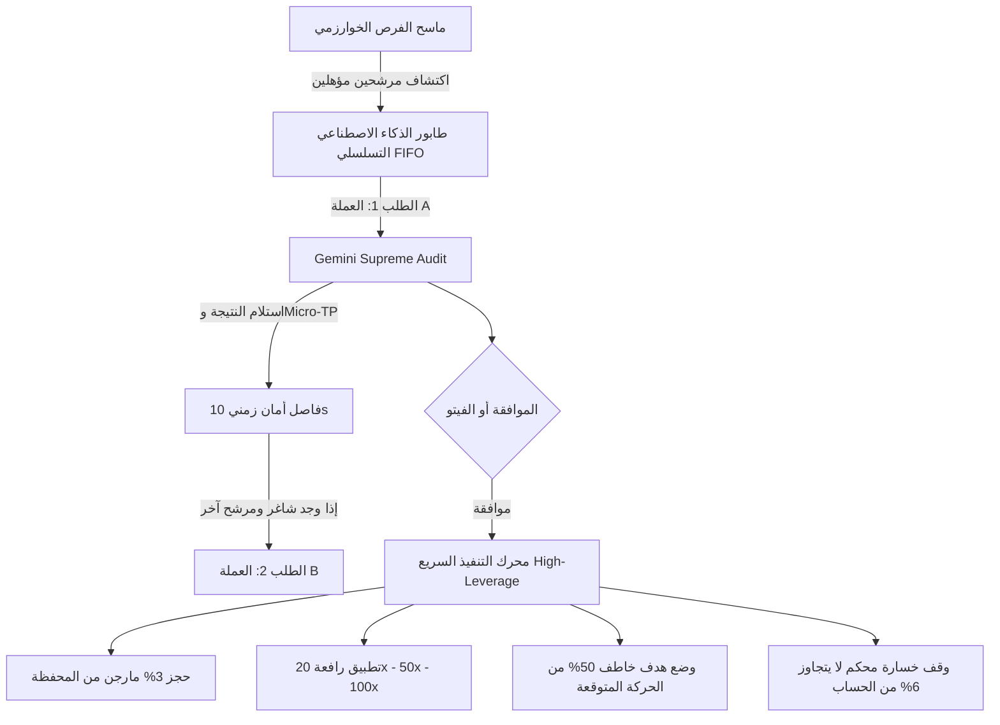

# خطة تنفيذ: نمط الصفقات السريعة (High-Leverage Scalping) وترشيد الذكاء الاصطناعي التسلسلي

---

## 📌 أهداف الخطة

1. **طابور تسلسلي آمن للذكاء الاصطناعي (Sequential FIFO Pipeline):**
   - إلغاء إرسال الطلبات المتزامنة في نفس الثانية نهائياً.
   - فحص العملات بالتتابع: إرسال العملة الأولى -> انتظار الاستجابة -> فاصل أمان زمني (Safe Cooldown Buffer من 8 إلى 15 ثانية) -> إرسال العملة التالية عند الحاجة.
   - حماية الكوتا اليومية من النفاد واستمرار عمل الذكاء دون أي خطأ 429.

2. **توليد أهداف خاطفة قريبة (Micro-TPs):**
   - إضافة هدف سريع جداً يمثل **50% من مسافة الهدف العادي** (نصف المسافة) لخطف الأرباح فورياً مع حركة السعر البسيطة.
   - الحفاظ على الأهداف العادية الأخرى لمن يرغب بالاستمرار.

3. **نمط الصفقات السريعة عالي الرافعة (High-Leverage Scalping Mode):**
   - **نسبة الدخول:** 3% فقط من رأس المال كمارجن لكل صفقة.
   - **الحد الأقصى للمخاطرة (Max Loss):** ألا يتجاوز وقف الخسارة 6% من إجمالي رأس المال تحت أي ظرف.
   - **الرافعة المالية الديناميكية:** 20x إلى 50x (وحتى 100x حسب سقف الرافعة المتاح لكل عملة في BingX).
   - **المحركات المشاركة:** V1 (الأساس و VWAP) + HARMONIC (النماذج التوافقية) + V6 (الزخم) + V17 (حالة السوق) + V18 (كتاب الأوامر اللحظي) + تدقيق الذكاء الاصطناعي.

---

## 🏗️ مراحل التنفيذ الهندسي

---

### المرحلة 1: طابور استدعاء الذكاء الاصطناعي التسلسلي (`GeminiQueueService`)
- **الملف المعني:** [`src/services/GeminiService.ts`](file:///e:/webProject/BotTrading_BingX/src/services/GeminiService.ts)
- **آلية العمل:**
  - بناء `SequentialQueue` داخلي يعالج مهام التحليل واحدة تلو الأخرى.
  - إضافة `cooldownDelayMs` (بين 8 إلى 12 ثانية) بين الطلب والآخر حتى لا تتراكم الطلبات في دقيقة واحدة.
  - إذا كان هناك 3 عملات مرشحة، يتم ترتيبها حسب نسبة التوافق الرياضي الأعلى، وإرسال الأولى أولاً، وعند اكتمال الصفقة أو رفضها، يُرسل المرشح الثاني.
  - ضغط نص الـ Prompt ليركز فقط على مستويات الأسعار، الفيبوناتشي، ونماذج الهارمونيك لتقليل التوكنز إلى أقل من 400 توكن.

---

### المرحلة 2: توليد الأهداف القريبة (Micro-TP) والأهداف الاعتيادية
- **الملفات المعنية:**
  - [`src/core/analysis/EngineConfluenceArbiter.ts`](file:///e:/webProject/BotTrading_BingX/src/core/analysis/EngineConfluenceArbiter.ts)
  - [`src/services/GeminiService.ts`](file:///e:/webProject/BotTrading_BingX/src/services/GeminiService.ts)
- **المعادلة الرياضية:**
  - مسافة الهدف الأول الطبيعي: `TargetDistance = |TP1 - Entry|`
  - **الهدف الخاطف السريع (Micro-TP 50%):**
    - في الشراء (LONG): `MicroTP = Entry + (TargetDistance * 0.5)`
    - في البيع (SHORT): `MicroTP = Entry - (TargetDistance * 0.5)`
  - يطلب برومبت الذكاء الاصطناعي تحديد:
    1. `microTP`: الهدف الخاطف شديد القرب (0.4% إلى 0.8% حركة فعلية).
    2. `standardTPs`: قائمة الأهداف الاستراتيجية المعتادة.

---

### المرحلة 3: معادلات إدارة رأس المال والرافعة لنمط السكالبينج السريع
- **الملفات المعنية:**
  - [`src/services/PaperTradingEngine.ts`](file:///e:/webProject/BotTrading_BingX/src/services/PaperTradingEngine.ts)
  - [`src/services/TradeManager.ts`](file:///e:/webProject/BotTrading_BingX/src/services/TradeManager.ts)
  - [`src/services/AutonomousOrchestrator.ts`](file:///e:/webProject/BotTrading_BingX/src/services/AutonomousOrchestrator.ts)
- **القواعد الصارمة:**
  1. **حجم المارجن (Margin Size):**
     $$\text{Margin} = \text{Total Balance} \times 0.03 \quad (3\%)$$
  2. **الرافعة المالية (Leverage):**
     - قراءة سقف الرافعة المسموح للعملة من BingX API (`maxLeverage`).
     - استخدام رافعة مستهدفة: **20x أو 30x** للعملات البديلة (Altcoins)، و **50x إلى 100x** للبيتكوين والإيثيريوم إذا كان حساب المتداول والمحرك في وضع `SCALP_TURBO`.
  3. **سقف وقف الخسارة (Stop Loss Risk Cap):**
     - يتم ضبط مسافة الستوب بحيث أقصى خسارة نقدية للصفقة:
       $$\text{Max Risk} \le \text{Total Balance} \times 0.06 \quad (6\%)$$
     - إذا كان الستوب الفني المقترح يتطلب مخاطرة أكبر من 6% من رأس المال، يتم تعديل الستوب تلقائياً إلى النقطة التي تحقق بالضبط شرط الـ 6%.
  4. **ميزة النقل السريع لنقطة الدخول (Instant Break-Even):**
     - بمجرد وصول السعر إلى 70% من الهدف الخاطف (Micro-TP)، يُنقل الستوب فوراً لسعر الدخول لحماية الصفقة من أي ارتداد مفاجئ.

---

### المرحلة 4: ربط المحركات المحددة وتحديث واجهة التيليجرام
- **الملفات المعنية:**
  - [`src/bot/handlers/autonomousHandlers.ts`](file:///e:/webProject/BotTrading_BingX/src/bot/handlers/autonomousHandlers.ts)
  - [`src/core/analysis/EngineConfluenceArbiter.ts`](file:///e:/webProject/BotTrading_BingX/src/core/analysis/EngineConfluenceArbiter.ts)
- **المحركات النشطة في هذا الوضع:**
  - إعطاء وزن ترجيحي مضاعف لمحركات:
    - **V1** (التوافق مع اتجاه الـ VWAP المؤسساتي).
    - **HARMONIC** (نماذج الفراشة والوطواط وانعكاسات الـ PRZ السريعة).
    - **V6** (انفجار زخم RSI و Stochastic).
    - **V17** (كشف نظام السوق وتجنب الفترات الميتة).
    - **V18** (قوة الشراء/البيع في دفتر الأوامر L2 Imbalance).
  - إضافة خيار في لوحة تحكم البوت:
    - ⚡ **هجين (Hybrid - الرافعة العادية 10x وأهداف متوازنة)**
    - 🚀 **سكالبينج تيربو (Turbo Scalp - رافعة 20-50x ومارجن 3% وهدف 50% سريع)**
    - 🌊 **سوينج (Swing - رافعة منخفضة 5x وأهداف بعيدة)**

---

## 🚦 جدول مصفوفة المقارنة بين الأنماط

| المعيار | النمط الهجين الحالي (Hybrid) | نمط السكالبينج السريع الجديد (Turbo Scalp) |
| :--- | :--- | :--- |
| **المارجن لكل صفقة** | 10% - 15% | **3% فقط من رأس المال** |
| **أقصى خسارة مسموحة** | حسب الستوب الفني (~10%-15%) | **لا يتجاوز 6% من إجمالي المحفظة** |
| **الرافعة المالية** | 10x ثابتة | **20x إلى 50x (وحتى 100x للعملات الكبرى)** |
| **الهدف الأساسي (TP)** | 1.5% إلى 3% حركة سعرية | **هدف خاطف 50% (حركة 0.5% إلى 1.0%)** |
| **سرعة الصفقة** | من ساعة إلى 6 ساعات | **من 5 دقائق إلى 30 دقيقة** |
| **استدعاء الذكاء الاصطناعي** | فوري (قد يسبب 429) | **طابور تسلسلي (FIFO) بفاصل زمني آمن** |

---

## 📝 خطوتنا التالية بعد موافقتك
عند تأكيدك للخطة، سنبدأ بتنفيذ الأكواد بالتسلسل:
1. بناء طابور الـ FIFO التسلسلي للذكاء في `GeminiService.ts`.
2. إضافة معادلة الهدف الخاطف (Micro-TP 50%) وضوابط الستوب (6% Max Risk) في `EngineConfluenceArbiter.ts` و `PaperTradingEngine.ts`.
3. تفعيل خيار نمط السكالبينج السريع عالي الرافعة في واجهة التيليجرام.
