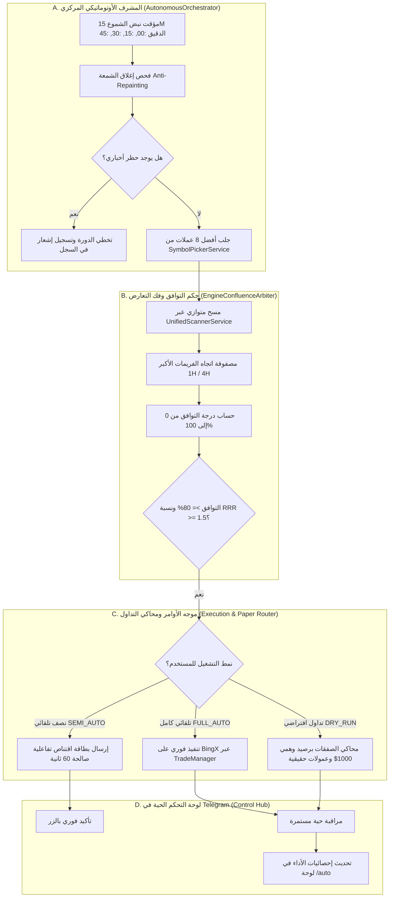

# 💎 وثيقة المعمارية الهندسية الشاملة لمنظومة التداول الذاتي الفائق
## PRODUCTION AUTONOMOUS QUANT TRADING ENGINE (V2)
> **الميثاق الهندسي والكمي الموحد لتحويل البوت إلى صندوق تداول خوارزمي ذاتي التشغيل (Autonomous Hedge-Fund Grade Engine) يجمع بين الرياضيات الصرفة، الذكاء الاصطناعي لحماية رأس المال، ومحاكاة التداول الحية.**

---

## 🧭 1. الفلسفة الجوهرية والميزة الكمية (The Quantitative Edge)

الهدف من هذه المنظومة ليس التخمين أو التنبؤ العشوائي، بل تطبيق **قانون الأعداد الكبيرة (Law of Large Numbers)** و **الميزة الإحصائية الموجبة (Positive Expectancy)**:

$$\mathbb{E} = (W \times R_{win}) - (L \times R_{loss})$$

حيث:
* $W$: معدل الصفقات الرابحة (Win Rate $\ge 52\%$).
* $L$: معدل الصفقات الخاسرة ($1 - W \le 48\%$).
* $R_{win}$: متوسط العائد عند الربح (لا يقل عن $1.5$ إلى $2.5$ ضعف المخاطرة).
* $R_{loss}$: متوسط الخسارة عند ضرب الوقف (محصور دائماً عند $1.0$ وحدة مخاطرة $R$).

إذا حافظ النظام على هذه المعادلة عبر 100 صفقة، فإن نمو المحفظة حتمي رياضياً بغض النظر عن النتيجة الفردية لأي صفقة.

---

## 🏛️ 2. جرد البنية التحتية القائمة (Codebase Assets & Reusable Foundation)

يمتلك المشروع بالفعل مكونات برمجية استثنائية تم فحصها داخل `src/`. المنظومة الجديدة لن تعيد اختراع العجلة، بل ستوظف وتنسق هذه الكنوز البرمجية في حلقة ذاتية مستمرة:

| المكون الحالي في الكود | المسار في المشروع | الحالة الحالية | الدور في المنظومة الذاتية V2 |
| :--- | :--- | :--- | :--- |
| **محركات التحليل V1 - V18** | `src/core/analysis/engines/` | جاهزة ومكتملة رياضياً | فحص مؤشرات الزخم، السيولة، SMC، وWyckoff. |
| **منظومة الهارمونيك الكاملة** | `src/core/analysis/engines/HarmonicMasterEngine.ts` | 11 نموذجاً رقمياً دقيقاً | تحديد مناطق الانعكاس المحتملة (PRZ). |
| **محركات الاقتناص السريعة** | `src/core/sniper/` & `SniperManager.ts` | جاهزة بدورة 60 ثانية | رصد نقاط الدخول الصفرية (Zero Drawdown Entries). |
| **مدير المخاطر والأوامر** | `src/services/TradeManager.ts` | جاهز ومتقدم | التحجيم الديناميكي، حظر التعارض، وتوزيع TP1-TP3. |
| **قاطع الدائرة اليومي** | `src/services/CircuitBreakerService.ts` | جاهز (4% تراجع = حظر 12h) | قاطع أمان طوارئ لمنع انهيار الحساب. |
| **فلتر الأخبار العالمية** | `src/services/MacroCalendarService.ts` | جاهز ومربوط بتحديث آلي | حظر التداول قبل الأخبار العاصفة بـ 15 دقيقة وبعدها بـ 30 دقيقة. |
| **حاسبة معامل الارتباط** | `src/services/CorrelationGuardService.ts` | جاهزة (Pearson $\le 0.80$) | منع فتح صفقات متطابقة الاتجاه لحماية المحفظة. |
| **رادار المراقبة والإبطال** | `src/services/PositionMonitor.ts` | جاهز (BE, Trailing, Flip, Freeze) | تأمين الصفقات عند TP1، وتفعيل الوقف المتحرك والخروج المبكر. |
| **محرك فرز واختيار العملات** | `src/services/SymbolPickerService.ts` | جاهز (حجم، تقلب، زخم) | الفرز الدوري لقائمة أفضل 8 عملات صالحة للتداول. |

---

## 🧩 3. المكونات الهندسية الجديدة المطلوب بناؤها (The Missing Pillars)

لتحويل النظام من نمط "الانتظار اليدوي لأوامر تيليجرام" إلى نمط "المحرك الذاتي الكامل"، سنبني **أربعة ركائز هندسية جديدة**:

---

## ⚙️ 4. تفاصيل المكونات الهندسية ومواصفاتها البرمجية

### 1) المشرف المركزي الذاتي (`AutonomousOrchestrator.ts`)
* **مكان الملف المقترح:** `src/services/AutonomousOrchestrator.ts`
* **المسؤوليات:**
  1. العمل كـ `Daemon Service` مستمر في الخلفية، يبدأ تلقائياً عند تشغيل السيرفر (`src/index.ts`).
  2. التزامن الصارم مع ثواني إغلاق الشموع:
     - دورة الفرز الساعي: كل ساعة عند الدقيقة 00 لتحديث قائمة العملات الـ 8 المفضلة.
     - دورة الاقتناص والتحليل: كل **15 دقيقة** فور إغلاق شمعة الـ 15M (في الثواني 02 إلى 05 من الدقائق: 00، 15، 30، 45) لتفادي إعادة الرسم (Anti-Repainting).
  3. إدارة حصص الاستعلام (Rate Limit Budgeting): تقسيم جلب البيانات على دفعات (Batches) لتفادي حظر الـ IP من BingX/CCXT.
  4. استدعاء `MacroCalendarService` و `CircuitBreakerService` قبل إطلاق أي مسح.

---

### 2) حكم التوافق وفك تعارض الاستراتيجيات (`EngineConfluenceArbiter.ts`)
* **مكان الملف المقترح:** `src/core/analysis/EngineConfluenceArbiter.ts`
* **المسؤوليات:**
  1. **حل تضارب الفريمات (Multi-Timeframe Hierarchy):**
     - الاتجاه الحاكم (Macro Bias) يؤخذ حصراً من فريمات **4H و 1H** عبر مؤشرات (EMA 200, SuperTrend, Cloud Renko V14).
     - إذا كان اتجاه 1H و 4H صاعداً (`BULLISH`)، **يُمنع منعاً باتاً فتح صفقات بيع (SHORT) مهما كانت إشارة فريم 5M أو 15M مغرية**، والعكس صحيح.
  2. **معادلة التوافق التراكمي (Weighted Confluence Scoring):**
     $$Score = \sum_{i=1}^{N} (w_i \times \text{Confidence}_i)$$
     حيث تُعطى الأوزان الأعلى لمحركات السيولة والهارمونيك والمفاهيم المؤسساتية:
     - محركات النخبة ($w = 1.3$): `V16` (مصفوفة الزمان والمكان)، `V15` (تشان والهارمونيك)، `HARMONIC` (النماذج الرقمية)، `V10` (المؤسساتي المتقدم).
     - محركات السيولة ($w = 1.1$): `V12` (CVD تدفق السيولة)، `V13` (وايكوف)، `V9` (SMC).
     - محركات التأكيد ($w = 0.8$): `V1`، `V3`، `V6`.
  3. **شرط الإطلاق:** درجة توافق إجمالية $\ge 80\%$ مع نسبة $RRR \ge 1.5$ وخلو الأصل من أي تجميد سابق (`FrozenPairsRegistry`).

---

### 3) محاكي التداول الافتراضي الكامل (`PaperTradingEngine.ts`)
* **مكان الملف المقترح:** `src/services/PaperTradingEngine.ts`
* **المسؤوليات:**
  1. توفير بيئة رملية آمنة (Sandbox) لا تحتاج إلى إيداع أي أموال حقيقية في المنصة.
  2. محاكاة دقيقة 100% للواقع المالي، تشمل:
     - **عمولة المنصة (Trading Fees):** خصم $0.02\%$ لأوامر الصانع (Maker) و $0.05\%$ لأوامر السوق (Taker).
     - **الانزلاق السعري المحاكى (Slippage):** احتساب انزلاق سلبي بمقدار $0.03\%$ إلى $0.05\%$ على أوامر الماركت ووقف الخسارة.
     - **حساب الأرباح والخسائر اللحظية** باستخدام أسعار السوق الحقيقية القادمة من BingX.
  3. تسجيل وتخزين الصفقات الافتراضية في قاعدة البيانات MongoDB (مع وسم `isPaperTrade: true`).
  4. حساب مؤشرات الجودة الإلزامية للمرور للحساب الحقيقي:
     - معدل الفوز (Win Rate).
     - معامل الربحية (Profit Factor = Gross Profit / Gross Loss).
     - أقصى تراجع تراكمي (Max Drawdown %).
     - معامل شارب (Sharpe Ratio).

---

### 4) لوحة التحكم الذاتي في التيليجرام (`autonomousHandlers.ts` & Keyboards)
* **المسؤوليات:**
  1. أمر `/auto` يفتح لوحة معلومات شاملة توضح:
     - حالة المحرك الذاتي: 🟢 يعمل | 🔴 متوقف.
     - النمط المعتمد: `[محاكاة افتراضية]` | `[نصف تلقائي]` | `[تلقائي كامل]`.
     - عدد الصفقات النشطة وحرارة المحفظة الحالية.
     - قائمة العملات المراقبة حالياً (Top Watchlist).
     - إحصائيات الـ 24 ساعة الماضية (الربح، الصفقات، التراجع).
  2. أزرار تفاعلية فورية لتغيير النمط وضبط أقصى مخاطرة مسموحة بنقرة واحدة.

---

## 📊 5. مصفوفة قواعد وإدارة المخاطر الصارمة (Risk Constraints)

| المعيار | القيمة المحددة | سبب الإلزام البرمجي |
| :--- | :--- | :--- |
| **المخاطرة لكل صفقة (Risk Per Trade)** | **$1.0\%$ إلى $1.5\%$** من رأس المال | منع استنزاف المحفظة عند توالي الخسائر الإحصائية. |
| **أقصى صفقات متزامنة (Max Concurrent)** | **3 صفقات كحد أقصى مطلق** | تركيز الهامش ومنع تشبع المحفظة. |
| **أقصى حرارة للمحفظة (Max Portfolio Heat)** | **$4.5\%$** (مجموع مخاطر الصفقات الـ 3) | ضمان عدم تعريض أكثر من 4.5% من الحساب للخطر في أي وقت. |
| **سقف التراجع اليومي (Circuit Breaker)** | **-4.0%** خلال 24 ساعة | إيقاف التداول الذاتي فوراً لمدة 12 ساعة لتفادي انهيارات السوق. |
| **حظر التداول المتطابق (Correlation Cap)** | معامل بيرسون $> 0.80$ | منع شراء عملتين تتحركان كمرآة لبعضهما ومضاعفة المخاطرة دون وعي. |
| **قفل التجميد بعد الخسارة (Loss Cooldown)** | **120 دقيقة (ساعتان)** | منع التداول الانتقامي (Revenge Trading) على نفس العملة. |
| **حظر الأخبار (Macro Event Blackout)** | 15 دقيقة قبل الخبر و 30 دقيقة بعده | تفادي الذيول القاتلة والانزلاق السعري العنيف في أخبار الفائدة والتضخم. |

---

## 🛠️ 6. الخطة التنفيذية الهندسية ومراحل العمل (Actionable Execution Plan)

### المرحلة 1: بناء المشرف المركزي الذاتي وتزامن الشموع (Days 1 - 2)
* إنشاء كائن `AutonomousOrchestrator.ts`.
* برمجة مؤقت التزامن مع إغلاق شمعة الـ 15 دقيقة والفرز الساعي.
* ربط فحص الأخبار `MacroCalendarService` وقاطع الدائرة `CircuitBreakerService` في مقدمة الحلقة.

### المرحلة 2: بناء حكم التوافق وفك التعارض `EngineConfluenceArbiter.ts` (Day 3)
* تجميع محركات V1-V18 ومنظومة الهارمونيك في هيكل موحد.
* تطبيق مصفوفة الترجيح للأوزان واشتراط توافق الفريمات الأكبر (1H/4H).
* استخراج إشارات الدخول المكتملة بأهدافها والوقف ونسبة RRR.

### المرحلة 3: بناء محاكي التداول الافتراضي المتكامل `PaperTradingEngine.ts` (Day 4)
* تصميم مخطط البيانات `PaperTrade` و `PaperAccount` في MongoDB.
* تطبيق معادلات خصم العمولات والانزلاق السعري وتحديث الأسعار عبر `PositionMonitor`.
* برمجة وحدة إحصاء مؤشرات الأداء (Sharpe, Profit Factor, Win Rate, Drawdown).

### المرحلة 4: ربط موجه التنفيذ ولوحة تحكم التيليجرام `/auto` (Day 5)
* ربط الأنماط الثلاثة: (تلقائي كامل، نصف تلقائي ببطاقة تأكيد 60 ثانية، ومحاكاة افتراضية).
* بناء لوحة تحكم تيليجرام تفاعلية أنيقة بأزرار سريعة للتشغيل والتحكم في الإعدادات.
* تعديل `src/index.ts` لتشغيل المشرف الذاتي كخدمة دائمة في النظام.

### المرحلة 5: الاختبار الميداني في بيئة المحاكاة والتحقق من المؤشرات (Sandbox Testing)
* تشغيل البوت في نمط `PAPER_TRADING` وتسجيل أول 30 إلى 60 صفقة افتراضية كاملة.
* التحقق التلقائي من اجتياز عتبات المرور (Win Rate $\ge 52\%$, Profit Factor $\ge 1.65$).

### المرحلة 6: الإطلاق الحقيقي التدريجي (Phased Live Rollout)
* التبديل إلى نمط `SEMI_AUTO` أو `FULL_AUTO` برأس مال صغير (100 - 300 دولار) للتحقق من تنفيذات BingX الواقعية، ثم التوسع التدريجي بأمان تام.

---

*هذه الوثيقة تمثل المرجع المعماري النهائي لتحويل مشروعك إلى منظومة تجارية كمية ذاتية التشغيل بالكامل.*
