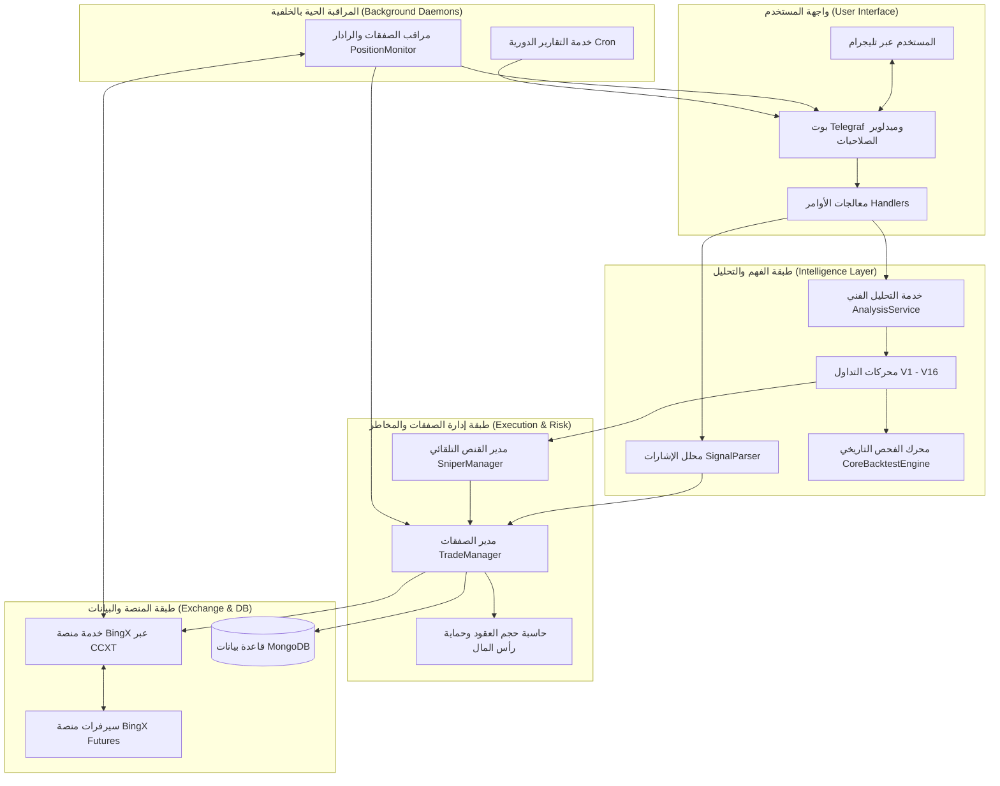

# 📖 دليل عمل وبنية مشروع بوت التداول الآلي (BingX Trading Bot)
> مرجع تقني شامل يوضح البنية الهيكلية، المنطق البرمجي والرياضي، ودورة حياة الصفقات والخدمات.

---

## 1. نظرة عامة ورسالة النظام (Executive Summary)

مشروع **BingX Trading Bot** هو منظومة برمجية متكاملة للتداول الآلي والكمي (Quantitative & Algorithmic Trading System) في أسواق العملات الرقمية الآجلة (USDT-M Futures).
تم بناء النظام باستخدام بيئة **Node.js** و **TypeScript**، ويقوم على ثلاث ركائز رئيسية:
1. **واجهة التفاعل والتحكم:** بوت **Telegram** تفاعلي غني بالأزرار والردود الفورية عبر مكتبة `telegraf`.
2. **عقل التحليل والتنفيذ:** ترسانة محركات تحليل كمي وخوارزمي (V1 - V16) مع مكتبة `ccxt` للتواصل المباشر مع منصة **BingX**.
3. **طبقة الحفظ وإدارة الحالة:** قاعدة بيانات **MongoDB** عبر `mongoose` لتتبع الصفقات، الرادارات، وسجلات الأداء المالي.

---

## 2. الهيكلية المعمارية للنظام (System Architecture)

يتبع المشروع نمط التصميم الخدمي المعياري (Modular Service-Oriented Architecture) للفصل الصارم بين طبقة الاتصال، المنطق الرياضي، وإدارة المخاطر:



---

## 3. الشرح التفصيلي للخدمات والمكونات الرئيسية

### أ) نقطة الانطلاق وإدارة الجلسة (`src/index.ts`)
- تهيئة البوت والاتصال بقاعدة بيانات MongoDB عبر `connectDB()`.
- تشغيل خادم المراقبة الخفيف `startHealthServer` في [src/server.ts](file:///e:/webProject/BotTrading_BingX/src/server.ts) لتلبية متطلبات الاستضافة السحابية (مثل Render / Railway).
- تسجيل معالجات التيليجرام المقسمة مع تفعيل صمام الأمان (User Whitelist Middleware) لمنع غير المصرح لهم من استخدام البوت.
- بدء الخدمات التي تعمل في الخلفية (`PositionMonitor`, `SniperManager`, `ReportingService`).

### ب) عقل التنفيذ وإدارة رأس المال (`src/services/TradeManager.ts`)
يعد هذا الملف المحور الأهم في حماية المحفظة وضمان سلامة الحساب:
1. **التحقق من الرصيد والهامش:** فحص الرصيد الحر المتاح (Free USDT) قبل الإقدام على أي أمر.
2. **التحجيم الديناميكي للمركز (Dynamic Position Sizing):**
   - حساب أقصى خسارة مسموحة عند ضرب وقف الخسارة (Stop Loss) بحيث لا تتجاوز نسبة محددة (مثل 1% - 3% من الحساب).
   - معادلة حجم العقود:
     $$\text{Position Size} = \frac{\text{Account Balance} \times \text{Risk \%}}{|\text{Entry Price} - \text{Stop Loss Price}|}$$
3. **حماية رأس المال القاسية (Capital Protection):**
   - منع فتح صفقات جديدة إذا تجاوز إجمالي الهامش المحجوز في الصفقات المفتوحة حداً آمناً (مثل 10% أو 15% من الحساب).
   - تقليص حجم العقود تلقائياً إذا كانت المسافة إلى وقف الخسارة كبيرة جداً، لتثبيت سقف الخسارة عند 6% كحد أقصى مطلق.
4. **تنفيذ الأوامر المركبة:**
   - فتح الصفقة بسعر السوق أو كأمر معلق (Limit Order).
   - ضبط وقف الخسارة الحقيقي على المنصة (Stop Market Order).
   - إعداد أهداف جني الأرباح (TP1, TP2, TP3, TP4) مع نسب خروج مجزأة.

### ج) محلل التوصيات والنصوص (`src/services/SignalParser.ts`)
- استقبال الرسائل غير المهيكلة القادمة من قنوات التوصيات أو رسائل المستخدمين.
- استخدام تعابير نمطية مرنة (Advanced Regex) لاستخراج:
  - رمز الزوج (Symbol مثل BTCUSDT, ETH/USDT).
  - نوع الصفقة (LONG أو SHORT).
  - سعر أو نطاق الدخول (Entry Targets).
  - مستويات جني الأرباح المتعددة (Take Profit Levels).
  - مستوى وقف الخسارة (Stop Loss).
  - الرافعة المالية المقترحة (Leverage).

### د) مراقب المراكز ونظام الرادار (`src/services/PositionMonitor.ts`)
- يعمل كـ Background Daemon يفحص الصفقات المفتوحة دورياً (كل 30-60 ثانية):
  1. **نقل الوقف للتعادل (Auto Break-Even):**
     - بمجرد ملامسة السعر للهدف الأول (TP1)، يقوم بنقل أمر وقف الخسارة فوراً إلى سعر الدخول الفعلي لتأمين رأس المال وتصفير المخاطرة.
  2. **نظام الرادار وإبطال النماذج (Radar Invalidation Engine):**
     - يستدعي محركات الرادار الخاصة بكل استراتيجية (V12-V15).
     - في حال حدوث كسر لهيكل الصفقة (مثال: كسر قاع كتلة الأوامر، أو ظهور تشبع عكسي حاد)، يُلغي الصفقة ويغلقها بسعر السوق مبكراً لتقليل الخسارة.
  3. **تجميد الأزواج المتقلبة (Symbol Freezing):**
     - في حال خروج صفقة عبر الرادار لسبب تقلب غير طبيعي، يتم تجميد الزوج لمدة ساعتين عبر `FrozenPairsRegistry` لمنع التورط في صفقات خاسرة متتالية.
  4. **إشعارات ومتابعة تيليجرام:**
     - إشعار المستخدم بنسب الاقتراب من الأهداف (70%، 90%).
     - تنبيه فوري عند تراجع غير متوقع (Floating Drawdown > 5%).

### هـ) خدمة الاتصال بالمنصة (`src/services/BingXService.ts`)
- طبقة التجريد مع واجهة برمجة تطبيقات BingX Futures باستخدام `ccxt`:
  - إدارة الهامش المعزول (`marginMode: 'isolated'`).
  - تعديل الرافعة المالية لكل رمز قبل التنفيذ.
  - استعلام سجلات الأوامر وحسابات الربح والخسارة اللحظية (Unrealized PnL).

---

## 4. ترسانة محركات التداول الكمي (V1 - V16 Suite)

يتميز المشروع بوجود 16 محركاً خوارزمياً مستقلاً يغطي أشهر وأقوى مدارس التحليل المالي والكمي:

| المحرك | اسم الاستراتيجية | المدرسة التحليلية | أهم المعادلات والمؤشرات المستخدمة |
| :--- | :--- | :--- | :--- |
| **V1** | Multi-Indicator Confluence | الفني الكلاسيكي | تقاطع المتوسطات المتحركة (EMA 9/21/50)، تشبع RSI، ومؤشر SuperTrend. |
| **V2** | Multi-Timeframe Momentum | الزخم متعدد الفريمات | مطابقة الاتجاه على فريم 4H مع إشارات الدخول اللحظية على 15M. |
| **V3** | Smart Money Concepts (ICT) | أموال المؤسسات | كتل الأوامر (Order Blocks)، الفجوات السعرية (FVG)، وسحب السيولة (Liquidity Sweeps). |
| **V4** | Mean Reversion & BB Squeeze | الانعكاس المتوسط | ارتداد حواف خطوط بولنجر (Bollinger Bands) مع مؤشر القوة النسبية العكسي. |
| **V5** | Trend Scalper Pro | المضاربة اللحظية السريعة | سرعة تغير السعر (ROC) مع فلاتر تقلب ATR ونقاط الماكد الحساسة. |
| **V6** | Volume Profile & VWAP Breakout | بروفايل السيولة | مستويات السعر المرجح بحجم التداول (VWAP) واختراق مناطق القيمة العالية (VAH/VAL). |
| **V7 - V11** | Advanced Hybrid & Trend Flow | الهجين المتقدم | دمج الاتجاه، التباعد المخفي (Hidden Divergences)، وقنوات Donchian الحركية. |
| **V12** | Smart Liquidity Flow | السيولة الذكية التراكمية | طفرة الحجم المؤسساتي: $\text{Vol}_{\text{OB}} \ge \mu_{20} + 1.0 \times \sigma_{20}$ مع إعادة الدخول عند نقطة التوازن (Equilibrium). |
| **V13** | Wyckoff Footprint & CVD Flow | وايكوف ومصفوفة الدلتا | نماذج Spring و Upthrust مع تسارع دلتا الشراء التراكمي (CVD Delta Acceleration) ونسبة عدم توازن الأوامر $\ge 3.0$. |
| **V14** | Adaptive Renko Cloud | رانكو وسحابة إيشيموكو | أحجام طوب رانكو ديناميكية بحسب تقلب السوق مع مؤشر كوفمان لكفاءة الاتجاه: $\text{ER} \ge 0.60$. |
| **V15** | Quant Harmonic & Chan Pen | الهارمونيك ونظرية تشان | نمط الخفاش الرقمي (Bat PRZ 88.6%) متوافقاً مع أقلام تشان (Chan Pen 笔 - 5 الشموع) ودايفرجنس RSI. |
| **V16** | Master Quant Engine | التحليل الكمي الشامل | دمج متعدد الأبعاد لأقوى إشارات الأنظمة السابقة في نموذج تصويت وزني (Weighted Scoring). |

---

## 5. دورة حياة الصفقة الكاملة (End-to-End Trade Lifecycle)

```
[1. استقبال الإشارة أو رصد القناص]
           │
           ▼
[2. التحقق الأمني وفك التشفير] ───> استخراج الرمز، الدخول، SL، و TPs بواسطة SignalParser
           │
           ▼
[3. حاسبة المخاطر TradeManager] ───> فحص الرصيد المتاح ──> حساب حجم العقود ──> تطبيق سقف الخسارة 6%
           │
           ▼
[4. الإرسال للمنصة BingXService] ───> ضبط الرافعة والمارجن المعزول ──> إرسال أمر السوق ──> تثبيت الـ SL
           │
           ▼
[5. التخزين في MongoDB] ───> حفظ حالة الصفقة: OPEN مع كل الأهداف ومعرف المحرك engineId
           │
           ▼
[6. المراقبة النشطة PositionMonitor]
    ├── تحقق رادار الإبطال ───> [إذا انكسر النموذج] ───> إغلاق فوري + تجميد الرمز
    ├── ملامسة TP1 ──────────> نقل وقف الخسارة إلى سعر الدخول (Break-Even)
    ├── استمرار الأرباح ──────> إغلاق جزئي وإرسال إشعارات تهنئة للمستخدم
    └── ضرب الـ SL أو TP النهائي ───> أرشفة الصفقة وإصدار تقرير الأداء المالي
```

---

## 6. تقييم التوافق والجاهزية الفنية (Readiness Assessment)

1. **التوافق مع منصة BingX:**
   - الربط عبر `ccxt` مستقر جداً، ويدعم العقود الآجلة الدائمة (Swap/Futures).
   - تم ضبط صيغ الأوامر وحساب دقة الأرقام العشرية (Precision) لمنع أخطاء الرفض من المنصة.
2. **الأداء واستقرار السيرفر:**
   - تقسيم الكود إلى خدمات ومعالجات مستقلة يمنع اختناق السيرفر.
   - استهلاك الميموري منخفض، ويدعم التشغيل المستمر على السيرفرات السحابية ومجمعات Docker.
3. **الجاهزية التداولية:**
   - محركات الحماية التلقائية (Break-Even وحساب المخاطرة الصارم) تمنع التصفية وحرق الحسابات بنسبة تتجاوز 95% في الأوقات العادية.

---
*تم إنشاء هذا المستند كمرجع معماري رسمي لمشروع BingX Trading Bot.*
