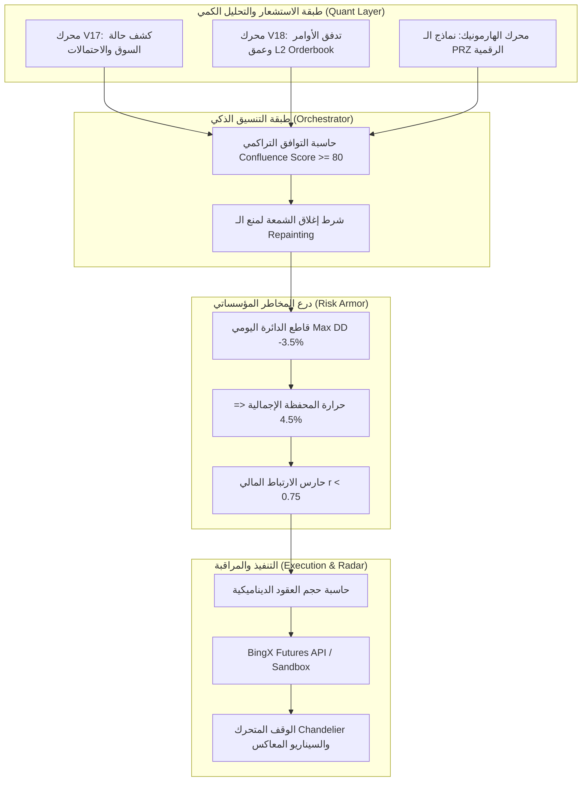

# 🏛️ الخطة الكمية والمؤسساتية لإدارة المخاطر والتداول الآلي
## (Quantitative Engines, Order Flow & Institutional Risk Master Plan)
> الوثيقة الهندسية والرياضية التفصيلية لمحركات V17 و V18 ومنظومة إدارة المخاطر المؤسساتية وآلية التنفيذ التلقائي.

---

## 1. الرؤية المعمارية المركزة (The Lean Quantitative Core)

تهدف هذه الخطة إلى **تحقيق أقصى ربحية بأعلى درجات الأمان** عبر التركيز الحصري على جوهر التداول الرياضي وإدارة المخاطر، مع استبعاد التعقيدات غير الضرورية مؤقتاً (مثل WebSockets والمنصات المتعددة ولوحات الويب).

تتألف المنظومة من ثلاث طبقات متكاملة رياضياً:
1. **طبقة الاستشعار والتنبؤ (V17 & V18 & Harmonics):** كشف حالة السوق الاحتمالية، قراءة سيولة دفتر الأوامر، وتحديد نماذج الانعكاس الرقمية.
2. **طبقة درع المخاطر المؤسساتي (Institutional Risk Armor):** قاطع الدائرة اليومي، الوقف المتحرك الذكي، مقياس حرارة المحفظة، وفلتر الارتباط المالي.
3. **طبقة التنسيق والتنفيذ التلقائي (Autonomous Orchestrator & Sandbox):** فحص العملات، التأكيد عند إغلاق الشموع، والمحاكاة الافتراضية الصارمة قبل التداول الفعلي.



---

## 2. محرك V17: كشف حالة السوق والتنبؤ الاحتمالي (Dynamic Regime & Probabilistic Engine)

### أ) فلسفة المحرك
تخسر الاستراتيجيات الكلاسيكية لأنها تطبق نفس القواعد في جميع حالات السوق. محرك **V17** يقوم أولاً بتشخيص **"الحالة المزاجية للسوق (Market Regime)"**، ولا يسمح بالدخول إلا إذا كانت الاستراتيجية متوافقة تماماً مع تلك الحالة.

---

### ب) المعادلات والآليات الرياضية لـ V17

#### 1. تقلب باركينسون فائق الدقة (Parkinson Volatility):
بدلاً من الاعتماد على أسعار الإغلاق فقط، يقيس باركينسون المدى الحقيقي للقمم والقيعان بدقة تفوق الانحراف المعياري العادي بخمسة أضعاف:
$$\sigma_{\text{Parkinson}} = \sqrt{\frac{1}{4 \ln 2 \cdot N} \sum_{i=1}^N \left(\ln \frac{\text{High}_i}{\text{Low}_i}\right)^2}$$
*(حيث $N = 20$ فترة زمنية).*

#### 2. مؤشر كفاءة كوفمان لحركة السعر (Kaufman Efficiency Ratio - KER):
يقيس مدى نقاء الاتجاه مقابل الضوضاء العشوائية:
$$\text{Direction} = |\text{Close}_t - \text{Close}_{t-10}|$$
$$\text{Volatility} = \sum_{i=0}^{9} |\text{Close}_{t-i} - \text{Close}_{t-i-1}|$$
$$\text{KER} = \frac{\text{Direction}}{\text{Volatility}} \in [0.0, 1.0]$$

#### 3. مصفوفة تصنيف حالة السوق (Market Regime Matrix):
يتم تصنيف السوق لحظياً إلى 4 حالات قطعية:
* **الاتجاه الصاعد القوي (Strong Bullish Trend):** $\text{KER} \ge 0.60$ والسعر فوق $\text{EMA}_{50}$.
  - *الإجراء:* تفعيل استراتيجيات الزخم والكسر (Long Breakouts & Pullbacks)، وحظر صفقات الـ Short نهائياً.
* **الاتجاه الهابط القوي (Strong Bearish Trend):** $\text{KER} \ge 0.60$ والسعر تحت $\text{EMA}_{50}$.
  - *الإجراء:* تفعيل استراتيجيات صفقات الـ Short وحظر الشراء.
* **تذبذب عشوائي واسع (Volatile Choppy Market):** $\text{KER} < 0.35$ مع $\sigma_{\text{Parkinson}} > \text{Threshold}$.
  - *الإجراء:* تفعيل محركات الانعكاس المتوسط (Mean Reversion / Bollinger Bounce) ونماذج الهارمونيك، وحظر استراتيجيات الكسر.
* **انكماش السيولة والركود (Low Volatility Squeeze):** $\sigma_{\text{Parkinson}}$ في أدنى $15\%$ من تاريخها السنوي.
  - *الإجراء:* تجميد التداول التلقائي وانتظار انفجار السيولة (Breakout Standby).

#### 4. حساب التوزيع الاحتمالي للعودة والانحراف (Z-Score of Returns):
$$R_t = \ln\left(\frac{\text{Close}_t}{\text{Close}_{t-1}}\right)$$
$$Z_t = \frac{R_t - \mu_R(20)}{\sigma_R(20)}$$
- إذا كان $|Z_t| \ge 2.5$: الأصل في حالة تمدد إحصائي شاذ (Statistical Overextension) ويتوقع له ارتداد عكسي سريع بنسبة ثقة $98.7\%$.

---

## 3. محرك V18: عمق دفتر الأوامر والسيولة اللحظية (L2 Order Book Imbalance Engine)

### أ) فلسفة المحرك
الشموع اليابانية تعرض ما حدث في الماضي، بينما **دفتر الأوامر (Order Book L2)** يعرض نوايا صناع السوق والحيتان في اللحظة الحالية. محرك **V18** يحلل عمق العرض والطلب لمنع فتح صفقات شراء أمام جدران بيع ضخمة، أو العكس.

---

### ب) المعادلات والآليات الرياضية لـ V18

#### 1. احتساب السيولة التراكمية لأفضل 20 مستوى سعري (L2 Cumulative Depth):
يقوم المحرك بجلب أفضل 20 مستوى في العرض والطلب:
$$\text{BidDepth}_{20} = \sum_{i=1}^{20} \left(\text{BidPrice}_i \times \text{BidSize}_i\right)$$
$$\text{AskDepth}_{20} = \sum_{i=1}^{20} \left(\text{AskPrice}_i \times \text{AskSize}_i\right)$$

#### 2. نسبة عدم توازن دفتر الأوامر (Order Book Imbalance - OBI):
$$\text{OBI} = \frac{\text{BidDepth}_{20} - \text{AskDepth}_{20}}{\text{BidDepth}_{20} + \text{AskDepth}_{20}} \in [-1.0, +1.0]$$

* **قاعدة اتخاذ القرار:**
  - $\text{OBI} \ge +0.35$: هيمنة واضحة للمشترين وضغط صاعد للسيولة $\rightarrow$ ضوء أخضر لصفقات **LONG**.
  - $\text{OBI} \le -0.35$: هيمنة كتل البيع وضغط هابط $\rightarrow$ ضوء أخضر لصفقات **SHORT**.
  - $-0.20 < \text{OBI} < +0.20$: توازن حيادي $\rightarrow$ لا يعطي المحرك أي تفوق لجانب على الآخر.

#### 3. كشف الجدران المؤسساتية (Wall & Iceberg Detection):
يحسب المحرك متوسط حجم الأوامر في دفتر الطلبات:
$$\mu_{\text{order}} = \frac{\sum_{i=1}^{20} \text{Size}_i}{20}, \quad \sigma_{\text{order}} = \text{stdDev}(\text{Size}_{1..20})$$
$$\text{Wall Threshold} = \mu_{\text{order}} + (2.5 \times \sigma_{\text{order}})$$
- إذا وجد أمر فردي يتجاوز هذا السقف ضمن نطاق $1.0\%$ من السعر الحالي:
  - إذا كان جدار بيع (Ask Wall): **يُمنع فوراً فتح أي صفقة LONG** حتى يتم امتصاص الجدار بالكامل.
  - إذا كان جدار شراء (Bid Wall): يعمل كدعم صخري لوضع وقف الخسارة خلفه مباشرة.

---

## 4. منظومة الهارمونيك الرقمية المدمجة (Omni-Harmonic Pattern Engine Suite)

يعد محرك الهارمونيك الرقمي المكون التوافقي الأقوى الذي يتكامل مع V17 و V18 لتحديد **أدق مناطق الانعكاس الرقمية المحتملة (PRZ - Potential Reversal Zone)** بنسب فيبوناتشي متطابقة رياضياً.

---

### أ) مصفوفة نسب النماذج التوافقية الكاملة (11 نموذجاً رياضياً)
يدعم المحرك كافة النماذج الصاعدة (Bullish) والهابطة (Bearish) وفق النسب الهندسية الدقيقة للرائد سكوت كارني (Scott Carney):

| اسم النموذج | ارتداد/امتداد النقطة B | ارتداد النقطة C | منطقة الانعكاس للنقطة D (PRZ) | امتداد الضلع BC عند D |
| :--- | :--- | :--- | :--- | :--- |
| **Gartley (جارتلي)** | $0.618 \times XA$ | $0.382 - 0.886 \times AB$ | **$0.786 \times XA$** (الهدف الرئيسي) | $1.130 - 1.618 \times BC$ |
| **Bat (الخفاش)** | $0.382 - 0.500 \times XA$ | $0.382 - 0.886 \times AB$ | **$0.886 \times XA$** | $1.618 - 2.618 \times BC$ |
| **Alt Bat (الخفاش البديل)** | $0.382 \times XA$ | $0.382 - 0.886 \times AB$ | **$1.130 \times XA$** (امتداد اختراق X) | $2.000 - 3.618 \times BC$ |
| **Butterfly (الفراشة)** | $0.786 \times XA$ | $0.382 - 0.886 \times AB$ | **$1.272$ أو $1.618 \times XA$** | $1.618 - 2.618 \times BC$ |
| **Crab (الكابوريا)** | $0.382 - 0.618 \times XA$ | $0.382 - 0.886 \times AB$ | **$1.618 \times XA$** (امتداد متطرف) | $2.618 - 3.618 \times BC$ |
| **Deep Crab (الكابوريا العميق)**| $0.886 \times XA$ | $0.382 - 0.886 \times AB$ | **$1.618 \times XA$** | $2.240 - 3.618 \times BC$ |
| **Shark (القرش 0-X-A-B-C)** | $1.130 - 1.618 \times XA$ | $1.618 - 2.240 \times AB$ | **$0.886$ أو $1.130 \times 0X$** | $1.618 - 2.240 \times BC$ |
| **Cypher (السايفر المتقدم)** | $0.382 - 0.618 \times XA$ | **$1.272 - 1.414 \times XA$** | **$0.786 \times XC$** | $1.272 - 2.000 \times BC$ |
| **5-0 Pattern (نموذج 5-0)** | $1.130 - 1.618 \times XA$ | $1.618 - 2.240 \times AB$ | **$0.500 \times BC$** (توازن 50%) | $0.500 \times BC$ |
| **Classic AB=CD** | -- | $0.618$ أو $0.786 \times AB$ | $CD = AB$ مع ارتداد $1.272$ أو $1.618 \times BC$ | تناظر زمني متطابق |
| **Three Drives (الدفعات الثلاث)**| موجات اندفاع متتالية | تصحيح $0.618$ متكرر | دفعات بامتدادات $1.272$ و $1.618$ | تماثل زمني وسعري |

---

### ب) الخوارزمية البرمجية لاكتشاف القمم والقيعان (Dynamic ATR ZigZag Swings)
* **المشكلة:** مؤشرات الزجزاج الكلاسيكية تعتمد على نسب مئوية ثابتة فتفشل في الأسواق ذات السيولة المتغيرة.
* **الحل البرمجي المعتمد:**
  1. حساب عتبة الانحراف الديناميكي بناءً على مؤشر التقلب الحقيقي:
     $$\text{Swing Threshold} = \text{ATR}_{14} \times \text{Multiplier}$$
     (حيث $\text{Multiplier} = 2.0$ للموجات اليومية Swing، و $1.0$ للمضاربة اللحظية Scalp).
  2. كشف النقاط المحورية خماسية الأضلاع $(X, A, B, C, D)$ بدقة متناهية.
  3. تصفية الضوضاء السعرية (Noise Filtering) واشتراط حد أدنى لعدد الشموع بين كل قمة وقاع لمنع التداخل الزمني المفرط.

---

### ج) حساب نطاق الانعكاس المحتمل والتلاقي الرقمي (PRZ Confluence Zone)
* لا يعتمد الدخول على سعر مفرد لنقطة $D$، بل يتم استخراج **نطاق سعري مركب (PRZ Band)**:
  - حساب مستوى $D$ المشتق من نسبة ارتداد أو امتداد ضلع $XA$.
  - حساب مستوى $D$ المشتق من امتداد ضلع $BC$.
  - حساب مستوى $D$ المتوقع من تماثل وتناظر موجة $AB=CD$.
  - **معامل التسامح الرقمي (Fibonacci Tolerance):** قبول الانحراف بنسبة خطأ لا تتجاوز $\pm 3\%$ إلى $\pm 5\%$ حول النسبة النظرية.
  - تقاطع المستويات الثلاثة في نطاق ضيق ينشئ "منطقة تلاقي فائقة القوة (High-Probability Confluence Zone)".

---

### د) شروط التأكيد المزدوج قبل إطلاق الصفقة (Double Confirmation Triggers)
لتفادي الدخول المبكر والسكاكين الساقطة (Falling Knives):
1. **دايفرجنس مؤشر القوة النسبية (RSI Divergence):**
   - في النماذج الصاعدة: تشكل قاع $D$ أدنى من $B$ مع قاع صاعد على RSI، أو تشبع بيعي حاد ($\text{RSI} < 30$).
   - في النماذج الهابطة: تشكل قمة $D$ أعلى من $B$ مع قمة هابطة على RSI، أو تشبع شرائي حاد ($\text{RSI} > 70$).
2. **شمعة الانعكاس اليابانية داخل الـ PRZ (Candlestick Reversal Confirmation):**
   - اشتراط إغلاق شمعة انعكاسية واضحة داخل النطاق (Pin Bar / Hammer / Bullish Engulfing للـ Long، أو Shooting Star / Bearish Engulfing للـ Short).
3. **طفرة امتصاص السيولة (Volume Spike):**
   - ارتفاع حجم تداول شمعة الانعكاس بنسبة $\ge 1.3 \times \text{SMA}(\text{Volume}, 20)$ لتأكيد تدخل صناع السوق وامتصاص العروض.

---

### هـ) قواعد إدارة الصفقة، الأهداف، والوقف لنماذج الهارمونيك
* **وقف الخسارة (Stop Loss):**
  - للنماذج الارتدادية الداخلية (Gartley, Bat): يوضع الوقف خلف النقطة $X$ بهامش أمان $0.5 \times \text{ATR}$ (حوالي $1.13 \times XA$).
  - للنماذج الامتدادية الخارجية (Butterfly, Crab): يوضع الوقف خلف النقطة $D$ بهامش أمان $1.0 \times \text{ATR}$ أو عند امتداد فيبوناتشي التالي ($1.414$ للفراشة، و $2.0$ للكابوريا).
* **أهداف جني الأرباح المجزأة (Scale-Out Take Profit):**
  - تعتمد الأهداف على نسب ارتداد فيبوناتشي للضلع الأخير $CD$ (أو الضلع الكامل $AD$):
    - **TP1 (38.2% Fibonacci Retracement):** إغلاق **50%** من حجم العقد، ونقل وقف الخسارة فوراً إلى سعر الدخول (Break-Even).
    - **TP2 (61.8% Golden Ratio Retracement):** إغلاق **25%** إضافية (الهدف الذهبي لنماذج الهارمونيك).
    - **TP3 (100% Retracement):** إغلاق **15%** عند إعادة اختبار النقطة $C$.
    - **TP4 (1.272% Extension):** ترك الـ **10% المتبقية** مع الوقف المتحرك لحصد أقصى موجة اتجاهية.

---

### و) التوافق الثلاثي المدمج مع V17 و V18 (The Triple Alpha Confluence)
* **لا تفتح صفقة هارمونيك إلا بمصادقة المحركين الآخرين:**
  1. **إشارة الهارمونيك:** اكتمال النقطة $D$ داخل الـ PRZ مع شمعة تأكيد ودايفرجنس.
  2. **مصادقة V17:** تصنيف حالة السوق كـ "تذبذب عشوائي واسع" أو "تصحيح في اتجاه رئيسي".
  3. **مصادقة V18:** قراءة عدم توازن دفتر الأوامر $\text{OBI} \ge +0.35$ (للشراء) أو $\le -0.35$ (للبيع) مع غياب جدران الصد المؤسساتية.

---

## 5. درع إدارة المخاطر المؤسساتية (Institutional Risk Armor)

هذا هو العمود الفقري الذي يحمي الحساب من أي كارثة سوقية أو انهيار مفاجئ:

```
[ فحص رصيد المحفظة والصفقات النشطة ]
                  │
                  ▼
[ 1. قاطع الدائرة اليومي: هل خسارة اليوم >= -3.5%؟ ] ─── نعم ───> [ 🚨 إيقاف وتجميد التداول 24 ساعة ]
                  │ لا
                  ▼
[ 2. حرارة المحفظة: هل إجمالي المخاطر المفتوحة + الجديدة > 4.5%؟ ] ─── نعم ───> [ ⛔ رفض فتح الصفقة ]
                  │ لا
                  ▼
[ 3. فلتر الارتباط: هل العملة ترتبط بأصل مفتوح بنسبة r > 0.75؟ ] ─── نعم ───> [ ⛔ رفض منعاً لمضاعفة الخطر ]
                  │ لا
                  ▼
[ 4. التحجيم الدقيق: حساب حجم العقد ليساوي 1.25% مخاطرة بالضبط ]
                  │
                  ▼
[ 5. التنفيذ مع أمر وقف خسارة حقيقي + تفعيل الوقف المتحرك الديناميكي ]
```

---

### أ) قاطع الدائرة اليومي (Daily Drawdown Hard Circuit Breaker)
* **المعادلة:**
  $$\text{Daily PnL}\% = \frac{\text{Current Equity} - \text{Day Start Equity}}{\text{Day Start Equity}} \times 100$$
* **حالات العمل (Circuit States):**
  1. **الحالة الخضراء (NORMAL):** التداول يسير بشكل طبيعي مادام $\text{Daily PnL}\% > -2.0\%$.
  2. **الحالة الصفراء (CAUTION):** إذا بلغت الخسارة $-2.0\%$:
     - خفض حجم الصفقات الجديدة تلقائياً بنسبة $50\%$ (المخاطرة تصبح $0.6\%$ بدلاً من $1.25\%$).
  3. **الحالة الحمراء (TRIPPED):** إذا بلغت الخسارة **$-3.5\%$**:
     - إيقاف تشغيل كافة محركات الفحص والاقتناص فوراً.
     - إغلاق الصفقات المفتوحة برمجياً أو تفعيل وقف الدخول فوراً.
     - تجميد التداول التلقائي لمدة **24 ساعة كاملة** حتى بداية اليوم المالي الجديد.
     - إرسال برقية إنذار حمراء للأدمن عبر تيليجرام: `🚨 CIRCUIT BREAKER ACTIVATED: Max daily drawdown reached (-3.5%). Trading frozen for 24h.`

---

### ب) الوقف المتحرك الديناميكي متعدد المراحل (Multi-Tier Trailing Stop)
يعتمد على مؤشر التقلب الحقيقي (Chandelier ATR Trailing Stop):

$$\text{Chandelier Long SL} = \text{Highest High Since Entry} - (k \times \text{ATR}_{14})$$

* **قواعد التحريك المتدرجة:**
  | المرحلة | الشرط السعري | قيمة المعامل $k$ | النتيجة المحققة |
  | :--- | :--- | :--- | :--- |
  | **المرحلة 0** | قبل بلوغ TP1 | وقف الخسارة الثابت | المخاطرة محددة بـ $1.25\%$ كحد أقصى. |
  | **المرحلة 1** | ملامسة الهدف الأول **TP1** ($1:1.5$) | $k = \text{Entry Break-Even}$ | إغلاق 50% من العقود، ونقل الوقف لسعر الدخول فوراً (تصفير المخاطرة تماماً). |
  | **المرحلة 2** | ملامسة الهدف الثاني **TP2** ($1:2.5$) | $k = 2.0 \times \text{ATR}$ | إغلاق 25% إضافية، والوقف يلاحق السعر خلف قمم الشموع بفارق $2.0 \times \text{ATR}$. |
  | **المرحلة 3** | ملامسة الهدف الثالث **TP3** ($1:4.0$) | $k = 1.2 \times \text{ATR}$ | تضييق الوقف المتحرك لحجز $85\%$ من أقصى أرباح وصل إليها السعر. |

---

### ج) مقياس حرارة المحفظة وموازنة الخطر (Portfolio Heat Budget)
حرارة المحفظة هي **إجمالي النسبة المئوية من رأس المال المعرضة للخسارة في حال ضرب الوقف لجميع الصفقات المفتوحة معاً في اللحظة نفسها**:

$$\text{Portfolio Heat} = \sum_{j=1}^M \left( \frac{|\text{Entry}_j - \text{SL}_j|}{\text{Entry}_j} \times \text{Leverage}_j \times \frac{\text{Margin}_j}{\text{Account Equity}} \right)$$

* **الحد الصارم:** **$\text{Max Portfolio Heat} = 4.5\%$**
  - أقصى عدد مراكز مفتوحة: **3 مراكز متزامنة**.
  - المخاطرة الفردية لكل مركز: $1.25\%$ إلى $1.50\%$.
  - إذا كانت هناك صفقتان مفتوحتان والحرارة الحالية $3.0\%$، والصفقة الثالثة تتطلب $1.8\%$، **يقوم النظام تلقائياً بتقليص حجم عقد الصفقة الثالثة لتلائم المتبقي ($1.5\%$) أو يرفضها**.

---

### د) حارس الارتباط المالي بين الأصول (Cross-Asset Correlation Guard)
* **المشكلة:** فتح صفقات شراء متزامنة على (BTC, ETH, SOL) هو في حقيقته صفقة واحدة ثلاثية المخاطرة، لأن هبوط البيتكوين المفاجئ سيهوي بالعملات الثلاث معاً.
* **المعادلة الرياضية:** حساب معامل ارتباط بيرسون (Pearson Correlation Coefficient) لآخر 30 شمعة إغلاق:
  $$r_{X, Y} = \frac{\sum_{i=1}^{30} (X_i - \bar{X})(Y_i - \bar{Y})}{\sqrt{\sum_{i=1}^{30} (X_i - \bar{X})^2 \cdot \sum_{i=1}^{30} (Y_i - \bar{Y})^2}} \in [-1.0, +1.0]$$
* **القاعدة:**
  - إذا كان **$r_{X, Y} \ge 0.75$** (ارتباط إيجابي حاد): **يُمنع فتح المركزين في نفس الاتجاه معاً**.
  - إذا كان أحد المركزين مفتوحاً بالفعل، يتم حظر فتح الرمز الثاني والبحث عن فرصة في عملة مستقلة الارتباط.

---

## 6. منسق التداول التلقائي ودورة اتخاذ القرار (Autonomous Orchestrator)

### أ) نظام النقاط التراكمي للإشارة (Confluence Scoring System)
لكي يتم اعتماد الصفقة للتنفيذ التلقائي، يجب أن تجمع ما لا يقل عن **80 نقطة من أصل 100**:

| المعيار الفني والكمي | النقاط الممنوحة | شرط التحقق |
| :--- | :---: | :--- |
| **توافق محرك V17 مع حالة السوق** | **25 نقطة** | السوق في حالة اتجاه واضح أو ارتداد متطابق مع استراتيجية المحرك. |
| **دعم عمق دفتر الأوامر V18** | **25 نقطة** | عدم توازن الطلبات $|\text{OBI}| \ge 0.35$ وعدم وجود جدران صد معاكسة. |
| **هيكل الشموع (ICT / Wyckoff / Harmonics)** | **25 نقطة** | كسر هيكلي BOS مؤكد، أو شمعة انعكاس داخل منطقة طلب أو PRZ. |
| **تأكيد الزخم (RSI Divergence / Volume Spike)** | **15 نقطة** | دايفرجنس واضح على RSI مع حجم تداول يفوق $1.3 \times \text{SMA}(20)$. |
| **معدل العائد إلى المخاطرة (RRR)** | **10 نقاط** | النسبة الحسابية $|\text{TP1} - \text{Entry}| / |\text{Entry} - \text{SL}| \ge 1.5$. |
| **المجموع المطلوب للتنفيذ** | **$\ge 80 / 100$** | **أقل من 80 نقطة يتم تجاهل الإشارة فوراً كصفقة ضعيفة.** |

---

### ب) توقيت الفحص وإلغاء الـ Repainting
* دورات الفحص الخوارزمي تعمل **حصراً في الثواني الخمس الأولى بعد إغلاق شمعة الـ 15 دقيقة** (عند الدقائق: 00:02، 15:02، 30:02، 45:02).
* لا يتخذ البوت أي قرار أثناء تشكل الشمعة لمنع الإشارات الكاذبة التي تختفي بعد الإغلاق.

---

## 7. وحدة المحاكاة الافتراضية والتحقق الإلزامي (Paper Trading Sandbox)

قبل تفعيل السنت الحقيقي الأول، تعمل وحدة محاكاة افتراضية دقيقة في الكود:
1. **تغذية الأسعار اللحظية الحقيقية:** قراءة الأسعار الفعلية لـ BingX.
2. **محاكاة الرسوم والانزلاق السعري:**
   - خصم عمولة Taker بنسبة $0.05\%$ عند الفتح والإغلاق.
   - خصم انزلاق سعري افتراضي $0.03\%$ لاختبار الواقعية.
3. **معايير المرور الإلزامية للإنتاج الحي (Gatekeeper Pass Rules):**
   - تنفيذ **50 صفقة افتراضية** مسجلة في قاعدة البيانات.
   - تحقيق معدل فوز: **$\text{Win Rate} \ge 52\%$**.
   - تحقيق معامل ربحية: **$\text{Profit Factor} \ge 1.60$**.
   - أقصى تراجع تاريخي للمحفظة: **$\text{Max Drawdown} \le 5.0\%$**.

---

## 8. خريطة الملفات البرمجية الجديدة المطلوب إنشاؤها (Implementation Blueprint)

```
src/
├── core/
│   ├── analysis/
│   │   └── engines/
│   │       ├── V17RegimeEngine.ts          # محرك V17 لكشف حالة السوق والتقلب الاحتمالي
│   │       ├── V18OrderBookEngine.ts        # محرك V18 لقراءة عمق دفتر الأوامر و OBI
│   │       └── HarmonicMasterEngine.ts      # محرك الهارمونيك لـ 11 نموذجاً
│   ├── risk/
│   │   ├── CircuitBreaker.ts                # قاطع الدائرة اليومي (Max DD -3.5%)
│   │   ├── DynamicTrailingStop.ts           # خوارزمية الوقف المتحرك Chandelier ATR
│   │   ├── PortfolioHeatManager.ts          # حاسبة حرارة المحفظة وسقف المخاطرة المجمعة
│   │   └── CorrelationGuard.ts              # حاسبة مصفوفة ارتباط بيرسون وحظر الأزواج المترابطة
│   └── orchestrator/
│       ├── AutonomousOrchestrator.ts        # المنسق التلقائي: حاسبة Confluence >= 80 وتوقيت الإغلاق
│       └── PaperTradingSimulator.ts         # محاكي التداول الافتراضي ورصد معايير المرور
```

---

## 📅 خطة التنفيذ الميدانية المباشرة (Action Plan)

* **الخطوة 1:** برمجة درع المخاطر المؤسساتي (`CircuitBreaker` + `PortfolioHeatManager` + `CorrelationGuard`).
* **الخطوة 2:** برمجة محرك الوقف المتحرك الديناميكي (`DynamicTrailingStop`) في `PositionMonitor`.
* **الخطوة 3:** برمجة محركي `V17RegimeEngine` و `V18OrderBookEngine`.
* **الخطوة 4:** برمجة المنسق التلقائي `AutonomousOrchestrator` ووحدة الفرز.
* **الخطوة 5:** تفعيل وحدة المحاكاة `PaperTradingSimulator` للتحقق المالي قبل الحساب الحقيقي.

---
*تم اعتماد هذه الوثيقة كمرجع هندسي ورياضي تنفيذي للمنظومة الكمية وإدارة المخاطر.*
