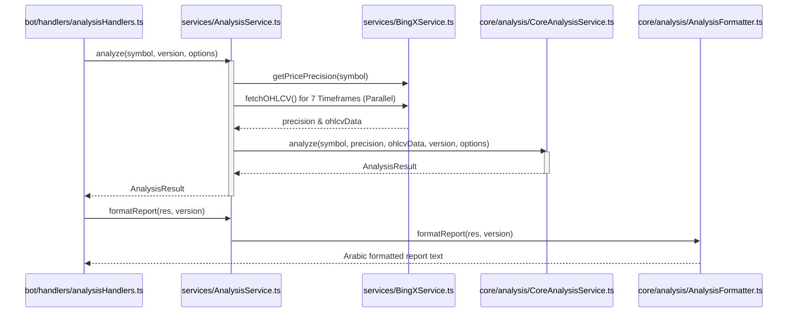

# 🌐 AnalysisService.ts — الخدمة المركزية للتحليل (Facade)

> **الموقع:** `src/services/AnalysisService.ts`  
> **الدور:** يُمثل واجهة مبسطة (Facade/Bridge) لطبقة التحليل الفني. يقوم بجلب البيانات التاريخية ودقة الأسعار بالتوازي من منصة BingX، ثم يقوم بتفويض معالجة البيانات والمؤشرات والمحركات الحسابية إلى كائنات طبقة الـ Core (`CoreAnalysisService` و `AnalysisFormatter`).

---

## 📋 هيكل التواصل والتقسيم الجديد

بعد عملية إعادة الهيكلة، تم تقسيم الملف القديم إلى ثلاثة أجزاء منفصلة لتحسين جودة الكود:

```
AnalysisService.ts (Bridge)
    ├── Core/Shared/Types      ← استيراد وإعادة تصدير التايبات للحفاظ على التوافقية
    ├── CoreAnalysisService    ← تفويض معالجة الشموع والمحركات (V1-V11) في الذاكرة
    └── AnalysisFormatter      ← تفويض تنسيق التقارير العربية وتوليد رسائل البوت
```

---

## 📦 التايبات والواجهات المعاد تصديرها (Re-exported Types)

تسهيلاً على الملفات الخارجية وبوت Telegram لعدم كسر الاستدعاءات القديمة، يقوم `AnalysisService` بإعادة تصدير الأنواع الفنية التالية من المسار `src/core/shared/types.ts`:
* `OHLCV` (بيانات الشمعة الخام).
* `CandleData` (البيانات المنظمة للمؤشرات).
* `IndicatorData` (المؤشرات المحسوبة).
* `TechnicalLevels` (مستويات الدعم والـ Pivot والفيبوناتشي).
* `AnalysisDetails` (تحليل كامل لإطار زمني محدد).
* `TradeRecommendation` (التوصية المستخرجة).
* `MatrixResult` (مصفوفة توافق الفريمات).
* `AnalysisResult` (النتيجة الإجمالية للتحليل).

---

## 🔧 شرح الدوال الرئيسية للخدمة

### 1. دالة التحليل الفني (`analyze`)
* **المدخلات:**
  ```typescript
  analyze(
      symbolInput: string,
      version: 'V1' | 'V2' | ... | 'V11' = 'V1',
      options: { quickTF?, longTF?, limit? }
  )
  ```
* **آلية العمل:**
  1. تطبيع العملة (مثل تحويل `BTC` إلى الرمز القياسي `BTC/USDT:USDT`).
  2. جلب دقة السعر في البورصة (`BingXService.getPricePrecision`).
  3. جلب الشموع المطلوبة بالتوازي لجميع الأطر السبعة المعتمدة في المصفوفة (`MATRIX_TFS`) باستخدام `Promise.all` لتسريع التجاوب وتفادي البطء.
  4. تمرير دقة الأسعار والشموع المجلوبة لـ **`CoreAnalysisService.analyze`** في طبقة الـ Core لحساب جميع المؤشرات والـ Matrix وتشغيل محرك التداول المختار في الذاكرة وإرجاع النتيجة الكاملة.

### 2. دالة تقرير التصحيح المتعدد (`generateCorrectionReport`)
* **آلية العمل:**
  1. جلب 50 شمعة بالتوازي لثلاثة أطر زمنية (`5m`, `15m`, `1h`).
  2. استدعاء `TechnicalAnalyzer.detectDivergence` و `TechnicalAnalyzer.calculateCorrectionFibLevels` لحساب مستويات تصحيح فيبوناتشي والانحرافات.
  3. تنسيق النتائج عربياً وتوليد تحذير تكتيكي للمتداول (مثل: "بداية ضعف" أو "خطر انعكاس مؤكد").

---

## 🔌 دوال التمرير والتوافقية (Proxy Methods)

تُعيد هذه الدوال توجيه الطلبات مباشرة لطبقة الـ Core:
* **`formatReport(...)`** ──> يوجه لـ `AnalysisFormatter.formatReport(...)`
* **`generateDetailedReport(...)`** ──> يوجه لـ `AnalysisFormatter.generateDetailedReport(...)`
* **`generateEducationalGuide(...)`** ──> يوجه لـ `AnalysisFormatter.generateEducationalGuide(...)`
* **`generateComprehensiveReport(...)`** ──> يوجه لـ `AnalysisFormatter.generateComprehensiveReport(...)`
* **`getAlgorithmExplanation(...)`** ──> يوجه لـ `AnalysisFormatter.getAlgorithmExplanation(...)`
* **`detectDivergence(...)`** ──> يوجه لـ `TechnicalAnalyzer.detectDivergence(...)`
* **`calculateCorrectionFibLevels(...)`** ──> يوجه لـ `TechnicalAnalyzer.calculateCorrectionFibLevels(...)`

---

## 🔄 التفاعل والتواصل بين الملفات (Interactions)


