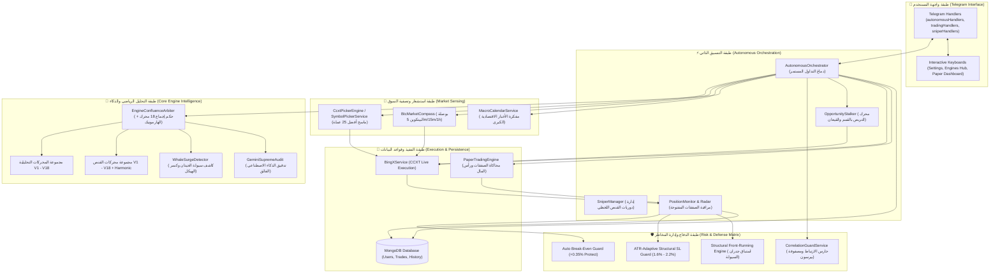

# 🏛️ أطلس بنية النظام والعلاقات البرمجية الشاملة (System Architecture & Relationships)

> **الإصدار:** V2.5 Quantitative Autonomous Suite  
> **البيئة:** Node.js + TypeScript (Strict Type Safety) + MongoDB + CCXT / BingX Perpetual Futures  
> **الهدف:** توضيح الهيكل المؤسسي لكيفية عمل البوت، العلاقات التفاعلية بين جميع المكونات، وتدفق البيانات من لحظة الاتصال بالبورصة حتى تسجيل الأرباح في المحفظة.

---

## 🗺️ 1. المخطط الهيكلي العام للنظام (High-Level Topology)

يعتمد البوت على **بنية معمارية سداسية الطبقات (Hexagonal Reactive Architecture)** مفككة الارتباط (Decoupled)، حيث لا تتداخل طبقة التحليل الرياضي مع واجهة المستخدم (Telegram) أو مع طبقة الاتصال بالمنصة (CCXT).



---

## 🔄 2. شبكة العلاقات والمسؤوليات بين الأجزاء (Component Relationships)

### 1. المنسق المستقل (`AutonomousOrchestrator.ts`)
* **الدور:** هو الرئيس التنفيذي للنظام (Master Controller). يعمل في حلقة لا نهائية ذكية (Smart Event Loop) كل 45 إلى 60 ثانية (أو مع كل شمعة جديدة).
* **علاقته مع باقي الأجزاء:**
  - يطلب قائمة العمليات الواعدة من `SymbolPickerService`.
  - يمرر كل عملة إلى `BtcMarketCompass` للتأكد من توافق الاتجاه العام.
  - يستدعي `EngineConfluenceArbiter` لحساب النتيجة التوافقية من كافة المحركات المفعلة.
  - إذا تخطت الصفقة نسبة التوافق المشروطة (مثلاً $\ge 70\%$):
    - يمررها إلى `CorrelationGuardService` للتأكد من عدم فتح مراكز مكررة لنفس الاتجاه والارتباط.
    - يمررها إلى `GeminiSupremeAudit` للتدقيق النهائي (إذا كان مفعلاً).
    - إذا كانت الصفقة تحتاج انتظار إعادة اختبار أو تصحيح، يرسلها إلى `OpportunityStalker`.
    - إذا كانت جاهزة للتنفيذ الفوري، يرسلها إلى `TradeManager` (للحساب الحقيقي) أو `PaperTradingEngine` (للحساب الافتراضي).

### 2. حكم إجماع المحركات (`EngineConfluenceArbiter.ts`)
* **الدور:** البرلمان الرياضي الذي يصوت فيه كل محرك تحليل وقنص مفعل.
* **المدخلات:** بيانات الشموع متعددة الفريمات (5m, 15m, 30m, 1h, 4h, 1d) وسعر الـ VWAP ومستويات الدعم والمقاومة.
* **العمليات الرياضية:**
  - استبعاد أي محرك تم حظره من قبل المستخدم في مصفوفة المحركات (`disabledEngines`).
  - تشغيل كل محرك متبقي، وقراءة اتجاهه (`LONG`, `SHORT`, `NONE`) ونسبة ثقته.
  - ترجيح أصوات المحركات وفق أوزان الثقة المؤسسية (`DEFAULT_ENGINE_WEIGHTS`).
  - حساب مؤشر الـ ATR الحقيقي لـ 14 شمعة وتحديد القمم والقيعان الهيكلية (Swing High / Swing Low).
  - حساب مستويات استباق الجدران السعرية (Front-Running TP) والستوب التكيفي الهيكلي.
* **المخرجات:** ملف شامل (`InstitutionalMarketDossier`) يحمل القرار النهائي، والنسبة المئوية الإجمالية للتوافق، والأهداف المقترحة بدقة.

### 3. محرك التربص وقناص الفوليوم اللحظي (`OpportunityStalker.ts` & `MicroVolumeAnalyzer.ts`)
* **الدور:** منع الدخول القمي (FOMO). عندما يجد النظام فرصة قوية بنسبة توافق عالية ولكن السعر ابتعد عن نقطة الدخول الذهبية، يقوم التربص بوضع العملة في طابور المراقبة (Stalking Queue).
* **العلاقة والآلية:**
  - يراقب السعر اللحظي لكل تكة (Tick).
  - بمجرد دخول السعر إلى نطاق الارتداد المناسب (Strike Zone ضمن مسافة $\le 0.6\%$).
  - يستدعي `MicroVolumeAnalyzer` لتحليل شمعة الدقيقة (1m):
    - التأكد من انفجار الحجم مقارنة بمتوسط 20 شمعة (Volume Burst $\ge 2.0\times$).
    - التأكد من نسبة سيولة الشراء للشراء أو البيع للبيع ($\ge 65\%$).
  - فور تحقق الشرط، يُطلق أمر التنفيذ اللحظي في قاع الارتداد بدلاً من القمة.

### 4. حراس المخاطر (Risk Defense Matrix)
* **بوصلة البيتكوين (`BtcMarketCompass.ts`):** تفحص شارت البيتكوين عبر مؤشرات EMA20 و EMA50 والزخم. إذا كان البيتكوين ينزف بنسبة $\ge 0.5\%$ في 15 دقيقة، يُحظر فتح صفقات شراء نهائياً لأي عملة بديلة (Altcoin).
* **حارس الارتباط ومصفوفة بيرسون (`CorrelationGuardService.ts`):** يحسب معامل ارتباط بيرسون $r$ بين العملة المرشحة وجميع الصفقات المفتوحة حالياً. إذا كان معامل الارتباط $> 0.80$، يمنع الصفقة فوراً لمنع مضاعفة الخسارة عند ارتداد السوق.
* **درع حماية الدخول التلقائي (`Auto Break-Even`):** يراقب الأرباح العائمة لحظة بلحظة؛ فإذا حققت الصفقة ربحاً سريعاً قدره $+0.35\%$، ينقل أمر وقف الخسارة تلقائياً إلى سعر الدخول مع إضافة هامش صغير $+0.05\%$ لتغطية عمولات المنصة، مما يجعل الصفقة مجانية ومحمية بالكامل من الانعكاس.

### 5. واجهة تيليجرام التفاعلية (`src/bot/handlers/*`)
* **الدور:** لوحة التحكم والقيادة الميدانية التي تمكّن المستخدم من تعديل كل بارامتر في النظام دون الحاجة لإعادة تشغيل الكود أو لمس السيرفر.
* **الأزرار والمفاتيح:** تترجم نقرات المستخدم إلى تعديلات فورية في وثيقة الإعدادات بقاعدة البيانات `MongoDB`، ليقوم المنظّم بقراءتها في التكة التالية مباشرة.

---

## 📈 3. مخطط تدفق دورة حياة الصفقة الكاملة (Lifecycle Data Flow)

```
[1. Live CCXT Market Scanner] -> مسح أفضل 25 عملة حسب حجم التداول الفعلي وتصفية العملات الخاملة
               ↓
[2. BTC Compass Filter]       -> هل السوق يسمح بالاتجاه؟ (صعود = Longs فقط | هبوط = Shorts فقط)
               ↓
[3. Multi-Timeframe Fetch]    -> جلب شموع 5m, 15m, 30m, 1h, 4h, 1d لجميع المؤشرات
               ↓
[4. Confluence Arbiter]       -> تصويت المحركات غير المحظورة وترجيح الأوزان الرياضية (Score >= 70%)
               ↓
[5. Correlation Guard]        -> فحص معامل بيرسون ومستوى المخاطرة الإجمالية للمحفظة Heat <= 6%
               ↓
[6. AI Supreme Audit]         -> فحص بصري وهيكلي بواسطة Gemini Pro Vision (اختياري)
               ↓
        [هل السعر عند الدخول المثالي؟]
          ├── نعم  ───────────────→ [تنفيذ فوري بالرافعة الديناميكية وحجم 1% مخاطرة]
          └── لا (بعيد > 0.6%) ───→ [إرسال إلى Opportunity Stalker للتربص بانفجار فوليوم 1m]
                                                  ↓
                                  [تحقق ارتداد السعر + Volume Spike 2x] ──→ [تنفيذ الصفقة]
                                                                                  ↓
                                                               [7. Active Position Monitoring]
                                                                  - تفعيل Auto Break-Even عند +0.35%
                                                                  - حجز ربح جزئي Micro-TP 50% عند الهدف الأول
                                                                  - خروج بالهدف النهائي أو الستوب التكيفي الهيكلي
```

---

## 📚 4. فهرس الملفات المرجعية في هذا الدليل

1. [01_SYSTEM_ARCHITECTURE_AND_RELATIONSHIPS.md](file:///e:/webProject/BotTrading_BingX/docs/COMPREHENSIVE_BOT_MANUAL/01_SYSTEM_ARCHITECTURE_AND_RELATIONSHIPS.md): بنية النظام العامة وشبكة العلاقات والمسؤوليات (هذا المستند).
2. [02_ALL_ANALYSIS_ENGINES_AND_MATHEMATICS.md](file:///e:/webProject/BotTrading_BingX/docs/COMPREHENSIVE_BOT_MANUAL/02_ALL_ANALYSIS_ENGINES_AND_MATHEMATICS.md): الدليل الرياضي والمنطقي الكامل للمحركات الـ 19 من V1 إلى V18 والهارمونيك وسيولة الحيتان.
3. [03_SNIPERS_STALKER_AND_AI_GUARDS.md](file:///e:/webProject/BotTrading_BingX/docs/COMPREHENSIVE_BOT_MANUAL/03_SNIPERS_STALKER_AND_AI_GUARDS.md): هندسة القناصات، التربص اللحظي، تدقيق الذكاء الاصطناعي، ومصفوفة الأمان.
4. [04_AUTONOMOUS_TRADING_LIFECYCLE_AND_EXECUTION.md](file:///e:/webProject/BotTrading_BingX/docs/COMPREHENSIVE_BOT_MANUAL/04_AUTONOMOUS_TRADING_LIFECYCLE_AND_EXECUTION.md): دورة التنفيذ المالي، إدارة رأس المال، الستوب الهيكلي، والتداول الافتراضي والحقيقي.
5. [05_SETTINGS_BUTTONS_AND_OPERATIONS_MANUAL.md](file:///e:/webProject/BotTrading_BingX/docs/COMPREHENSIVE_BOT_MANUAL/05_SETTINGS_BUTTONS_AND_OPERATIONS_MANUAL.md): الدليل الميداني لأوامر وأزرار التلغرام وكيفية ضبط النظام لأفضل أداء.
