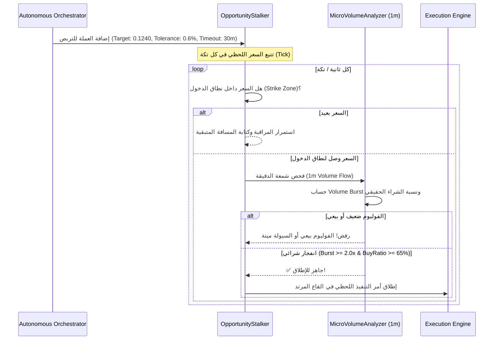

# 🎯 منظومة القناص، التربص الذكي، ودروع الأمان والذكاء الاصطناعي (Snipers, Stalker & AI Guards)

> يشرح هذا المستند الأسلحة المتقدمة للنظام: الفرق الجوهري بين محركات التحليل ومحركات القنص اللحظي، خوارزمية محرك التربص (Opportunity Stalker)، كاشف انفجار الفوليوم اللحظي (1m Micro-Volume Flow)، وتكامل دروع الأمان الأربعة (الذكاء الاصطناعي، بوصلة البيتكوين، مصفوفة بيرسون للارتباط، ومفكرة الأخبار الاقتصادية).

---

## ⚡ 1. الفرق الجوهري: محركات التحليل مقابل محركات القنص

في التحليل الكمي، يقع معظم المتداولين في خطأ **"التحليل الممتاز بالتوقيت السيئ"**؛ فقد يكون التحليل على فريم الساعة صاعداً بامتياز، ولكن إذا دخل المتداول فوراً فقد ينعكس عليه السعر لتصحيح قاع شمعة 5 دقائق، مما يضرب وقف الخسارة قبل أن يصعد السعر للهدف!

لحل هذه المعضلة، تم تقسيم كل خوارزمية إلى شقين مستقلين:

```
┌────────────────────────────────────────────────────────┐
│ 1. محرك التحليل (Analysis Engine)                     │
│    - الوظيفة: استكشاف الاتجاه الكلي والقوة الاحتمالية │
│    - الفريمات: 1h, 4h, 1d                             │
│    - النتيجة: "العملة مؤهلة للشراء بنسبة 85%"         │
└───────────────────────────┬────────────────────────────┘
                            │ يمرر الترشيح إلى
┌───────────────────────────▼────────────────────────────┐
│ 2. محرك القنص اللحظي (Sniper Engine)                   │
│    - الوظيفة: الترقب عند الزناد وتحديد لحظة الانعكاس   │
│    - الفريمات: 1m, 5m, 15m                            │
│    - النتيجة: "جاهز لإطلاق النار الآن (ReadyToFire)!" │
└────────────────────────────────────────────────────────┘
```

---

## 🦅 2. محركات القنص الـ 14 وسجل الاقتناص (`SniperRegistry.ts`)

ترث جميع محركات القنص واجهة موحدة صارمة `ISniperEngine` وتصدر تقريراً لحظياً غنياً بالمعلومات (`SniperReport`):

```typescript
export interface SniperReport {
    symbol: string;
    engineId: string;
    direction: 'LONG' | 'SHORT' | 'NONE';
    entry: number;
    sl: number;
    tp: number;
    readyToFire: boolean;            // هل الزناد جاهز للإطلاق الآن؟
    confidence: number;              // نسبة الثقة اللحظية
    completedConditions: string[];   // الشروط الفنية التي اكتملت
    pendingConditions: string[];     // الشروط التي ما زالت معلقة
}
```

### 📋 قائمة محركات القنص المتخصصة:
1. **V1-SNIPER:** يقتنص ملامسة السعر لخط الـ VWAP اليومي مع تأكيد شمعة انعكاسية 5m.
2. **V7-SNIPER:** قناص هياكل SMC يترقب إعادة اختبار قاع الـ 4 ساعات بعد كسر وهمي للسيولة.
3. **V8-SNIPER:** قناص ICT Turtle Soup يترصد الشموع ذات الذيول الطويلة الرافضة للمستويات الخارجية.
4. **V9-SNIPER:** قناص الجيب الذهبي (Golden Pocket 0.618 Fib) يترقب شمعة دوجي أو مطرقة عند النسبة الذهبية.
5. **V10-SNIPER:** قناص حجم POC يترقب عودة السعر لنقطة السيطرة الحجمية وبدء ظهور شموع هيكن آشي عديمة الذيول العكسية.
6. **V11-SNIPER:** قناص الترند التكيفي يترقب إغلاق شمعة 5 دقائق فوق متوسط EMA 20 بعد تراجع هادئ.
7. **V12-SNIPER:** قناص KAMA يترقب تقاطع السعر اللحظي مع متوسط كوفمان بالتزامن مع قفزة مؤشر CCI فوق +50.
8. **V13-SNIPER:** قناص مراحل وايكوف يترقب مرحلة الاختبار (Phase C: Spring / Test) بأحجام تداول متناقصة تدل على جفاف البيع.
9. **V14-SNIPER:** قناص الرينكو يترقب تشكل قالبين صاعدين متتاليين بعد موجة هبوط كاملة.
10. **V15-SNIPER:** قناص كسر تشان بين يترقب كسر قمة الفراكتال اللحظية لشمعة 5 دقائق.
11. **V16-SNIPER:** قناص الإجماع الكمي يشترط تزامن صعودي لحظي على 3 فريمات في نفس الدقيقة.
12. **V17-SNIPER:** قناص انضغاط التقلب يترقب أول شمعة خروج بعد انضغاط شديد في نطاق البولنجر.
13. **V18-SNIPER:** قناص دفتر الأوامر اللحظي يترقب ظهور جدار طلبات مفاجئ (Spoofing-Absorbed Bid Wall) في عمق L2.
14. **HARMONIC-SNIPER:** قناص الهارمونيك اللحظي يترقب أول شمعة انعكاس صريحة داخل صندوق الـ PRZ بدقة سنت واحد.

---

## 🎯 3. محرك التربص الذكي (`OpportunityStalker.ts`)

عندما يكتشف المنظّم فرصة عملة ممتازة بنسبة توافق عالية (مثلاً $85\%$)، لكن السعر الحالي يكون قد قفز وابتعد عن نقطة الدخول الآمنة بنسبة تزيد عن $0.6\%$، يرفض النظام الدخول الفوري منعاً للوقوع في فخ الشراء القمي (FOMO). وبدلاً من إهمال الفرصة، يرسلها إلى **طابور التربص (Stalking Queue)**.



### ⚙️ محددات محرك التربص:
* **السعة القصوى (Capacity):** يتسع الطابور لمراقبة حتى 3 عملات في نفس الوقت لمنع استهلاك المعالج ومعدل طلبات المنصة. إذا ظهرت عملة رابعة بنسبة توافق أعلى، يتم استبدال العملة الأقل نقاطاً تلقائياً.
* **صلاحية التربص (Timeout):** مدة صلاحية المرشح 30 دقيقة. إذا لم يرتد السعر خلالها للنطاق المطلوب، تُلغى الفرصة لانتفاء الزخم الهيكلي.
* **نطاق الضرب (Strike Zone):** مسافة سماح محكمة $\le 0.6\%$ من سعر الدخول النظري.

---

## 🔬 4. محلل التدفق الدقيق للشمعات اللحظية (`MicroVolumeAnalyzer.ts`)

لا يكتفي التربص بوصول السعر لنطاق الدخول، بل يطلب فحصاً مجهرياً لشمعة الدقيقة (1m) للتأكد من وجود مشتري حقيقي:

1. **انفجار الحجم (Volume Burst Ratio):**
   $$BurstRatio = \frac{CurrentVolume_{1m}}{SMA_{20}(Volume_{1m})} \ge 2.0\times$$
   (يجب أن يكون حجم شمعة الدقيقة الحالية ضعف متوسط الـ 20 دقيقة السابقة على الأقل).

2. **نسبة السيولة الفاعلة (Buy/Sell Volume Dominance):**
   $$BuyVolumeRatio = \left(\frac{Close_{1m} - Low_{1m}}{High_{1m} - Low_{1m}}\right) \times 100 \ge 65\%$$
   (يجب أن تثبت الشمعة أن المشترين أغلقوا الشمعة بالقرب من قمتها بامتصاص بيعي واضح).

---

## 🛡️ 5. دروع الأمان المؤسسية والذكاء الاصطناعي (Defense Guards)

### 🤖 أ. درع تدقيق الذكاء الفائق (Gemini Supreme Audit)
* **المسار:** `src/services/GeminiAuditService.ts`
* **الآلية:** عندما ترصد المحركات توافقاً عالياً، يمكن تصعيد الصفقة إلى نموذج الذكاء الاصطناعي التوليدي المتطور (Google Gemini Pro Vision).
* **الفحص الميداني:**
  - يتم تزويد النموذج ببيانات الشموع والمؤشرات ونقاط الدخول والوقف المستهدفة في ملف JSON منظم.
  - يقوم الذكاء بفحص منطقية الصفقة والتأكد من عدم وجود كسر زائف أو مقاومة كبرى غير مرئية.
  - النتيجة: موافقة صريحة (`APPROVE`) مع تقييم جودة (Confidence) أو رفض مسبب (`REJECT: Impending Macro Resistance`).

### 🧭 ب. بوصلة البيتكوين الحية (`BtcMarketCompass.ts`)
* **المسار:** `src/core/analysis/BtcMarketCompass.ts`
* **الفلسفة:** البيتكوين هو المحرك الأساسي لسيولة الكريبتو بالكامل. فتح صفقات شراء لعملات بديلة أثناء نزيف البيتكوين هو انتحار مالي.
* **مؤشرات البوصلة:**
  - فريم الفحص السريع: **15m** وفريم التأكيد الكلي: **1h**.
  - متوسطات الحركة الأسية: $EMA_{20}$ و $EMA_{50}$ لسعر BTC.
  - فحص التغير اللحظي: إذا هبط البيتكوين بنسبة $\ge 0.5\%$ في 15 دقيقة، يُفعل وضع التعتيم الكامل (**Blackout**).
* **قواعد العبور الصارمة:**
  - اتجاه صاعد للبيتكوين ($BTC > EMA_{20} \land EMA_{20} > EMA_{50}$) $\rightarrow$ السماح بصفقات الـ **LONG** فقط، وحظر الـ SHORT.
  - اتجاه هابط للبيتكوين $\rightarrow$ السماح بصفقات الـ **SHORT** فقط، وحظر الـ LONG.
  - اتجاه محايد أو متذبذب $\rightarrow$ السماح بالاتجاهين بشروط توافق أعلى ($\ge 75\%$).

### 🔗 ج. حارس الارتباط ومصفوفة بيرسون (`CorrelationGuardService.ts`)
* **المسار:** `src/services/CorrelationGuardService.ts`
* **الخطر المعالج:** إذا فتح البوت صفقة شراء على `ETH` ثم فتح صفقة شراء على `OP` و `ARB`، فإن هذه الصفقات الثلاث مرتبطة بنسبة $95\%$ بحركة الإيثريوم. فإذا هبط الإيثريوم ستخسر الصفقات الثلاث معاً!
* **المعادلة الرياضية لمعامل ارتباط بيرسون (Pearson Correlation $r$):**
  $$r = \frac{\sum (R_A - \bar{R}_A)(R_B - \bar{R}_B)}{\sqrt{\sum (R_A - \bar{R}_A)^2 \sum (R_B - \bar{R}_B)^2}}$$
  (حيث $R_A, R_B$ هي عوائد الإغلاق للشموع السابقة بين الزوجين).
* **سقف الارتباط:** يُحظر فتح أي صفقة جديدة إذا كان معامل الارتباط مع أي صفقة مفتوحة $r > 0.80$ لنفس الاتجاه.
* **حرارة المحفظة الإجمالية (Portfolio Heat Cap):** سقف المخاطرة الكلية لجميع الصفقات المفتوحة معاً لا يتجاوز **6.0%** من رأس المال الإجمالي.

### 📅 د. مفكرة الاقتصاد الكلي (Macro News Filter)
* **المسار:** `src/services/MacroCalendarService.ts`
* **الآلية:** يرتبط البوت ببيانات حية للمفكرة الاقتصادية العالمية (بيانات التضخم CPI، قرار الفائدة الفيدرالية FOMC، تقرير التوظيف الأمريكي NFP).
* **درع الحماية:** يتم تجميد فتح صفقات جديدة قبل صدور الخبر عالي الأهمية (High Impact) بـ 15 دقيقة وبعده بـ 15 دقيقة لتفادي الذيول العشوائية والانزلاقات السعرية (Slippage).
