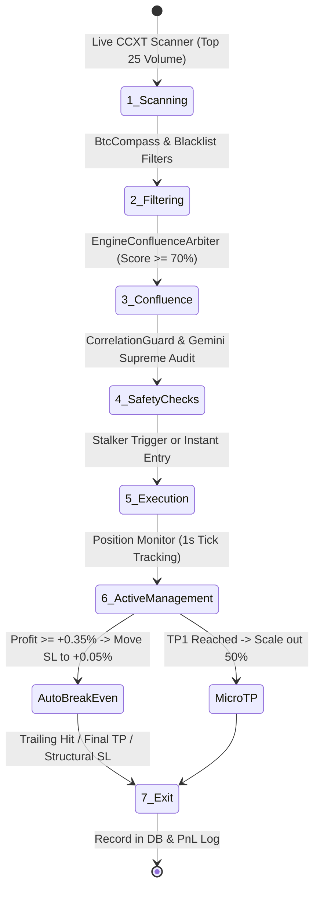

# 💰 دورة حياة التداول الذاتي والتنفيذ المالي (Autonomous Trading Lifecycle & Execution)

> يوضح هذا المستند الآلية الحسابية والمالية الكاملة لكيفية تنفيذ الصفقات في النظام: من إدارة رأس المال والرافعة الديناميكية، إلى الوقف الهيكلي التكيفي، وحماية الدخول التلقائية، وجني الأرباح المجزأ واستباق الجدران.

---

## 🔄 1. دورة حياة الصفقة الذاتية خطوة بخطوة (Full Lifecycle)

تمر كل صفقة في المنظومة الذاتية عبر سبع مراحل دقيقة غير قابلة للاختراق:

---

## 💵 2. إدارة رأس المال والرافعة المالية الديناميكية (Risk Sizing & Leverage)

لا يقوم النظام بفتح أحجام عقود عشوائية أو بأرقام ثابتة؛ بل يطبق النموذج الكمي لإدارة المخاطر المشروطة بنسبة رأس المال:

### 📐 أ. معادلة حجم المركز (Margin Sizing):
يتم تحديد حجم رأس المال المعرض للخطر في الصفقة الواحدة بحيث لا تتجاوز الخسارة القصوى **1.0% إلى 1.2%** من إجمالي المحفظة عند ضرب كامل الستوب:

$$RiskAmount = TotalBalance \times 0.010$$
$$StopLossDistancePct = \frac{|EntryPrice - StopLossPrice|}{EntryPrice}$$
$$PositionNotional = \frac{RiskAmount}{StopLossDistancePct}$$
$$MarginRequired = \frac{PositionNotional}{Leverage}$$

* **مثال عملي:**
  - رصيد المحفظة: $1000 USDT$.
  - المخاطرة المستهدفة: $1.0\% = 10 USDT$.
  - الستوب الهيكلي المحسوب: $2.0\%$ مسافة عن الدخول.
  - الحجم الاسمي للمركز (Notional): $\frac{10}{0.02} = 500 USDT$.
  - بالرافعة المالية $25\times$: الهامش المحجوز من الحساب = $\frac{500}{25} = 20 USDT$ فقط!
  - النتيجة: لو انهار السعر وضرب الستوب كاملاً، لن يخسر الحساب سوى $10 USDT$ المقررة مسبقاً بدقة.

### ⚡ ب. جدول الرافعة الديناميكية المتدرجة (Dynamic Leverage Scale):
لتحقيق التوازن بين الكفاءة الهامشية وتفادي شبح التصفية (Liquidation)، يقسم النظام العملات إلى 3 فئات:

| فئة العملة | أمثلة | الرافعة الديناميكية | سبب الاختيار |
| :--- | :--- | :---: | :--- |
| **العملات السيادية (Majors Ultra)** | BTC, ETH | **40x** | سيولة عملاقة وعمق أوامر يحمي من الانزلاق السعري |
| **العملات القيادية (Large Caps)** | SOL, BNB, XRP, ADA, LINK | **25x** | استقرار نسبي وتحركات فنية منتظمة |
| **العملات البديلة (Altcoins)** | SUI, NEAR, INJ, WLD, SAND | **18x** | حماية من التذبذب السريع وتقلبات الذيول اللحظية |

---

## 🛡️ 3. نظام وقف الخسارة الهيكلي التكيفي (ATR-Adaptive Structural SL)

### ❌ عيوب الستوب القديم (The Rigid 0.94% Flaw):
في الإصدارات السابقة، كان النظام يطبق حداً أقصى جامداً للستوب قدره $0.94\%$. هذه النسبة الضيقة جداً كانت تؤدي إلى "حرق الصفقات مبكراً" بواسطة الذيول السعرية العادية للشمعات (Noise Stop-Outs)، حيث يضرب السعر الستوب بفارق أجزاء من السنت ثم ينطلق مباشرة نحو الهدف!

### ✅ الحل الهندسي الجديد: الستوب الهيكلي المعتمد على القمم والقيعان + ATR:
1. **رصد القمم والقيعان الهيكلية (Swing High / Swing Low):**
   - يفحص المحرك أدنى قاع لآخر 6 شمعات على فريم الدخول ($SwingLow_6$) لصفقات الشراء.
   - يفحص أعلى قمة لآخر 6 شمعات ($SwingHigh_6$) لصفقات البيع.
2. **إضافة وسادة الأمان الديناميكية (ATR Buffer):**
   - يُحسب مؤشر $ATR$ لـ 14 شمعة.
   - لصفقات الشراء:
     $$ProposedSL = SwingLow_6 - (0.35 \times ATR)$$
   - لصفقات البيع:
     $$ProposedSL = SwingHigh_6 + (0.35 \times ATR)$$
3. **حصر الستوب بين الحدود الآمنة المؤسسية (Bounded Clamping):**
   - يتم حصر نسبة الستوب النهائية ضمن النطاق القابل للتخصيص من التلغرام:
     $$SL_{Pct} \in [MinSL, MaxSL] \quad (\text{افتراضياً: } 1.6\% \le SL \le 2.2\%)$$
   - إذا كان القاع قريباً جداً، يُرفع الستوب إلى $1.6\%$ على الأقل لمنع الخروج بالضوضاء.
   - إذا كان القاع بعيداً جداً، يُقفل الستوب عند $2.2\%$ لحماية رأس المال وحفظ الرافعة.

---

## 🚀 4. درع حماية الدخول التلقائي (Auto Break-Even Guard)

* **الفلسفة:** الصفقة الرابحة يجب ألا تتحول أبداً إلى صفقة خاسرة!
* **المسار:** مدمج في مراقب الصفقات اللحظي `PositionMonitor` و `PaperTradingEngine`.
* **شرط التفعيل اللحظي:**
  بمجرد أن يتحرك السعر في اتجاه الصفقة محققاً ربحاً عائماً قدره:
  $$UnrealizedGain \ge +0.35\%$$
* **الإجراء الفوري:**
  - يتم نقل أمر وقف الخسارة تلقائياً في السيرفر والمنصة إلى سعر الدخول مضافاً إليه نسبة تغطية العمولات:
    $$NewSL = EntryPrice \pm (EntryPrice \times 0.0005) \quad (+0.05\%)$$
  - النتيجة: تصبح الصفقة **"محمية ومجانية بالكامل (Risk-Free)"**. فإذا ارتد السوق فجأة تخرج الصفقة بربح رمزي يغطي رسوم التداول بالكامل، مانعة أي خسارة في رأس المال الأصلي.

> 📊 **إثبات الفاعلية من الباتش الأخير (86 صفقة):**
> أنقذ هذا الدرع وحده **32 صفقة** من أصل 51 صفقة عاكسها السوق، حيث خرجت بربح/تعادل رمزي (-$2.96 عمولات فقط عبر 32 صفقة)، مانعاً خسائر محققة كانت ستتجاوز **35$ دولار** لو ضربت الستوب الكامل!

---

## 🎯 5. جني الأرباح المجزأ واستباق الجدران (Micro-TP & Structural Front-Running)

### ✂️ أ. جني الأرباح المصغر (Micro-TP 50% Scale-Out):
- لتأمين الأرباح النفسية والمالية السريعة في أسواق العقود الآجلة، يقسم النظام إغلاق الهدف إلى مرحلتين:
  - **المرحلة 1 (Micro-TP):** عند وصول السعر إلى الهدف الأول (نحو $+1.2\%$ إلى $+1.5\%$ حركة سعرية)، يتم إغلاق **50% من حجم الصفقة** فوراً وحجز الأرباح في رصيد المحفظة مع تفعيل الـ Break-Even تلقائياً للنصف المتبقي.
  - **المرحلة 2 (Full TP):** يُترك النصف الثاني ليحقق الهدف الموسع (الهدف الثاني أو الثالث) أو الخروج بمؤشر Trailing Stop.

### 🧱 ب. استباق جدران السيولة (Structural Front-Running):
- يقع معظم المتداولين المبتدئين في مصيدة وضع أمر جني الأرباح $TP$ على نفس رقم المقاومة تماماً أو أعلى منه، فيصل السعر قبل المقاومة بدولار واحد ثم يرتد بعنف دون أن ينفذ أمر الهدف!
- **الحل في البوت:**
  - يقوم المحرك بحساب أقرب جدار مقاومة رئيسي $NearestResistance$.
  - يقوم بتطبيق معادلة استباق الجدار (Front-Running Margin):
    $$AdjustedTP = NearestResistance \times (1 - 0.0015) \quad (-0.15\%)$$
  - يضمن هذا التعديل خروج الصفقة قبل الزحام وجني الأرباح بسلاسة قبل أن يبدأ البائعون في إغراق السوق.

---

## 🎮 6. المحاكاة الافتراضية مقابل التداول الحقيقي (Paper vs Real Execution)

يوفر البوت بيئتي تداول متطابقتين بنسبة $100\%$ من حيث المنطق الرياضي:

| الميزة | التداول الافتراضي (Paper Trading) | التداول الحقيقي (Live CCXT) |
| :--- | :--- | :--- |
| **مصدر الأسعار** | أسعار حية مباشرة تكة بتكة من BingX API | أسعار حية مباشرة تكة بتكة من BingX API |
| **تنفيذ الأوامر** | محاكاة واقعية في قاعدة البيانات مع حساب العمولات | إرسال أوامر حقيقية لمنصة BingX Perpetual |
| **الانزلاق السعري** | محسوب برمجياً لمحاكاة السوق الحقيقي | انزلاق حقيقي في دفتر الأوامر |
| **رأس المال** | رصيد افتراضي يمكن تصفيره أو ضبطه (`/set_paper_balance`) | رصيد USDT الحقيقي في حساب الفيوتشرز |
| **الاستخدام الأمثل** | فحص الخوارزميات، اختبار أوزان المحركات، والتدريب | جني الأرباح الحقيقية بعد التأكد من الاستقرار |
