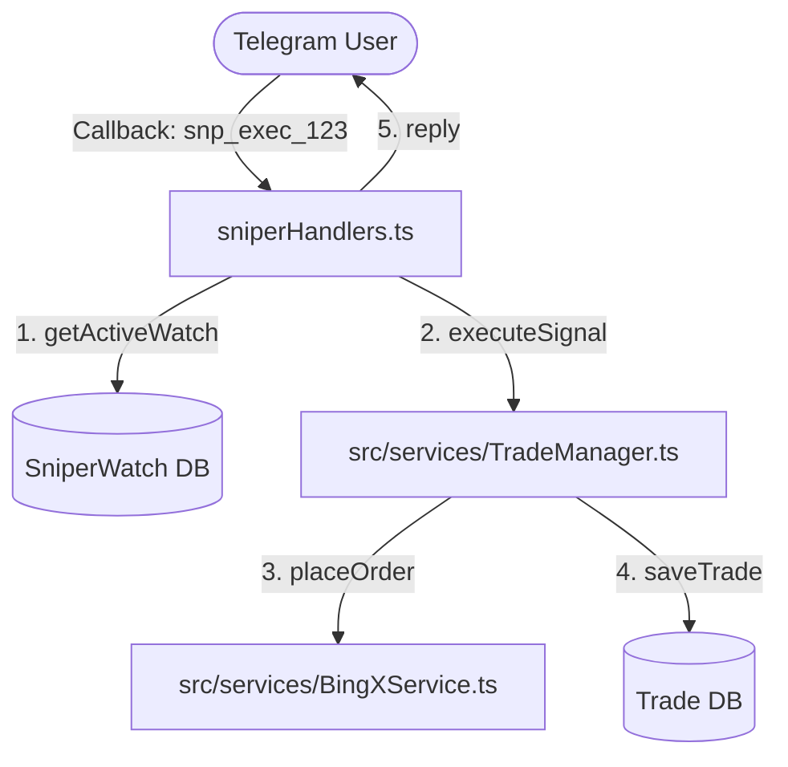

# 🤖 Specialized Bot Handlers — معالجات أوامر البوت المتخصصة

> **الموقع:** `src/bot/handlers/`  
> **الدور:** استقبال وتوجيه تفاعلات المستخدمين في تليجرام (commands, text inputs, callback queries) وتحويلها إلى استدعاءات لطبقة الخدمات الوسيطة. تعتمد على نظام **State Machine** لإدارة مدخلات المستخدم المتتالية.

---

## 🗺️ قائمة المعالجات الفرعية ووظائفها

تم تقسيم الأوامر والمعالجات لتسهيل التطوير والصيانة:

---

### 1. معالج الاقتناص (`sniperHandlers.ts`)
* **التسجيل:** `registerSniperHandlers(bot, sniperManager)`
* **الأوامر:**
  - `/sniper`: فتح لوحة إعداد الاقتناص.
  - `/watches`: عرض قائمة الاقتناصات النشطة حالياً.
* **الـ Callback Queries:**
  - `menu_sniper`: فتح لوحة الاقتناص واختيار العملة والمحرك.
  - `snp_exec_<watch_id>`: تنفيذ صفقة الاقتناص الفورية في البورصة عبر `TradeManager`.
  - `snp_copy_<symbol>_<engine>`: نسخ إشارة التداول بتنسيق نصي.
  - `snp_radar_<watch_id>`: إدراج الصفقة المقترحة في الرادار لمراقبتها.
  - `snp_cancel_<watch_id>`: إيقاف وإلغاء الاقتناص الجاري.
* **الحالات المرتبطة (State Machine):**
  - `AWAITING_SNIPER_SYMBOL`: انتظار كتابة الرمز المطلوب قنصه (مثل BTC).
  - `AWAITING_SNIPER_HOURS`: انتظار اختيار ساعات صلاحية المراقبة.

---

### 2. معالج فرز واختيار العملات (`pickerHandlers.ts`)
* **التسجيل:** `registerPickerHandlers(bot, bingx)`
* **الأوامر:**
  - `/picker` أو `/scan`: تشغيل الفحص والفرز اللحظي للأسواق.
* **الـ Callback Queries:**
  - `picker_start`: إطلاق فحص السوق وتعديل الكاش في `SymbolPickerService`. يعرض شريط تقدم تفاعلي للمستخدم (Progress Bar) أثناء الفحص.
  - `menu_picker_settings`: فتح إعدادات محرك الفرز المفضل.
* **الحالات المرتبطة:**
  - `AWAITING_PICKER_LIMIT`: انتظار إدخال الحد الأقصى لعدد العملات في القائمة.

---

### 3. معالج رادار الصفقات (`radarHandlers.ts`)
* **التسجيل:** `registerRadarHandlers(bot)`
* **الأوامر:**
  - `/radar`: فتح لوحة التحكم برادارات المراقبة الفعالة.
* **الـ Callback Queries:**
  - `menu_radar`: عرض قائمة الصفقات الخاضعة لمراقبة الرادار.
  - `rad_toggle_trailing_<id>`: تفعيل/تعطيل الوقف المتحرك التلقائي (Trailing Stop).
  - `rad_toggle_wick_<id>`: تفعيل/تعطيل تنبيه كشط السيولة (Wick Sweep).
  - `rad_toggle_rev_<id>`: تفعيل/تعطيل تنبيه الانعكاس المعاكس.
  - `rad_cancel_<id>`: إيقاف مراقبة الرادار للصفقة المحددة.

---

### 4. معالج التحليل التقني (`analysisHandlers.ts`)
* **التسجيل:** `registerAnalysisHandlers(bot, tradeManager)`
* **الـ Callback Queries:**
  - `menu_analyze`: لوحة بدء التحليل الفني.
  - `an_run_<version>_<symbol>`: إطلاق التحليل الفني باستخدام الإصدار المختار.
  - `an_exec_<scalp/swing>_<symbol>_<version>`: تنفيذ صفقة فورية بناءً على نتيجة التحليل التوصية.
* **الحالات المرتبطة:**
  - `AWAITING_ANALYSIS_SYMBOL_<version>`: انتظار إدخال اسم العملة لبدء تحليلها بالنسخة المحددة.

---

### 5. معالج الإعدادات الفنية لوحة الأرقام (`settingsHandlers.ts`)
* **التسجيل:** `registerSettingsHandlers(bot)`
* **الـ Callback Queries:**
  - `menu_settings`: فتح لوحة الإعدادات الرئيسية.
  - `sett_edit_risk`, `sett_edit_leverage` ...: بدء إدخال قيم جديدة.
  - `np_<type>_<action>_<value>`: معالجة ضغطات لوحة الأرقام Inline Numpad (مثل إضافة أرقام، مسح، حفظ).
* **الحالات المرتبطة:**
  - `AWAITING_RISK_PERCENTAGE`: انتظار نسبة المخاطرة.
  - `AWAITING_FIXED_LEVERAGE`: انتظار قيمة الرافعة الثابتة.

---

### 6. المعالج الرئيسي وتدفق الرسائل (`messageHandlers.ts`)
* **التسجيل:** `registerMessageHandlers(bot, tradeManager)`
* **الأوامر:**
  - `/start` و `/menu`: تصفير الـ state وعرض لوحة التحكم الرئيسية الفاخرة.
* **المدخلات النصية العامة:**
  - عند كتابة اسم عملة دون أوامر مسبقة: يُطلق التحليل الافتراضي.
  - عند إرسال نص إشارة تداول خارجية: يتم تمريرها لـ `SignalParser` لفحصها وتنفيذها تلقائياً.
  - معالجة أي إدخال نصي آخر بناءً على الـ `user.botState` الحالي للمستخدم في قاعدة البيانات.

---

## 🔌 التفاعل والتواصل بين الملفات (Interactions)

