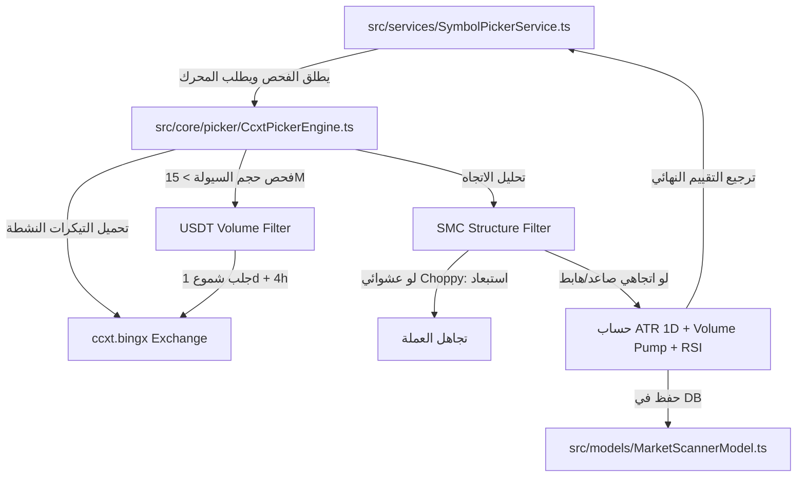

# 🔍 Picker System — نظام فرز واكتشاف العملات المرشحة للتداول

> **المسار الأساسي:** `src/core/picker/`  
> **الدور:** فرز وتقييم مئات العملات الرقمية تلقائياً لاكتشاف العملات التي تمتلك أفضل فرصة حركة وزخم واتجاه فني واضح، واستبعاد العملات الراكدة أو العشوائية (Choppy).

---

## 🏗️ مكونات النظام الأساسية

يحتوي النظام على محركين رئيسيين للفرز والاختيار:

---

### 1. محرك التقييم متعدد المعايير (`CurrencyPickerEngine.ts`)

يعتمد على مفهوم **خطوات الفحص المجدولة (Scan Pipeline)**. حيث يتم تمرير بيانات العملة على سلسلة من الفحوصات الفنية، كل فحص يمتلك وزناً نسبياً وتأثيراً على النتيجة النهائية (0–100 نقطة).

#### 📊 خطوات الفحص الافتراضية (Default Pipeline)

| الخطوة (Step) | الوزن النسبي (Weight) | معيار التقييم الفني | شروط الحصول على درجة كاملة (100) |
| :--- | :--- | :--- | :--- |
| **`Volume`** | 15% | حجم التداول اليومي بالدولار (USDT). | سيولة وحجم ممتاز يزيد عن 500 مليون دولار. |
| **`RSI`** | 20% | مؤشر القوة النسبية RSI على فريم 15 دقيقة. | السعر في منطقة ارتداد وشيك: RSI بين 35–45 (شراء) أو 55–65 (بيع). |
| **`MACD`** | 20% | تقاطع مؤشر MACD وزخم الحركة على فريم ساعة. | حدوث تقاطع حديث (Crossover) للماكد أو تصاعد حاد للزخم. |
| **`TrendAlign`** | 25% | توافق الاتجاه فريمات 15m + 1h + 4h (SMA20). | توافق الاتجاه بالكامل (سواء صاعداً أو هابطاً) عبر الأطر الثلاثة معاً. |
| **`Volatility`** | 10% | مؤشر التقلب الحقيقي ATR بالنسبة المئوية. | تقلب صحي كافٍ لحركة السعر (ATR بين 0.4% و 1.5% لكل شمعة 15m). |
| **`LevelProximity`** | 10% | القرب من مستويات الدعم والمقاومة الكبرى. | السعر على مسافة قريبة جداً (أقل من 0.3%) من مستويات Pivot أو Fibonacci 61.8/38.2. |

---

### 2. محرك التقييم الاحترافي المباشر (`CcxtPickerEngine.ts`)

يستخدم اتصالاً مباشراً بأسواق العقود الآجلة لمنصة BingX عبر مكتبة CCXT لجلب كافة التيكرات النشطة وتصفيتها:

1. **الترشيح الأولي للسيولة:** جلب كل العقود الآجلة USDT وتصفيتها وترتيبها تنازلياً حسب حجم التداول، وأخذ أفضل 35–50 عملة ذات حجم تداول نشط (الحد الأدنى للسيولة المقبولة 15 مليون دولار).
2. **استبعاد الحركة العشوائية (Choppy Filter):**
   - مقارنة السعر الحالي بالسعر قبل 10 شمعات مضت على فريمي 1d و 4h.
   - إذا تضاربت الاتجاهات أو سارت العملة بشكل عرضي متذبذب (Choppy)، يتم **تجاهل العملة فوراً واستبعادها** لتركيز الصفقات على الاتجاهات القوية فقط (Trending).
3. **حساب تقلبات ATR اليومية:** احتساب ATR(14) على الشموع اليومية وتحديد معدل التغير اليومي (ATR / Current Price). النطاق الممتاز بين 1.5% و 5% يعطي 30 نقطة.
4. **كشف الضخ الحاد للحجم (Volume Pump):** إذا كان حجم التداول الحالي خلال الـ 24 ساعة الماضية **يزيد عن 1.5 ضعف** متوسط حجم التداول اليومي لآخر 20 يوماً، يتم احتساب 20 نقطة إضافية كإشارة لدخول المؤسسات أو السيولة غير الطبيعية.

---

## 🗄️ نموذج قاعدة البيانات `MarketScannerModel.ts`

يستخدم لتخزين وتحديث نتائج الفحص الأخيرة للعملات التي تم فحصها من قبل محرك CCXT لمراجعتها وتتبع سلوكها فترات أطول:
```typescript
{
    symbol:         { type: String, required: true, unique: true }, // الرمز الكامل للعملة
    marketType:     { type: String, default: 'CRYPTO' },           // نوع السوق
    volume24h:      { type: Number, default: 0 },                  // حجم تداول الـ 24 ساعة الأخيرة
    structure1D:    { type: String, default: 'CHOPPY' },           // هيكل السوق اليومي (BULLISH/BEARISH/CHOPPY)
    structure4H:    { type: String, default: 'CHOPPY' },           // هيكل السوق على فريم 4H
    atr14_1D:       { type: Number, default: 0 },                  // قيمة مؤشر ATR لآخر 14 شمعة يومية
    atrPercentage:  { type: Number, default: 0 },                  // نسبة ATR الحالية إلى السعر
    finalScore:     { type: Number, default: 0 },                  // التقييم الرقمي النهائي (0–100)
    lastUpdated:    { type: Date, default: Date.now }              // وقت آخر تحديث
}
```

---

## 🔌 التفاعل والتواصل بين الملفات (Interactions)


