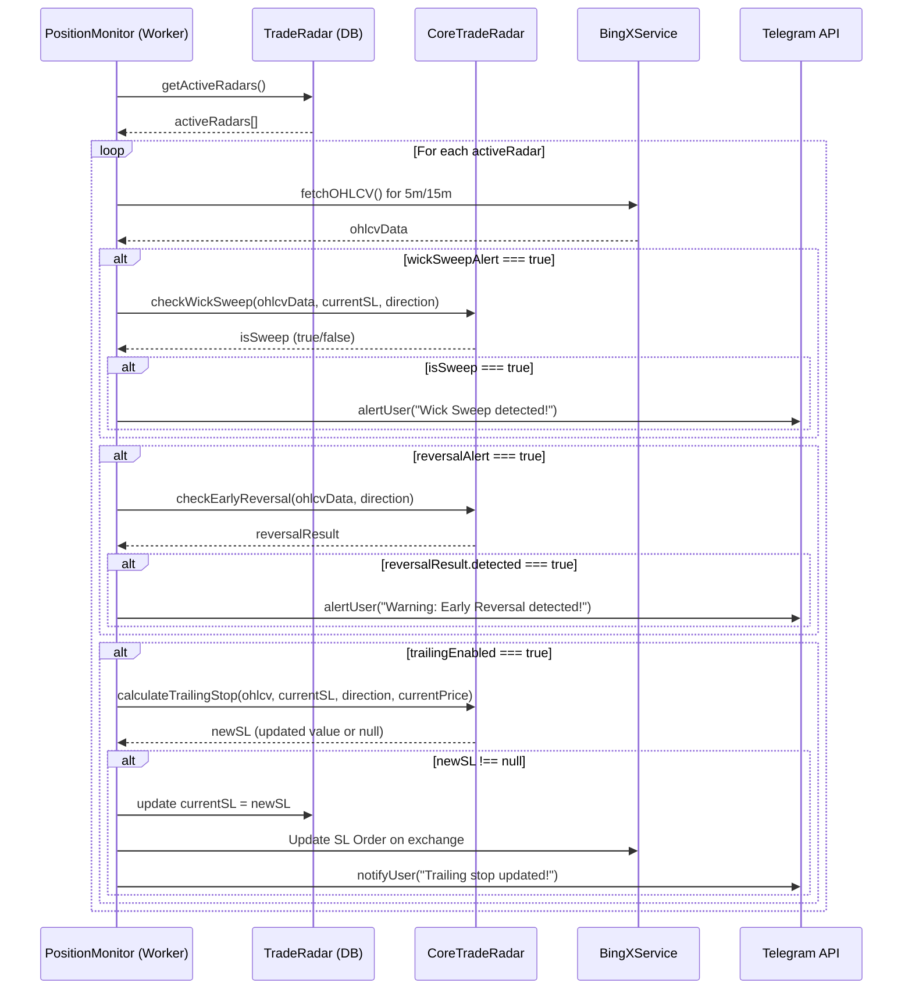

# 👁️ Radar System — نظام رادار مراقبة الصفقات المفتوحة وحمايتها

> **المسار الأساسي:** `src/core/radar/`  
> **الدور:** مراقبة الصفقات المفتوحة مباشرة بشكل لحظي لحمايتها من التغيرات المفاجئة في حركة السعر، وكشف عمليات كشط السيولة (Liquidity Sweeps)، والتنبؤ المبكر بالانعكاسات المعاكسة، بالإضافة لتفعيل الوقف المتحرك الديناميكي (Dynamic Trailing Stop).

---

## 🏗️ منطق العمليات الحسابية في الذاكرة (`CoreTradeRadar.ts`)

يعمل الرادار الحسابي كـ Pure Logic لا يعتمد على قاعدة البيانات أو البوت بشكل مباشر، ويحتوي على ثلاث دوال رئيسية:

### 1. كشف كشط السيولة العابر للوقف (`checkWickSweep`)
* **المفهوم:** رصد قيام المؤسسات بضرب مستويات وقف الخسارة مؤقتاً لتجميع السيولة قبل إكمال الاتجاه الأساسي.
* **الآلية:**
  - يتم فحص شمعة الإغلاق الأخيرة.
  - **الشرط:** إذا كان ذيل الشمعة (Wick Low/High) قد كسر وتجاوز مستوى الـ Stop Loss، ولكن **جسم الشمعة قد أغلق بأمان (Close Price)** داخل النطاق الآمن للصفقة.
  - **النتيجة:** ترجع الدالة قيمة منطقية `true` لتنبيه البوت بحدوث Wick Sweep، وهي إشارة ممتازة للمستثمر بأن السعر حافظ على قوته.

### 2. التنبؤ بالانعكاس السعري المبكر (`checkEarlyReversal`)
* **المفهوم:** الكشف عن بداية ضعف اتجاه الصفقة ورصد الانعكاس المعاكس قبل حدوث خسارة فعلية.
* **الآلية:**
  - يتم تشغيل الكشف بالاتجاه المعاكس لصفقة المستخدم.
  - **الشرط:** دمج مؤشرين معاً:
    1. كشف تغير طابع اتجاه السوق (CHOCH / MSS) المعاكس لاتجاه الصفقة.
    2. رصد انحراف مؤشر القوة النسبية (RSI Divergence) المعاكس لحركة السعر.
  - **النتيجة:** عند توافق الشرطين، يتم إصدار تنبيه فوري بالانعكاس المبكر لحماية المحفظة.

### 3. حساب الوقف المتحرك الديناميكي (`calculateTrailingStop`)
* **المفهوم:** رفع وقف الخسارة تلقائياً لتأمين الأرباح مع تحرك السعر في اتجاه الأهداف.
* **الآلية:**
  - تحسب الدالة قيمة ATR(14) اللحظية.
  - **الحساب (معادلة ATR):**
    - `New SL = Current Price - (2.0 * ATR)` (للصفقات الصاعدة LONG).
    - `New SL = Current Price + (2.0 * ATR)` (للصفقات الهابطة SHORT).
  - **النمط البديل (Swing Fractal Fallback):** إذا لم تتوفر قيم كافية للـ ATR، يتم استخدام مستويات القمم والقيعان الصغرى لآخر 5 شموع.
  - **الشرط:** يتم تحديث الـ SL فقط إذا كانت القيمة الجديدة **أفضل (تؤمن ربحاً أعلى)** من قيمة الوقف الحالية. وإلا تعود الدالة بـ `null`.

---

## 🗄️ نموذج قاعدة البيانات `TradeRadar.ts`

يخزن النموذج إعدادات المراقبة لكل صفقة مفتوحة وسجل الأحداث التي تم تنبيه المستخدم بها:
```typescript
{
    tradeId:            ObjectId,   // معرف الصفقة المرتبط بها الرادار
    userId:             ObjectId,   // معرف المستخدم
    telegramId:         String,     // معرف تليجرام للإشعارات
    symbol:             String,     // رمز العملة
    direction:          String,     // اتجاه الصفقة (LONG / SHORT)
    entryPrice:         Number,     // سعر الدخول الفعلي
    currentSL:          Number,     // وقف الخسارة الحالي المحدث
    isActive:           Boolean,    // هل الرادار نشط حالياً؟
    settings: {
        notifyOnce:       Boolean,  // إشعار مرة واحدة فقط لكل نوع حدث
        trailingEnabled:  Boolean,  // تفعيل تحريك الوقف التلقائي
        wickSweepAlert:   Boolean,  // تفعيل تنبيه Wick Sweep
        reversalAlert:    Boolean,  // تفعيل تنبيه خطر الانعكاس
    },
    sentEvents: [{                  // سجل التنبيهات المرسلة سابقاً لمنع التكرار
        type:    String,            // (WICK_SWEEP, REVERSAL_WARNING, TRAILING_UPDATE)
        sentAt:  Date,
        details: String
    }],
    lastCheckedAt:      Date,       // وقت آخر فحص
    createdAt:          Date
}
```

---

## 🔌 التفاعل والتواصل بين الملفات (Interactions)


