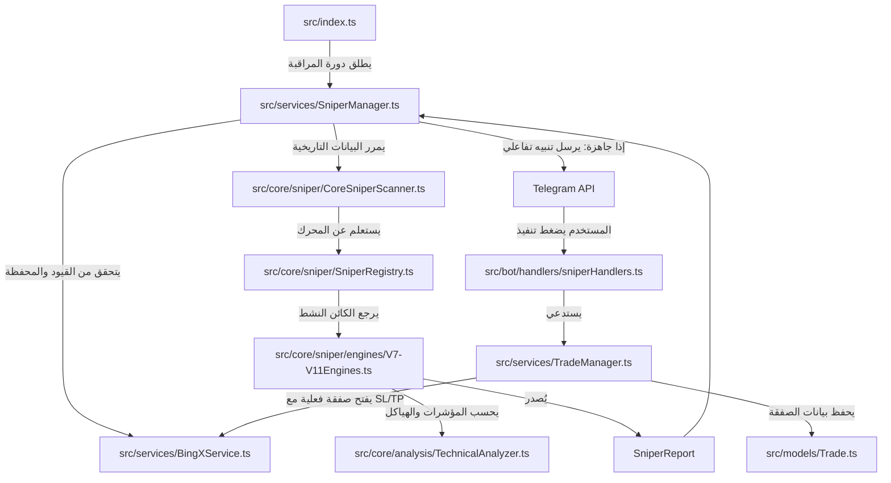

# 🎯 Sniper System — نظام قنص الفرص والصفقات المؤسساتية

> **المسار الأساسي:** `src/core/sniper/`  
> **الدور:** القلب الحسابي والمنطقي لمحركات الاقتناص. يهدف النظام إلى الكشف الدقيق عن نقاط الانعكاس والسيولة المؤسساتية (Smart Money Concepts) وتصدير تقارير فنية مفصلة بحالة شروط الدخول المتعددة.

---

## 🏗️ مكونات النظام الأساسية

### 1. واجهة المحرك (`ISniperEngine.ts`)
تحدد العقد الأساسي لجميع محركات الاقتناص. يجب على كل محرك تنفيذ الخصائص والدوال التالية:
* **`engineId`**: المعرف الفريد للمحرك (مثال: `V7-SWING`, `V11-SCALP`).
* **`displayName`**: الاسم العربي المعروض للمستخدم في قائمة خيارات Telegram.
* **`mode`**: نوع التداول المستهدف (`SCALP` أو `SWING`).
* **`requiredTFs`**: مصفوفة الأطر الزمنية المطلوبة للتحليل (تتراوح بين 1m وحتى 1d حسب طبيعة المحرك).
* **`scan(...)`**: تشغيل التحليل الفني وإرجاع كائن موحد من النوع `SniperReport`.

### 2. واجهة التقرير الموحد (`SniperReport`)
يُصدر المحرك تقريراً كاملاً في كل دورة مراقبة حتى لو لم تكتمل شروط الدخول بالكامل (تقرير استعداد)، ويحتوي على:
* مستويات الدخول المثالية، وقف الخسارة (`sl`)، جني الأرباح الأول والثاني (`tp`/`tp2`).
* مؤشر الجاهزية (`readyToFire: boolean`).
* نسبة الثقة (`confidence`) ونسبة النجاح المقدرة (`winRate`).
* شروط الدخول المكتملة (`completedConditions`) والشروط قيد الانتظار (`pendingConditions`).
* نصوص تفصيلية منسقة للرسائل.

### 3. ماسح الاقتناص المركزي (`CoreSniperScanner.ts`)
منسق عمليات التحليل في الذاكرة (Pure In-memory Coordinator) ويقوم بالآتي:
1. تحديد السعر الحالي استناداً لآخر شمعة إغلاق في فريمات 5m أو 15m.
2. حساب المتوسط السعري المرجح بالحجم **VWAP** من فريم 1d أو 1h.
3. حساب جميع المؤشرات الفنية المتقدمة للأطر الزمنية المطلوبة بالتوازي باستخدام `TechnicalAnalyzer`.
4. تمرير السعر والمؤشرات الجاهزة إلى محرك الاقتناص المختار لتنفيذ فحصه الحسابي.

### 4. سجل المحركات (`SniperRegistry.ts`)
يحتوي على جدول تسجيل وتفعيل جميع النسخ المتوفرة من محركات الاقتناص، ويحتوي على وظيفة `getSniperEngine(engineId)` للحصول على كائن المحرك المطلوب.

---

## 🏎️ مقارنة وتفصيل محركات الاقتناص (V7 – V11)

| المحرك | الاسم الفني | الفلسفة الأساسية | شروط التفعيل والزناد (Trigger) | وقف الخسارة (SL) وجني الأرباح (TP) |
| :--- | :--- | :--- | :--- | :--- |
| **V7** | قناص الهيكل والسيولة الذكي | دمج مناطق الاهتمام (OB/FVG) مع مستويات الفيبوناتشي الذهبية لتحديد أفضل قاع/قمة للانعكاس. | كسر هيكل السوق اللحظي (MSS) بدقة + تشبع مؤشر RSI واختلاف الزخم (Divergence). | **SL:** أسفل/أعلى المنطقة الذهبية بمسافة نصف ATR.<br>**TP:** مستويات Pivot أو الفيبوناتشي المعاكسة. |
| **V8** | قناص الموجات والسيولة | تتبع الموجات السعرية الرئيسية وكشط السيولة (Liquidity Sweeps) عند مستويات القيعان والقمم السابقة. | ارتداد قوي وتولد ذيل شمعة طويل كاشط للسيولة + ارتداد من متوسط EMA50 + ارتفاع الحجم (Volume Spike). | **SL:** أسفل ذيل شمعة الكشط بمسافة 3× ATR.<br>**TP:** مستويات الأهداف الموجية بمسافة 3.0× و 5.5× ATR. |
| **V9** | قناص SMC الذكي | التحليل الهيكلي الشامل للمؤسسات (Smart Money Concepts) على الأطر الزمنية الكبيرة وتأكيد الدخول على الصغير. | توافق اتجاه الكسر (BOS/CHOCH) على الفريم الأكبر، تراجع السعر لـ OB/FVG نشط، ثم CHOCH تأكيدي على الفريم الأصغر. | **SL:** أسفل أقرب دعم أو OB بمسافة ربع ATR (حد أقصى 3%).<br>**TP:** مستويات الدعم والمقاومة التاريخية مع RRR >= 1.5. |
| **V10** | الهجين المؤسساتي المطور | دمج كسر الهيكل وتدفق السيولة مع مؤشرات فنية هجينة والتحليل الخطي وحيتان العقود الآجلة. | اتجاه Heikin-Ashi SuperTrend صاعد، السعر متواجد في منطقة OB/FVG نشطة وقريب من نقطة التحكم السعري POC للحجم المتراكم. | **SL:** أسفل كتلة السيولة النشطة.<br>**TP:** مستويات الدعم والمقاومة التاريخية الحقيقية. |
| **V11** | قناص القرار الذكي | محرك ذكاء اصطناعي تكيفي يقوم بفرز حالة السوق (عرضي متذبذب Ranging vs اتجاهي Trending) وتغيير الاستراتيجية تلقائياً. | **سوق عرضي (KAMA flat):** البيع/الشراء من حدود البولنجر مع RSI متطرف.<br>**سوق اتجاهي:** تفعيل SMC الكامل (OB/FVG + CHOCH) أو ركوب موجة إليوت 3 الاندفاعية. | **سوق عرضي:** SL خارج نطاق البولنجر وتصفية الأرباح عند خط المنتصف.<br>**سوق اتجاهي:** إستراتيجية SMC متكاملة. |

---

## 🗄️ نموذج قاعدة البيانات `SniperWatch.ts`

يخزن النموذج الطلبات الفعالة التي أطلقها المستخدمون لمراقبة الأسواق واقتناص الصفقات:
```typescript
{
    userId:             ObjectId,   // معرف المستخدم المرتبط
    telegramId:         String,     // معرف تليجرام للإشعارات
    symbol:             String,     // الرمز الكامل (BTC/USDT:USDT)
    symbolShort:        String,     // الرمز القصير (BTC)
    engineId:           String,     // معرف قناص الاقتناص (V7-V11)
    status:             String,     // الحالة (ACTIVE, TRIGGERED, EXPIRED, CANCELLED)
    autoExecute:        Boolean,    // تنفيذ تلقائي فور توفر الإشارة
    notifyOnce:         Boolean,    // إرسال تنبيه واحد فقط عند أول تغير
    expiresAt:          Date,       // وقت انتهاء مهمة المراقبة
    notificationCount:  Number,     // عدد الإشعارات المرسلة
    lastReport:         Object,     // التقرير الأخير المخزن مؤقتاً
    lastNotifiedAt:     Date,       // تاريخ آخر تنبيه تم إرساله
}
```

---

## 🔌 التفاعل والتواصل بين الملفات (Interactions)


