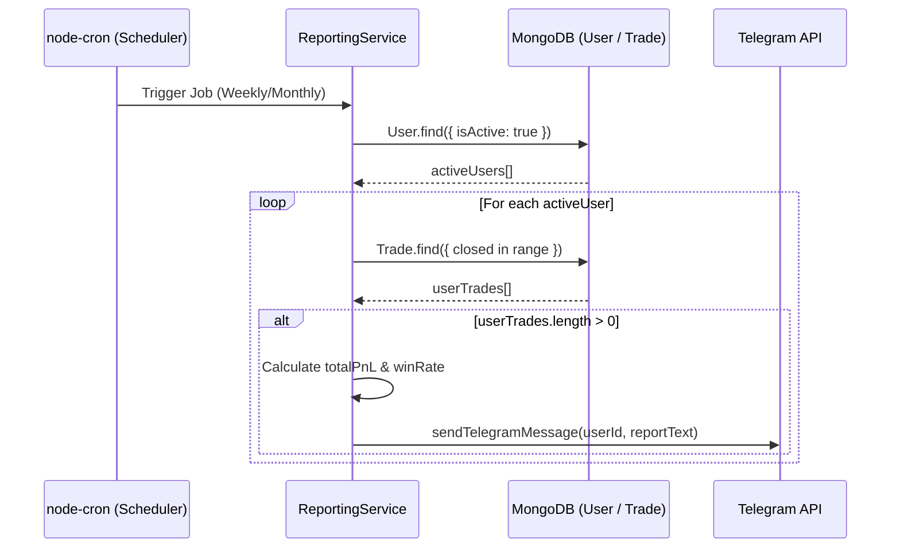

# 📊 ReportingService.ts — خدمة التقارير الدورية الآلية

> **الموقع:** `src/services/ReportingService.ts`  
> **الدور:** إدارة التقارير التلقائية المجدولة زمنياً (أسبوعياً وشهرياً) وإرسال ملخص إحصائي للأرباح والخسائر والصفقات المنفذة لكل مستخدم نشط عبر Telegram.

---

## 📋 هيكل الجدولة (Cron Schedules)

تعتمد الخدمة على مكتبة `node-cron` لجدولة المهام. ويتم تهيئة المهام عند تشغيل البوت عبر استدعاء دالة `init()` من ملف `index.ts`.

| نوع التقرير | توقيت التشغيل (Cron Expression) | التوقيت الفعلي |
| :--- | :--- | :--- |
| **تقرير أسبوعي** | `0 0 * * 0` | كل يوم أحد الساعة 00:00 بتوقيت الخادم |
| **تقرير شهري** | `0 0 1 * *` | أول يوم من كل شهر الساعة 00:00 بتوقيت الخادم |

---

## ⚙️ المنطق الحسابي واستعلام البيانات

عند إطلاق المهمة المجدولة، تقوم دالة `generateAndSendReports(type)` بالآتي:

1. **البحث عن المستخدمين النشطين:** جلب جميع المستخدمين المسجلين وحالتهم نشطة (`User.find({ isActive: true })`).
2. **تحديد فترة التقرير:**
   - **التقرير الأسبوعي:** يبدأ من 7 أيام مضت وحتى اللحظة الحالية.
   - **التقرير الشهري:** يبدأ من شهر كامل مضى وحتى اللحظة الحالية.
3. **جلب الصفقات المغلقة:** لكل مستخدم، يتم البحث في صفقاته المغلقة والمنتهية فقط خلال الفترة المحددة:
   ```typescript
   Trade.find({
       userId: user._id,
       entryTime: { $gte: startTime, $lte: now },
       currentStatus: { $in: ['CLOSED_PROFIT', 'CLOSED_LOSS'] }
   })
   ```
4. **حساب الإحصائيات:**
   - حساب إجمالي الأرباح والخسائر المجمعة بالـ USDT (`totalPnL`).
   - حساب عدد الصفقات الرابحة (`wins`).
   - حساب نسبة النجاح (`winRate = (wins / totalTrades) * 100`).
5. **تنسيق وإرسال الرسالة:**
   - يتم إرسال الرسالة منسقة لكل مستخدم على حدة لتجنب إرسال تقارير فارغة (إذا لم يقم المستخدم بأي صفقات خلال الفترة، يتم تجاهله تلقائياً).

---

## 🔌 التفاعل والتواصل بين الملفات (Interactions)


