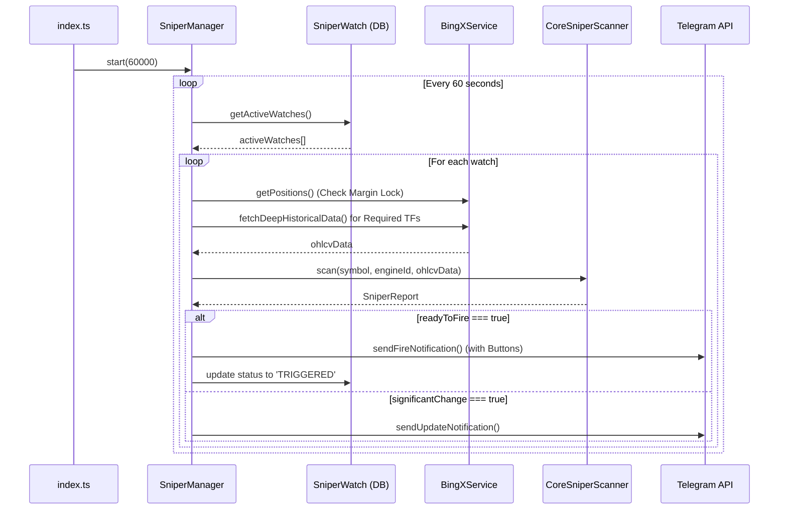

# 🎯 SniperManager.ts — مدير الاقتناص

> **الموقع:** `src/services/SniperManager.ts`  
> **الدور:** إدارة دورة الاقتناص الخلفية النشطة، وفحص شروط الدخول المستمرة للعملات المراقبة، وتنفيذ حماية رأس المال الهامشي (Margin Lock)، وإرسال التنبيهات والأزرار التفاعلية إلى Telegram.

---

## 📋 هيكل الفئة (Class Structure)

يعمل `SniperManager` كخادم خلفي مستقل (Background Worker) يتم تشغيله عند بدء تشغيل البوت في `index.ts`.

### الخصائص الرئيسية (Key Properties)
* **`isRunning`**: حالة تشغيل الخدمة (نشط / متوقف).
* **`intervalId`**: مرجع مؤقت الحلقة التكرارية (`NodeJS.Timeout`).
* **`notifier`**: دالة رد النداء (Callback) لإرسال التنبيهات عبر البوت مع خيارات تنسيق لوحة المفاتيح والـ HTML/Markdown.

---

## ⚙️ الوظائف والعمليات الرئيسية

### 1. إدارة دورة العمل (`start` / `stop`)
* **`start(intervalMs = 60,000)`**: تشغيل الدورة المستمرة (الدورة الافتراضية كل 60 ثانية).
* **`stop()`**: إيقاف الدورة التكرارية وإيقاف فحص الاقتناصات.

### 2. الحلقة الأساسية (`runCycle` / `processWatch`)
تقوم الدورة كل 60 ثانية بالخطوات التالية:
1. جلب جميع الاقتناصات النشطة من قاعدة البيانات (`SniperWatch.find({ status: 'ACTIVE' })`).
2. تمرير كل اقتناص إلى `processWatch`:
   - **فحص انتهاء الصلاحية**: إذا تجاوز الاقتناص وقت الصلاحية (`expiresAt < new Date()`) يتم تحويل حالته إلى `EXPIRED` وإشعار المستخدم.
   - **توليد التقرير**: استدعاء دالة `generateReport` لجلب الشموع وتشغيل المنطق الحسابي في طبقة الـ Core.
   - **تنبيه الإشارات الجاهزة**: إذا كانت شروط الدخول كاملة (`report.readyToFire === true`):
     - يتم إرسال رسالة تفصيلية للمستخدم مع أزرار التنفيذ السريع.
     - يتم تحويل حالة المراقبة إلى `TRIGGERED` لمنع التكرار.
   - **تنبيه التحديثات**: إذا تغير عدد الشروط المكتملة ولم تكتمل بالكامل بعد، يتم إرسال تحديث مرحلي للمستخدم (مثلاً: "تحديث: 3/5 شروط مكتملة").

---

## 🛡️ قفل الهامش وتأكيد المحفظة (Margin Lock & Concurrency Control)

قبل إجراء أي تحليل دوري لعملة مراقبة، تقوم دالة `generateReport` بالاستعلام عن المراكز المفتوحة حالياً في المحفظة عبر `BingXService.getPositions()`.
* **شرط الحماية:** إذا كان عدد الصفقات النشطة على الحساب الفعلي **يساوي أو يزيد عن 5 صفقات**، يتم تفعيل **Margin Lock** (قفل الهامش).
* **الإجراء:** يتم تجميد إطلاق الصفقات الجديدة وتنبيه السجل `logger.warn` لمنع استهلاك الهامش المتاح في البورصة وتجنب التصفية (Liquidation).

---

## 📨 نظام التنبيهات والأزرار التفاعلية

### 🚀 رسالة إطلاق الصفقة (Fire Notification)
عند اكتمال كافة الشروط بنجاح، يتم إرسال تقرير الاقتناص مع لوحة مفاتيح Inline تحتوي على الخيارات التالية:

| الزر | الـ Callback Data | الإجراء المرتبط |
| :--- | :--- | :--- |
| **`⚡ تنفيذ الصفقة`** | `snp_exec_<watch_id>` | تنفيذ أمر دخول السوق فوراً عبر `TradeManager` بناءً على أهداف وقف الخسارة وجني الأرباح المحسوبة. |
| **`📝 نسخ الصفقة`** | `snp_copy_<symbol>_<engineId>` | إرسال نص الإشارة للمستخدم بتنسيق قياسي لنسخه يدوياً في منصات أخرى. |
| **`👁 تفعيل المراقبة`** | `snp_radar_<watch_id>` | تسجيل العملة في الرادار لمتابعة اختراقات السعر الحية. |
| **`❌ إلغاء الاقتناص`** | `snp_cancel_<watch_id>` | إلغاء المراقبة وتعطيل الطلب. |

---

## 🔌 التفاعل والتواصل بين الملفات (Interactions)

