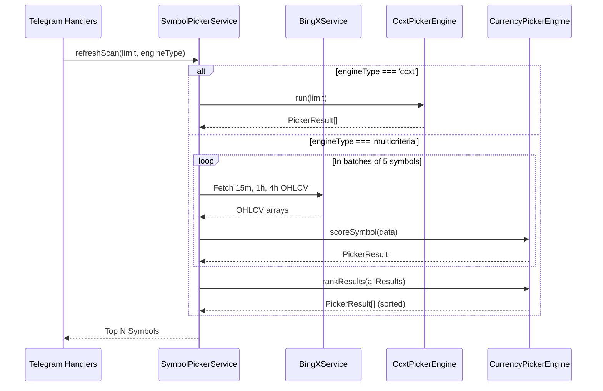

# 🔍 SymbolPickerService.ts — خدمة فرز واختيار العملات

> **الموقع:** `src/services/SymbolPickerService.ts`  
> **الدور:** إجراء فحص شامل وبحث تلقائي في الأسواق لاكتشاف أفضل العملات الصالحة للتداول بناءً على الحجم، السيولة، والتقلبات. تقوم الخدمة بإدارة عمليات الاستعلام المتوازية وتخزين نتائج الفحص مؤقتاً لتجنب قيود الطلبات (Rate Limits).

---

## 📋 هيكل العمليات والخصائص

### قائمة العملات النشطة للبحث (`SCAN_SYMBOLS`)
تحتوي الخدمة على قائمة ثابتة تضم **50 عملة مشهورة** في أسواق العقود الآجلة (مثل BTC, ETH, SOL, AVAX, MATIC, ARB, WLD...) ويتم فحصها بشكل دوري لترشيح الأفضل منها.

### الخصائص الرئيسية (Properties)
* **`cachedResults`**: مصفوفة لتخزين نتائج الفحص الأخيرة في الذاكرة لمنع الفحص المتكرر عند استعلام المستخدمين.
* **`lastScanTime`**: وقت إجراء آخر عملية فحص كاملة للأسواق.
* **`isScanning`**: مؤشر تشغيل يمنع تداخل عمليتي فحص في نفس الوقت.

---

## ⚙️ الوظائف والعمليات الرئيسية

### 1. الاستعلام السريع من الكاش
* **`getLastResults()`**: تُرجع النتائج المحفوظة مباشرة مع تاريخ الفحص بدون استهلاك موارد البورصة.
* **`hasResults()`**: تُرجع قيمة منطقية لمعرفة ما إذا كان الكاش يحتوي على نتائج جاهزة.
* **`isScanRunning()`**: التحقق من حالة الفحص الحالية.

### 2. إجراء فحص جديد (`refreshScan`)
تقوم هذه الدالة بإعادة فحص السوق بالكامل، وتعمل كالتالي:
* تقبل وسيط `limit` لتحديد عدد أفضل عملات مطلوبة (الافتراضي أفضل 20 عملة).
* تقبل نوع المحرك (`multicriteria` أو `ccxt`).
* **آلية الـ Batching (الدفعات المتوازية):**
  - يتم فحص قائمة الـ 50 عملة في مجموعات صغيرة متوازية (Batch Size = 5).
  - يتم استدعاء `scanSingleSymbol` لكل عملة داخل الـ Batch بالتوازي عبر `Promise.allSettled`.
  - يتم وضع تأخير زمني (`300ms`) بين كل Batch والآخر لحماية التطبيق من قيود الطلبات (Rate Limit) في BingX.
* **الترتيب والتصفية:** يتم فرز وترتيب النتائج تنازلياً حسب التقييم النهائي واستخراج أفضل عملات مرشحة وتحديث الكاش.

### 3. فحص العملة الفردية (`scanSingleSymbol`)
لكل عملة مراقبة، تقوم الخدمة بطلب البيانات التالية بالتوازي:
1. شموع 15 دقيقة (شموع 100).
2. شموع ساعة واحدة (شموع 100).
3. شموع 4 ساعات (شموع 60).
4. بيانات الـ Ticker الحالية (لحساب السيولة اليومية بالدولار ومعدل التغير اليومي 24h).
5. تمرير البيانات المجلوبة لكائنات الـ Core لحساب التقييم الرقمي.

---

## 🔌 النمط الأحادي المشترك (Singleton Pattern)

يتم تشغيل الخدمة كـ Singleton مشترك عبر الدالة `getSymbolPickerService(bingx)` لضمان وجود كاش موحد ومشاركتها بين كل معالجات البوت دون تكرار إنشاء الحلقات التكرارية والطلبات.

```typescript
let _pickerServiceInstance: SymbolPickerService | null = null;

export function getSymbolPickerService(bingxService: BingXService): SymbolPickerService {
    if (!_pickerServiceInstance) {
        _pickerServiceInstance = new SymbolPickerService(bingxService);
    }
    return _pickerServiceInstance;
}
```

---

## 🔄 التفاعل والتواصل بين الملفات (Interactions)


