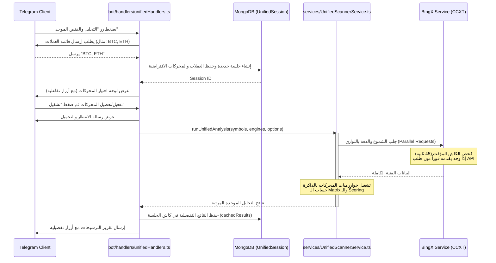

# 👁️ UnifiedScannerService.ts — خدمة المسح والتحليل الموحد

> **الموقع:** `src/services/UnifiedScannerService.ts`  
> **الدور:** يُمثل خدمة وسيطة مركبة (Composite Facade Service) تُدير عمليات التحليل الفني والقنص متعدد المحركات لعدة عملات معاً بشكل متوازٍ، وتصنيف النتائج وترشيح الأفضل منها للمتداول.

---

## 📋 نظرة عامة

يقوم البوت بالوضع الافتراضي بطلب شموع تاريخية لكل عملة على حدة وبشكل متتابع، مما يسبب بطءاً كبيراً في التجاوب ويزيد خطر حظر الـ API من منصة التداول. تحل خدمة `UnifiedScannerService` هذه المشكلة تماماً من خلال:
* **التنفيذ المتوازي:** استخدام `Promise.all` لإرسال كافة استعلامات الشموع ومستويات دقة الأسعار معاً لجميع العملات في دورة واحدة.
* **كاش الشموع المؤقت (In-Memory Candle Cache):** تخزين الشموع المسترجعة في الذاكرة لمدة 45 ثانية، فإذا طلبت محركات متعددة نفس البيانات لا يتم إرسال طلب جديد للبورصة.
* **محرك ترجيح واختيار (Scoring Matrix):** تقييم مخرجات كل محرك بناءً على جاهزية الإشارة، قوة المصفوفة التوافقية (Matrix Score)، ونسبة الوثوقية الافتراضية للمحرك لتوليد تقرير موحد مرتب تنازلياً.

---

## 🔧 شرح وتفصيل الوظائف الفنية

### 1. تشغيل التحليل الموحد لعدة عملات (`runUnifiedAnalysis`)

* **المدخلات:**
  ```typescript
  async runUnifiedAnalysis(
      symbols: string[],
      engines: string[],
      options: { quickTF?: string; longTF?: string; limit?: number; antiRepainting?: boolean }
  )
  ```
* **آلية العمل الفنية:**
  1. يتم فحص قائمة العملات وتطبيعها للصيغة القياسية (مثل `BTC` إلى `BTC/USDT:USDT`).
  2. جلب مستويات دقة الأسعار والشموع التاريخية لـ 7 فريمات فنية معتمدة (`MATRIX_TFS`) لكل عملة بالتوازي:
     ```typescript
     await Promise.all([
         this.bingxService.getPricePrecision(symbol),
         ...MATRIX_TFS.map(async tf => { ... })
     ])
     ```
  3. تمرير البيانات المجلوبة لكل محرك فني مختار (من V1 إلى V14) ليعمل في الذاكرة بالكامل دون إعادة جلب البيانات.
  4. حساب وزن التقييم (Score) للمحرك:
     * **إذا توفرت إشارة نشطة (LONG/SHORT):**
       $$\text{Score} = 100 + (\text{Matrix Percentage} \times 0.5) + (\text{Base Trust Score} \times 0.5)$$
     * **إذا لم تتوفر إشارة فنية:**
       $$\text{Score} = (\text{Matrix Percentage} \times 0.2) + (\text{Base Trust Score} \times 0.2)$$
  5. ترتيب النتائج تنازلياً حسب الـ Score لبناء التقرير النهائي.
  6. صياغة تقرير عربي موحد يوضح السعر الحالي والترشيحات مع أزرار تفاعلية (التفاصيل، النسخ، التنفيذ).

---

### 2. تشغيل القنص الموحد لعدة عملات (`runUnifiedSniper`)

* **المدخلات:**
  ```typescript
  async runUnifiedSniper(
      symbols: string[],
      engines: string[]
  )
  ```
* **آلية العمل الفنية:**
  1. استخراج الأطر الزمنية المطلوبة للمحركات المختارة (عبر `engine.requiredTFs`) وتجميعها في مجموعة فريدة لمنع الاستعلامات المتكررة.
  2. جلب البيانات العميقة التاريخية بالتوازي لكل عملة وفريم استناداً للمدة اللازمة للمحرك (مثل 210 يوم لـ 1d، 40 يوم لـ 4h، 12 يوم لـ 1h، و3 أيام للفريمات الصغيرة).
  3. تشغيل كاشف القنص (`CoreSniperScanner.scan`) لكل محرك في الذاكرة.
  4. حساب نقاط الترشيح للمحركات:
     * إذا كان محرك الاقتناص جاهزاً لإطلاق الصفقة (`readyToFire`): يضاف `200` نقطة.
     * إذا كان هناك اتجاه نشط: يضاف `100` نقطة.
     * تضاف نسبة من قوة الثقة (Confidence) ونسبة نجاح المحرك (WinRate) وثقة المحرك الافتراضية.
  5. توليد تقرير الاقتناص المرتب وعرض حالة زناد الدخول وشروطه المكتملة والمتبقية.

---

## 📊 جدول نسب الوثوقية الافتراضية للمحركات (Default Trust Scores)

تستخدم الخدمة مصفوفة وثوقية مبنية على الأداء التاريخي الفعلي للمحركات في الاختبارات الرجعية:

| المحرك الفني | نسبة الوثوقية الافتراضية للتحليل الفني | نسبة الوثوقية الافتراضية لقناص الصفقات |
| :--- | :---: | :---: |
| **V11** (القرار التكيفي) | 95% | 95% |
| **V10** (المؤسساتي POC) | 93% | 93% |
| **V12** (تدفق السيولة CVD) | 90% | 90% |
| **V13** (مصائد وايكوف) | 90% | 90% |
| **V14** (الشبكة العرضية) | 88% | 88% |
| **V9** (قناص SMC) | 87% | 87% |
| **V8** (الموجي والسيولة) | 85% | 85% |
| **V7** (الهجين) | 85% | 85% |

---

## 🔄 التفاعل المعماري للخدمة مع البوت وقاعدة البيانات


