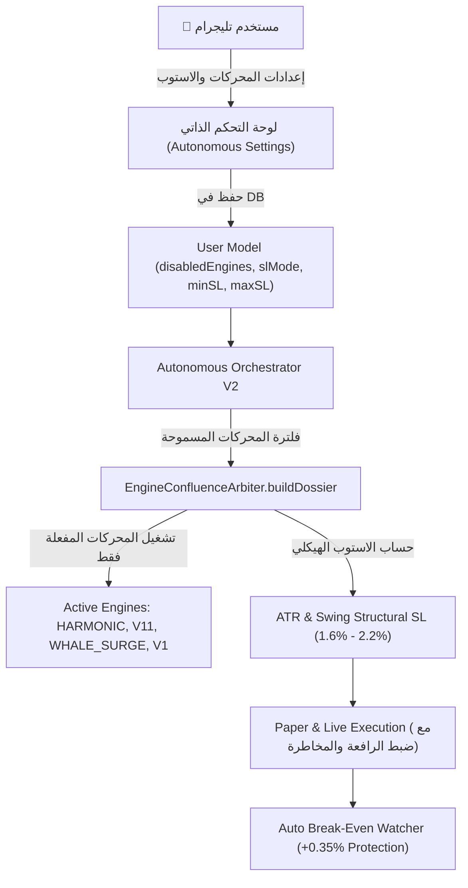

# 🚀 خطة التطوير: نظام التحكم بالمحركات (Engine Selector) والاستوب الهيكلي التكيفي (ATR Structural SL)

بناءً على نتائج تحليل صفقات التداول الافتراضي السابقة (596 صفقة) والتي أثبتت رقمياً أن **عزل المحركات الضعيفة** و**توسيع وقف الخسارة إلى النطاق الهيكلي (1.6% - 2.2%)** يقلبان أداء البوت رأساً على عقب من خسائر متراكمة إلى **ربحية صافية مستدامة**، تهدف هذه الخطة إلى تطبيق هاتين الخاصيتين بشكل مرن ومتكامل مع واجهة تليجرام وقاعدة البيانات ومحرك التداول.

---

## 🎯 الأهداف الأساسية للخطة

1. **الخاصية الأولى: نظام اختيار وحظر المحركات (Engine Selector & Exclusion Matrix)**:
   - تمكين المستخدم من استبعاد أي محرك من التحليل أو التدخل في اتخاذ القرار (مثل: `V10, V9, V12, V13, V16, V17, V18, V4, V5, V6, V2, V8`) بضغطة زر واحدة.
   - منع المحركات المحظورة من التأثير على نقاط التوافق (Confluence Score) أو إرسال إشارات دخول أو إدراجها كمحرك رئيسي.
   - إضافة قائمة تفاعلية في تليجرام مع زر سريع لتشغيل "المحركات الذهبية فقط" (Golden Engines Preset: `HARMONIC`, `V11`, `WHALE_SURGE`, `V1`).

2. **الخاصية الثانية: وقف الخسارة الهيكلي التكيفي (ATR & Swing Structural SL)**:
   - إلغاء قيد الحصر الإجباري القديم في كود `SCALP_TURBO` (0.8% - 1.0%) الذي تسبب في خروج 74% من الصفقات الخاسرة بسبب تذبذب السوق العادي.
   - احتساب الاستوب بناءً على **أدنى قاع للشموع السابقة (Swing Low)** لصفقات الشراء، أو **أعلى قمة (Swing High)** لصفقات البيع، مع إضافة هامش أمان مستمد من مؤشر **ATR(14)**.
   - ضبط نطاق الاستوب التكيفي الصارم بين **1.6% كحد أدنى** (لمنع الصيد بالذيول) و **2.2% كحد أقصى** (لحماية رأس المال).
   - مواءمة الرافعة المالية والهامش تلقائياً بحيث تبقى المخاطرة الدولارية الصافية لكل صفقة ثابتة وآمنة (~1% - 1.2% من رأس المال).
   - استمرار عمل نظام التأمين الفوري السريع (**Auto Break-Even عند +0.35%**) لضمان نقل الاستوب لسعر الدخول فور تحرك الصفقة نحو الربح.

---

## 🏗️ التصميم المعماري ومراحل التنفيذ



---

### المرحلة 1: تحديث قاعدة البيانات (Database Schema & User Settings)
* **الملف المستهدف**: `src/models/User.ts`
* **التعديلات**:
  - إضافة الحقول التالية إلى كائن `autonomousSettings`:
    ```typescript
    // المحركات المحظورة من التحليل والقرار
    disabledEngines?: string[]; // الافتراضي: ['V10', 'V9', 'V12', 'V13', 'V16', 'V17', 'V18', 'V4', 'V5', 'V6', 'V2', 'V8']
    
    // إعدادات وقف الخسارة الهيكلي التكيفي
    slMode?: 'ATR_STRUCTURAL' | 'FIXED_TURBO'; // الافتراضي: ATR_STRUCTURAL
    minSlPercentage?: number; // الافتراضي: 1.6%
    maxSlPercentage?: number; // الافتراضي: 2.2%
    atrMultiplier?: number;   // الافتراضي: 1.5x
    ```

---

### المرحلة 2: دمج فلترة المحركات في مصفوفة التوافق الرياضي
* **الملف المستهدف**: `src/core/analysis/EngineConfluenceArbiter.ts`
* **التعديلات**:
  1. تحديث دالة `buildDossier(..., options)` لتستقبل مصفوفة `disabledEngines?: string[]`.
  2. في حلقة فحص المحركات `enginesToTest`:
     ```typescript
     for (const engId of enginesToTest) {
         if (disabledEngines.includes(engId.toUpperCase())) {
             continue; // تخطي المحرك تماماً: لا استهلاك للمعالج، لا تصويت، لا وزن
         }
         ...
     }
     ```
  3. التأكد من أن المحركات المحظورة لا تضاف إلى `engineVerdicts` ولا إلى قائمة `enginesSummary`، وبالتالي يستحيل اختيارها كمحرك رئيسي (`primaryEngine`) للصفقة.

---

### المرحلة 3: تطبيق وقف الخسارة الهيكلي التكيفي (ATR Structural SL)
* **الملفات المستهدفة**:
  - `src/core/analysis/EngineConfluenceArbiter.ts`
  - `src/services/AutonomousOrchestrator.ts`
* **التعديلات الفنية**:
  1. **إلغاء قيد الـ 0.94% الإجباري** في دالة `auditAndExecuteCandidate` داخل `AutonomousOrchestrator.ts` عند تفعيل نمط `ATR_STRUCTURAL`.
  2. بناء خوارزمية حساب الاستوب الهيكلي الدقيق:
     ```typescript
     // 1. حساب الـ ATR الحقيقي على فريم 15 دقيقة
     const atr15m = TechnicalAnalyzer.calculateATR(quickCandles, 14);
     
     // 2. تحديد قاع/قمة الشموع السابقة (Recent Swing Levels)
     const recentCandles = quickCandles.slice(-6); // آخر 6 شموع
     const swingLow = Math.min(...recentCandles.map(c => c.low));
     const swingHigh = Math.max(...recentCandles.map(c => c.high));
     
     // 3. احتساب الاستوب المقترح
     let structuralSL: number;
     if (recDir === 'LONG') {
         // أسفل القاع السابق بمسافة ATR عازلة
         structuralSL = swingLow - (atr15m * 0.5);
         // ضبط المسافة بنطاق الأمان (بين 1.6% و 2.2%)
         const currentDistPct = ((currentPrice - structuralSL) / currentPrice) * 100;
         if (currentDistPct < minSlPct) structuralSL = currentPrice * (1 - (minSlPct / 100));
         if (currentDistPct > maxSlPct) structuralSL = currentPrice * (1 - (maxSlPct / 100));
     } else {
         // أعلى القمة السابقة بمسافة ATR عازلة
         structuralSL = swingHigh + (atr15m * 0.5);
         // ضبط المسافة بنطاق الأمان (بين 1.6% و 2.2%)
         const currentDistPct = ((structuralSL - currentPrice) / currentPrice) * 100;
         if (currentDistPct < minSlPct) structuralSL = currentPrice * (1 + (minSlPct / 100));
         if (currentDistPct > maxSlPct) structuralSL = currentPrice * (1 + (maxSlPct / 100));
     }
     ```
  3. **موازنة الرافعة المالية (Risk Equalizer)**:
     - إذا اتسع الاستوب من 0.9% إلى 1.8%، يقوم النظام تلقائياً بتعديل الرافعة الديناميكية (مثلاً من 25x إلى 15x-20x) أو خفض الهامش قليلاً، بحيث لا يتجاوز أقصى تراجع للمحفظة في حال ضرب الاستوب النسبة المحددة (1% - 1.2% من رأس المال).

---

### المرحلة 4: واجهة التحكم التفاعلية في تليجرام (Telegram UI & Buttons)
* **الملف المستهدف**: `src/bot/handlers/autonomousHandlers.ts`
* **التعديلات**:
  1. إضافة قسم مخصص في لوحة الإعدادات (`renderAutonomousSettingsHub`):
     - زر: `🎛️ إدارة المحركات الفنية والكمية (Engine Selector)`
     - زر: `🛑 نمط وقف الخسارة: هيكلي تكيفي ATR (1.6% - 2.2%) 🟢` (للتبديل بنقرة واحدة).
  2. إنشاء صفحة تفاعلية لإدارة المحركات (`renderEngineSelectorHub`):
     - زر سريع: `👑 تفعيل المحركات الذهبية فقط (الأعلى ربحية) [V1, V11, HARMONIC, WHALE]`
     - زر سريع: `🔄 تفعيل جميع المحركات بلا استثناء`
     - أزرار شبكية لكل محرك:
       - `[✅ V1]` | `[❌ V2]` | `[✅ V3]`
       - `[❌ V6]` | `[✅ V7]` | `[❌ V8]`
       - `[❌ V9]` | `[❌ V10]` | `[✅ V11]`
       - `[❌ V12]` | `[❌ V13]` | `[❌ V16]`
       - `[❌ V17]` | `[❌ V18]` | `[✅ HARMONIC]`
       - `[✅ WHALE SURGE]`
     - الضغط على أي زر يعكس حالته فوراً (من ✅ إلى ❌ والعكس) ويحفظ التغيير في قاعدة البيانات والذاكرة الحية للمنظومة.

---

## 🧪 التحقق والاختبار (Verification & Validation)

1. **اختبار عزل المحركات**:
   - تشغيل سيناريو فحص تجريبي والتأكد من أن المحرك المعطل لا يظهر نهائياً في التقرير التحليلي أو سجل العمليات (`logs`).
2. **اختبار دقة الاستوب الهيكلي**:
   - اختبار حساب الاستوب لعملات متقلبة (مثل SOL، NEAR، WLD) والتأكد من وقوعه دائماً بين 1.6% و 2.2% وأسفل قاع الشمعة السابقة بمسافة أمان.
3. **اختبار سلامة الـ Build**:
   - التأكد من اجتياز المشروع بالكامل للأمر `npm run build` بنجاح ودون أي أخطاء من نوع TypeScript.

---

## ❓ أسئلة واستفسار للمستخدم قبل البدء بالتنفيذ:
- هل تفضل أن نضع المحركات الذهبية المقترحة افتراضياً مفعلة (`HARMONIC, V11, WHALE_SURGE, V1, V3, V7`) وحظر باقي المحركات (`V10, V9, V12, V13, V16, V17, V18, V4, V5, V6, V2, V8`) بشكل مسبق، مع إمكانية تعديلها في أي وقت عبر أزرار تليجرام؟
- هل نطاق الستوب التكيفي المقترح بين **1.6% إلى 2.2%** مع استمرار تأمين الدخول (**Auto Break-Even عند +0.35%**) مناسب لك لاعتماده في الكود؟
