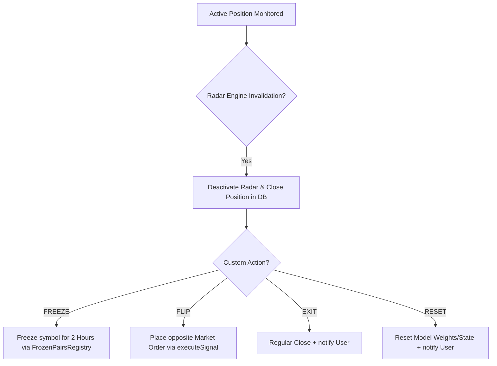

# Technical Guide - Modernizing V12 to V15 Trading Engines & Radar Monitoring

This technical document details the math, algorithms, file architectures, and Radar state machine behaviors for the V12, V13, V14, and V15 engines integrated into the BotTrading_BingX platform.

---

## 1. Directory Structure of Changes

### Created Files
- `[NEW]` [IRadarEngine.ts](file:///e:/webProject/BotTrading_BingX/src/core/radar/engines/IRadarEngine.ts) — Base interface defining radar contracts.
- `[NEW]` [V12RadarEngine.ts](file:///e:/webProject/BotTrading_BingX/src/core/radar/engines/V12RadarEngine.ts) — Invalidation checks for V12 (Smart Liquidity).
- `[NEW]` [V13RadarEngine.ts](file:///e:/webProject/BotTrading_BingX/src/core/radar/engines/V13RadarEngine.ts) — Invalidation checks for V13 (Volumetric Flow).
- `[NEW]` [V14RadarEngine.ts](file:///e:/webProject/BotTrading_BingX/src/core/radar/engines/V14RadarEngine.ts) — Invalidation checks for V14 (Adaptive Renko Cloud).
- `[NEW]` [V15RadarEngine.ts](file:///e:/webProject/BotTrading_BingX/src/core/radar/engines/V15RadarEngine.ts) — Invalidation checks for V15 (Quant Harmonic).
- `[NEW]` [RadarEngineRegistry.ts](file:///e:/webProject/BotTrading_BingX/src/core/radar/RadarEngineRegistry.ts) — In-memory map and resolver for active radar instances.
- `[NEW]` [FrozenPairsRegistry.ts](file:///e:/webProject/BotTrading_BingX/src/utils/FrozenPairsRegistry.ts) — Tracks symbols undergoing trading freezes.
- `[NEW]` [V15SniperEngine.ts](file:///e:/webProject/BotTrading_BingX/src/core/sniper/engines/V15SniperEngine.ts) — Strategy criteria scanner for V15.
- `[NEW]` [V15Engine.ts](file:///e:/webProject/BotTrading_BingX/src/core/analysis/engines/V15Engine.ts) — Mirrored analysis script for V15 backtests and keyboard runs.

### Modified Files
- `[MODIFY]` [V12SniperEngine.ts](file:///e:/webProject/BotTrading_BingX/src/core/sniper/engines/V12SniperEngine.ts) — Refined order block filters.
- `[MODIFY]` [V12Engine.ts](file:///e:/webProject/BotTrading_BingX/src/core/analysis/engines/V12Engine.ts) — Mirrored V12 analysis.
- `[MODIFY]` [V13SniperEngine.ts](file:///e:/webProject/BotTrading_BingX/src/core/sniper/engines/V13SniperEngine.ts) — Localized CVD variables.
- `[MODIFY]` [V13Engine.ts](file:///e:/webProject/BotTrading_BingX/src/core/analysis/engines/V13Engine.ts) — Mirrored V13 analysis.
- `[MODIFY]` [V14SniperEngine.ts](file:///e:/webProject/BotTrading_BingX/src/core/sniper/engines/V14SniperEngine.ts) — Implemented Adaptive Renko Cloud.
- `[MODIFY]` [V14Engine.ts](file:///e:/webProject/BotTrading_BingX/src/core/analysis/engines/V14Engine.ts) — Mirrored V14 analysis.
- `[MODIFY]` [Trade.ts](file:///e:/webProject/BotTrading_BingX/src/models/Trade.ts) / [TradeRadar.ts](file:///e:/webProject/BotTrading_BingX/src/models/TradeRadar.ts) — Added `engineId?: string`.
- `[MODIFY]` [TradeManager.ts](file:///e:/webProject/BotTrading_BingX/src/services/TradeManager.ts) — Signal persistence of `engineId`.
- `[MODIFY]` [PositionMonitor.ts](file:///e:/webProject/BotTrading_BingX/src/services/PositionMonitor.ts) — Executed independent radar calls and actions.
- `[MODIFY]` [SniperManager.ts](file:///e:/webProject/BotTrading_BingX/src/services/SniperManager.ts) — Bypassed frozen symbols.
- `[MODIFY]` [SignalParser.ts](file:///e:/webProject/BotTrading_BingX/src/services/SignalParser.ts) — Added `engineId` interface property.
- `[MODIFY]` [SniperRegistry.ts](file:///e:/webProject/BotTrading_BingX/src/core/sniper/SniperRegistry.ts) / [CoreAnalysisService.ts](file:///e:/webProject/BotTrading_BingX/src/core/analysis/CoreAnalysisService.ts) / [CoreBacktestEngine.ts](file:///e:/webProject/BotTrading_BingX/src/core/backtest/CoreBacktestEngine.ts) / [AnalysisService.ts](file:///e:/webProject/BotTrading_BingX/src/services/AnalysisService.ts) / [UnifiedScannerService.ts](file:///e:/webProject/BotTrading_BingX/src/services/UnifiedScannerService.ts) — Integrated V15.
- `[MODIFY]` [AnalysisFormatter.ts](file:///e:/webProject/BotTrading_BingX/src/core/analysis/AnalysisFormatter.ts) / [analysisKeyboards.ts](file:///e:/webProject/BotTrading_BingX/src/bot/keyboards/analysisKeyboards.ts) / [baseKeyboards.ts](file:///e:/webProject/BotTrading_BingX/src/bot/keyboards/baseKeyboards.ts) / [analysisHandlers.ts](file:///e:/webProject/BotTrading_BingX/src/bot/handlers/analysisHandlers.ts) / [pickerHandlers.ts](file:///e:/webProject/BotTrading_BingX/src/bot/handlers/pickerHandlers.ts) — Menu keys, descriptions, and handlers for V15.

---

## 2. Mathematical Specifications

### V12 (Smart Liquidity Flow)
- **Order Block Volume Spike:**
  $$\text{Volume}_{\text{OB}} \ge \text{mean}(\text{Volume}_{20}) + 1.0 \times \text{stdDev}(\text{Volume}_{20})$$
- **Equilibrium Micro Re-entry:**
  $$\text{Price}_{\text{Eq}} = \text{OB}_{\text{Low}} + \frac{\text{OB}_{\text{High}} - \text{OB}_{\text{Low}}}{2}$$
- **Radar Invalidation (RSI & Body Close):**
  If position is `LONG` and 15M candle body closes below $\text{OB}_{\text{Low}}$ while $\text{RSI}(14) < 30$, or position is `SHORT` and closes above $\text{OB}_{\text{High}}$ while $\text{RSI}(14) > 70$.

### V13 (Wyckoff Footprint Flow)
- **Wyckoff Wick Sweep Ratios:**
  $$\text{Range}_{\text{Total}} = \text{High} - \text{Low}$$
  $$\text{Wick}_{\text{Bottom}} = \frac{\text{min}(\text{Open}, \text{Close}) - \text{Low}}{\text{Range}_{\text{Total}}}$$
  $$\text{Wick}_{\text{Top}} = \frac{\text{High} - \text{max}(\text{Open}, \text{Close})}{\text{Range}_{\text{Total}}}$$
  Spring requires $\text{Wick}_{\text{Bottom}} \ge 0.50$, Upthrust requires $\text{Wick}_{\text{Top}} \ge 0.50$.
- **L2 Footprint Simulation:**
  $$\text{BuyVolume} = \text{Volume} \times \frac{\text{Close} - \text{Low}}{\text{Range}_{\text{Total}}}$$
  $$\text{SellVolume} = \text{Volume} \times \frac{\text{High} - \text{Close}}{\text{Range}_{\text{Total}}}$$
  $$\text{ImbalanceRatio} = \frac{\text{BuyVolume}}{\text{SellVolume}} \ge 3.0 \text{ (Ask/Bid Imbalance)}$$
- **CVD Delta Acceleration:**
  $$\Delta = \text{Volume} \times \frac{\text{Close} - \text{Open}}{\text{Range}_{\text{Total}}}$$
  $$\text{Acceleration} = |\Delta| \ge \text{AverageVolume}_{20} \times 0.1$$

### V14 (Adaptive Renko Cloud)
- **Dynamic Renko Brick Size:**
  $$\text{BrickSize} = \text{ATR}_{\text{Daily}}(14) \times \text{Multiplier}$$
  (Multiplier = 1.0 for SWING, 0.5 for SCALP)
- **Kaufman Efficiency Ratio (ER):**
  $$\text{Change} = |\text{Close}_t - \text{Close}_{t-10}|$$
  $$\text{Volatility} = \sum_{i=0}^{9} |\text{Close}_{t-i} - \text{Close}_{t-i-1}|$$
  $$\text{ER} = \frac{\text{Change}}{\text{Volatility}} \ge 0.60$$
- **Ichimoku Cloud Levels:**
  - Conversion Line (Tenkan-sen): $\frac{\text{High}_9 + \text{Low}_9}{2}$
  - Base Line (Kijun-sen): $\frac{\text{High}_{26} + \text{Low}_{26}}{2}$
  - Leading Span A (Senkou Span A): $\frac{\text{Tenkan-sen}_{t-26} + \text{Kijun-sen}_{t-26}}{2}$
  - Leading Span B (Senkou Span B): $\frac{\text{High}_{52, t-26} + \text{Low}_{52, t-26}}{2}$

### V15 (Quant Harmonic & Chan Pen)
- **Chan Pen (笔) Criteria:**
  - Sub-sequence of 5 candles ($c_1, c_2, c_3, c_4, c_5$).
  - Upward Pen requires $c_1.\text{high} < c_4.\text{low}$ and $c_5.\text{close} > c_1.\text{close}$.
  - Central Hub consolidation overlap: $\text{hubTop} = \text{min}(c_2.\text{high}, c_3.\text{high}) > \text{hubBottom} = \text{max}(c_2.\text{low}, c_3.\text{low})$.
- **Harmonic Bat PRZ Ratios:**
  - $B_{\text{ratio}} = \frac{|B - A|}{|X - A|} \in [0.35, 0.55]$
  - $C_{\text{ratio}} = \frac{|C - B|}{|B - A|} \in [0.35, 0.90]$
  - $D_{\text{ratio}} = \frac{|D - A|}{|X - A|} \in [0.85, 0.93] \text{ (PRZ targeted at 88.6\%)}$
- **RSI Divergence at Point D:**
  - Bullish: price makes a lower low ($D_{\text{low}} \le B_{\text{low}}$), but $\text{RSI}_D > \text{RSI}_B$ (or $\text{RSI}_D \le 35$).
  - Bearish: price makes a higher high ($D_{\text{high}} \ge B_{\text{high}}$), but $\text{RSI}_D < \text{RSI}_B$ (or $\text{RSI}_D \ge 65$).

---

## 3. Radar State Machine and Actions

Invalidation monitors are processed independently inside `PositionMonitor.ts`. When an engine's criteria are broken, the position is immediately closed in market, and the respective Radar action is triggered:

### Radar Engine Invalidation Criteria & Actions Table

| Engine | Strategy Name | Invalidation Rule | Triggered Action | Action Implementation |
| :--- | :--- | :--- | :--- | :--- |
| **V12** | Smart Liquidity | OB body close breach + RSI confluence | `FREEZE` | Close position + freeze trading pair for 2 hours in memory. |
| **V13** | Volumetric Flow | Sweep level breach + volume spike | `FLIP` | Close position + open opposite market trade using same parameters. |
| **V14** | Adaptive Renko Cloud | 3 opposite Renko bricks + cloud cross | `EXIT` | Close position + normal Telegram notification. |
| **V15** | Quant Harmonic | Point X breach $>0.5\%$ + volume surge | `RESET` | Close position + clear harmonic model weights and indicators. |
