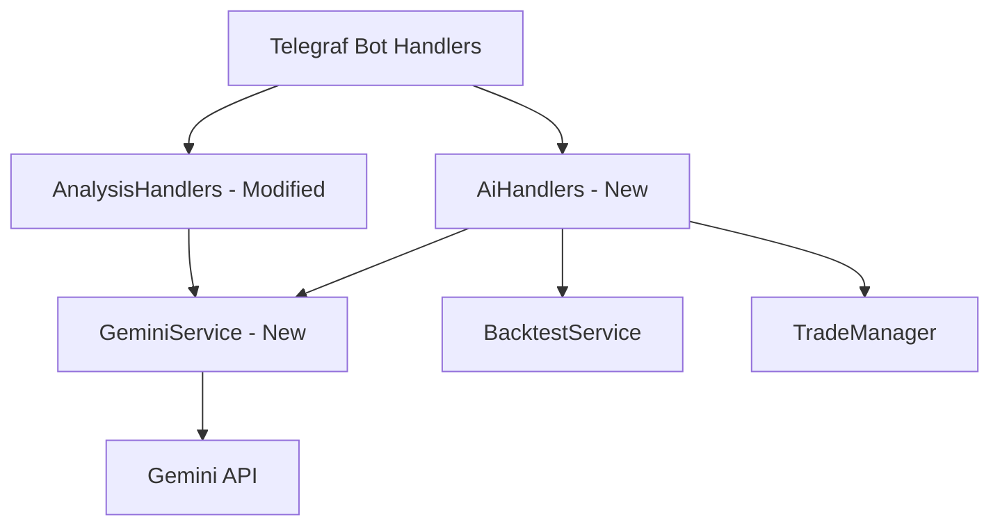

# إضافة الذكاء الاصطناعي (Gemini AI) لتحليل صفقات البوت وتحسين المحركات

هذه الخطة مخصصة لتلبية رغبتكم في دمج الذكاء الاصطناعي **Gemini** في نظام البوت لمساعدتك في تحليل الصفقات، اتخاذ القرارات المثالية، وتقديم تحليلات معمقة لنتائج الاختبارات واقتراح تحسين المعادلات الفنية والرياضية وإعادة اختبارها بالتكرار بناءً على طلبك.

---

## إقرار ومراجعة المستخدم المطلوبة

> [!IMPORTANT]
> **مفتاح Gemini API:** سنعتمد على متغير البيئة `GEMINI_API_KEY` في ملف `.env`. يجب توفير هذا المفتاح لتفعيل الخدمات الذكية.
>
> **محرك الذكاء الاصطناعي الافتراضي:** سنستخدم النموذج `gemini-1.5-flash` لأنه يجمع بين السرعة العالية، انخفاض التكلفة، ودعم النوافذ السياقية الضخمة لمعالجة بيانات الشموع الطويلة.

---

## التعديلات المقترحة

سوف نقوم بإنشاء وتعديل الملفات البرمجية لتفعيل الميزات التالية:
1. **خدمة Gemini (`GeminiService`)**: خدمة متكاملة للتواصل مع واجهات Gemini.
2. **التحليل الشامل بالذكاء**: تشغيل كافة المحركات الـ 16 ومحركات القنص ثم دمجها والخروج بالتوصية الأفضل عبر الذكاء الاصطناعي.
3. **التحليل بالذكاء لكل محرك**: زر مخصص لتحليل مؤشرات ومعادلات محرك معين لبيان مدى قوة الإشارة.
4. **تحليل صفقات الاختبار والضربات**: قراءة المؤشرات عند الدخول وتفسير أسباب ضرب الأهداف/الاستوب مع اقتراح تعديل الصيغ الرياضية.
5. **مستشار تحسين المحركات التكراري**: تشغيل اختبار، تحليل النتائج، اقتراح قيم معاملات جديدة، ثم إعادة الاختبار بالقيم الجديدة عند موافقة المستخدم وتكرار ذلك.

---

### الهيكل العام للملفات



---

### [مكونات الذكاء الاصطناعي]

#### [NEW] [GeminiService.ts](file:///e:/webProject/BotTrading_BingX/src/services/GeminiService.ts)
خدمة مستقلة تتصل بـ Gemini عبر طلبات HTTP المباشرة (باستخدام `fetch` الأصلي لتجنب مشاكل تعارض الحزم وتسهيل التثبيت).
تتضمن الوظائف التالية:
- `generateComprehensiveAnalysis`: استقبال نتائج الـ 16 محركاً ومحركات القنص وتحديد الصفقة الذهبية.
- `generateEngineAiAnalysis`: تحليل فني ذكي لإشارات محرك فردي بالتفصيل.
- `analyzeBacktestHits`: تحليل صفقات الاختبار الخاسرة والرابحة وتفسير سبب ضرب الهدف/الاستوب واقتراح تصحيح المعادلات.
- `optimizeEngineParameters`: توليد معاملات محسنة (إما إعدادات الاختبار كـ leverage و maxSl أو قيم معاملات المحرك الخاصة).

---

### [مكونات المحرك الأساسي والاختبار الرجعي]

#### [MODIFY] [ITradingEngine.ts](file:///e:/webProject/BotTrading_BingX/src/core/analysis/engines/ITradingEngine.ts)
تعديل واجهة المحركات لتقبل معاملات متغيرة اختيارية ممررة من الذكاء الاصطناعي لغرض التحسين:
```typescript
export interface ITradingEngine {
    analyze(
        cp: number, 
        vwap: number, 
        allTimeframes: Record<string, AnalysisDetails>, 
        mtfOHLCV: Record<string, OHLCV[]>,
        options: { quickTF: string, longTF: string, params?: Record<string, any> } // تم إضافة params لتجاوز القيم الافتراضية
    ): EngineResult;
}
```

#### [MODIFY] [CoreBacktestEngine.ts](file:///e:/webProject/BotTrading_BingX/src/core/backtest/CoreBacktestEngine.ts)
تعديل محرك المحاكاة لاستيعاب وتمرير المعاملات المخصصة `params` إلى داخل المحرك أثناء دورة المحاكاة.

#### [MODIFY] [V12Engine.ts](file:///e:/webProject/BotTrading_BingX/src/core/analysis/engines/V12Engine.ts)
كمثال تطبيقي، جعل الثوابت مثل `MIN_IMPULSE` و `volumeSpike` تقبل التمرير الخارجي عبر `options.params` لتمكين البوت من اختبار تحسينات الذكاء الفنية.

---

### [واجهة بوت التليجرام ولوحة التحكم]

#### [MODIFY] [baseKeyboards.ts](file:///e:/webProject/BotTrading_BingX/src/bot/keyboards/baseKeyboards.ts)
إضافة الأزرار الرئيسية التالية إلى لوحة التحكم الرئيسية للبوت:
- `🧠 التحليل الشامل بالذكاء`
- `🧠 اختبار وتحسين المحركات`

#### [MODIFY] [analysisKeyboards.ts](file:///e:/webProject/BotTrading_BingX/src/bot/keyboards/analysisKeyboards.ts)
إضافة زر مخصص في نتائج تحليل أي محرك فردي:
- `🧠 التحليل بالذكاء الاصطناعي`

#### [NEW] [aiHandlers.ts](file:///e:/webProject/BotTrading_BingX/src/bot/handlers/aiHandlers.ts)
معالج مستقل لجميع أوامر الذكاء الاصطناعي:
- استقبال رمز العملة وتحليلها فحصاً شاملاً.
- معالجة الضغط على زر "التحليل بالذكاء الاصطناعي" لمحرك معين.
- معالجة زر "تحليل نتائج الاختبار بالذكاء" لعرض أسباب ضرب الأهداف وسبل تصحيح المعادلات.
- بناء سيناريو التحسين التكراري: (عرض الاقتراح -> طلب الموافقة -> إعادة الاختبار بالقيم الجديدة -> تكرار الدورة).

#### [MODIFY] [index.ts](file:///e:/webProject/BotTrading_BingX/src/index.ts)
تسجيل معالج الذكاء الاصطناعي الجديد `registerAiHandlers` في البوت عند التشغيل.

---

## خطة التحقق والتاكد

### اختبارات آلية
- تشغيل خادم البوت محلياً ورصد الأخطاء البرمجية أثناء البناء والترجمة (`npm run build`).
- التحقق من الاتصال بواجهة Gemini بطلب فحص بسيط للتأكد من صحة المفتاح والردود.

### تحقق يدوي
1. الضغط على زر **التحليل الشامل بالذكاء** وإدخال عملة للتأكد من جلب بيانات الـ 16 محركاً وتوليد تقرير موحد مدمج بالـ AI.
2. الضغط على زر **التحليل بالذكاء** بجانب أي محرك للتأكد من توليد تقرير فني ذكي للمؤشرات.
3. تشغيل اختبار رجعي واستدعاء زر **تحليل الصفقات بالذكاء** للتأكد من قراءة بيانات الصفقات وتفسير الضربات.
4. تجربة **حلقة تحسين المحركات التكرارية**:
   - بدء الاختبار -> الحصول على اقتراح وقيم محسنة -> الضغط على "تطبيق وإعادة الاختبار" -> التحقق من تشغيل الاختبار بالإعدادات الجديدة وتحسن النتائج وتوليد التقرير المحدث.
