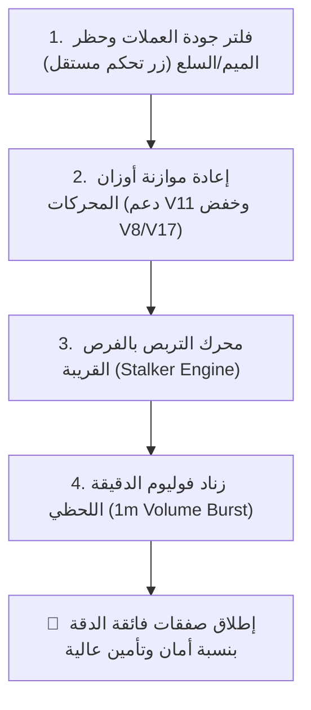

# الخطة الشاملة المتكاملة: محرك التربص الذكي + فوليوم الدقيقة + فلترة جودة العملات + موازنة المحركات

تحدد هذه الوثيقة الخطة التنفيذية لتطوير المنظومة بالكامل، وإضافة أربع ركائز كبرى مبنية على التحقيق الجنائي الفعلي للنتائج السابقة، مع توفير **زر تحكم مستقل لكل إضافة في لوحة تحكم التليجرام**.

---

## 🌟 الركائز الأربع للخطة الجديدة



---

## 🛡️ الركن الأول: حظر عملات الميم والسلع (فلتر السيولة النظيفة)
*(بناءً على ثبوت خسارة 8$ في PUMP والنفط)*

### الهدف
منع تداول عملات الميم عديمة السيولة الحقيقية (مثل `PUMP`) أو أزواج السلع والنفط والذهب (`NCCO1OILBRENT2USD`, `NCCOGOLD2USD`) التي تختلف حركتها وتسبب ذيولاً وهمية وتآكلاً في الرسوم.

### آلية العمل
* إنشاء قائمة حظر سوداء تلقائية (Blacklist): `['PUMP', 'NCCO1OILBRENT2USD', 'NCCOGOLD2USD', 'LUNA', 'FTT', ...]`
* فلتر سيولة نظيفة: يشترط أن تكون العملة من العملات الرقمية الحقيقية ذات القيمة السوقية (Market Cap) والسيولة المؤسساتية.

### زر التحكم في التليجرام
* **الزر**: `🛡️ حظر الميم والسلع: مفعل 🟢 / معطل ⚪` (`cleanCryptoOnlyEnabled`)
* عند التفعيل: يستبعد فوراً أي عملة ميم أو سلع من الماسح والرادار.
* عند التعطيل: يسمح بمسح وتداول جميع الأزواج دون استثناء.

---

## ⚖️ الركن الثاني: إعادة موازنة أوزان المحركات الرياضية (Weights Optimization)
*(بناءً على تفوق V11 وخسائر V8 و V17)*

### التشخيص الفعلي من البيانات
* **محرك V11 (Orderflow/Volume)**: حقق **+2.65$** (الأكثر ربحية).
* **محرك HARMONIC (النسب الذهبية)**: حقق **50% نسبة نجاح** و **+1.41$**.
* **محرك V8 (Liquidity Sweeps)**: نسبة فوز ضعيفة **23.1%** وخسارة **-4.87$** لأنه يحاول شراء القيعان أثناء هبوط العملة!
* **محرك V17 (Volatility Breakout)**: خسارة **-4.76$** بسبب دخوله المتأخر بعد تمدد الشمعة.

### المعالجة الرياضية
1. **رفع وزن محرك V11**: من $1.0$ إلى **$1.6$** (إعطاء الأولوية القصوى لتدفق الفوليوم).
2. **رفع وزن محرك HARMONIC**: من $1.0$ إلى **$1.4$** (احترام النماذج التوافقية ومستويات الارتداد).
3. **تقييد وتخفيض وزن محرك V8**: من $1.2$ إلى **$0.6$**، ومنعه من إعطاء إشارة شراء إلا إذا كان السعر فوق خط الـ VWAP فقط.
4. **تخفيض وزن محرك V17**: من $1.0$ إلى **$0.7$** لمنع الدخول المتأخر في القمم.

### زر التحكم في التليجرام
* **الزر**: `⚖️ موازنة المحركات الذكية: مفعل 🟢 / معطل ⚪` (`optimizedWeightsEnabled`)
* يتيح التبديل بين التوزيع الذكي الجديد أو الأوزان الافتراضية المتساوية.

---

## 🎯 الركن الثالث: محرك التربص بالفرص القريبة (`Opportunity Stalker`)

### الهدف
عدم تفويت العملات الممتازة التي تبعد مسافة بسيطة ($0.2\% - 0.6\%$) عن الدعم، بوضعها في قائمة تربص خاصة ومراقبتها كل 15 ثانية لاقتناص لحظة الارتداد الدقيقة.

### أزرار التحكم في التليجرام
1. `🎯 نظام التربص: مفعل 🟢 / معطل ⚪` (`stalkerEnabled`).
2. `سعة رادار التربص`: أزرار سريعة (`2` \| `3` \| `5` \| `8` \| `✍️ كتابة رقم`).
3. `مهلة صلاحية التربص`: أزرار سريعة (`15 د` \| `30 د` \| `45 د` \| `60 د` \| `✍️ كتابة رقم`).

---

## ⏱️ الركن الرابع: زناد فوليوم الدقيقة اللحظي (`1m Volume Burst Trigger`)

### الهدف
القضاء على الـ 14 صفقة التي ضربت الستوب مباشرة بسبب الدخول في نهاية شمعة الـ 15 دقيقة، باشتراط فحص آخر 10 شمعات دقيقة للتأكد من وجود ضخ سيولة حقيقي:
* **نسبة فوليوم الشراء**: $\ge 65\%$ من إجمالي آخر 10 دقائق.
* **انفجار الفوليوم**: وجود شمعة دقيقة واحدة على الأقل $\ge 2.0x$ مقارنة بالمتوسط.

### أزرار التحكم في التليجرام
1. `معامل انفجار الفوليوم`: خيارات (`1.5x` \| `2.0x` \| `2.5x` \| `3.0x`).
2. `نسبة سيولة الشراء المطلوبة`: خيارات (`60%` \| `65%` \| `70%` \| `75%`).

---

## 📱 شكل قائمة الإعدادات المحدثة في بوت التليجرام

```text
⚙️ لوحة إعدادات الحماية والتداول الذاتي
━━━━━━━━━━━━━━━━━━━━━
• حظر عملات الميم والسلع (PUMP/النفط): 👉 🟢 مفعل (كريبتو نظيف فقط)
• موازنة المحركات الذكية (دعم V11 وخفض V8): 👉 🟢 مفعل
• رادار التربص بالفرص (Stalker Engine): 👉 🟢 مفعل (3 عملات | مهلة 30 د)
• زناد فوليوم الدقيقة (1m Volume Burst): 👉 🟢 مفعل (انفجار 2.0x | شراء 65%)
• بوصلة البيتكوين والتوقيت: 👉 🟢 مفعل [فريم 15m]
• منع القمم والقيعان: 👉 🟢 مفعل
• استباق جدران المقاومة: 👉 🟢 مفعل
• التأمين الفوري (Auto Break-Even): 👉 🟢 مفعل
━━━━━━━━━━━━━━━━━━━━━
[ 🛡️ حظر الميم والسلع: مفعل 🟢 ]
[ ⚖️ موازنة المحركات: مفعل 🟢 ]
[ 🎯 نظام التربص: مفعل 🟢 ]
[ 2 ]  [ 3 ]  [ 5 ]  [ ✍️ عدد مخصص ]
[ 15د ]  [ 30د ]  [ 45د ]  [ ✍️ مهلة مخصصة ]
[ 🧭 بوصلة البيتكوين: مفعل 🟢 ]
[ 5m ]  [ 15m ]  [ 1h ]  [ 4h ]
```

---

## 🚀 خطة التنفيذ المباشرة

1. **تحديث ملف `User.ts`**: إضافة حقول الإعدادات الجديدة (`cleanCryptoOnlyEnabled`, `optimizedWeightsEnabled`, `stalkerEnabled`, ...).
2. **تحديث الماسح اللحظي (`CcxtPickerEngine.ts` و `SymbolPickerService.ts`)**: تطبيق فلتر استبعاد عملات الميم والسلع عند تفعيل الخيار.
3. **تحديث مصفوفة التوافق (`EngineConfluenceArbiter.ts`)**: تطبيق الأوزان الرياضية المحسنة (رفع V11 وهارمونيك وخفض V8 و V17).
4. **بناء فاحص فوليوم الدقيقة (`MicroVolumeAnalyzer.ts`) ومحرك التربص (`OpportunityStalker.ts`)**.
5. **تحديث واجهة التليجرام (`autonomousHandlers.ts`)**: إضافة الأزرار التفاعلية الجديدة.
6. **البناء والاختبار الحي المباشر**.
