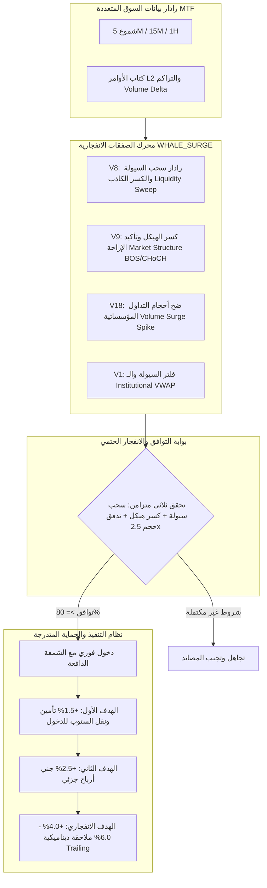

# 🚀 خطة تنفيذ محرك الصفقات الانفجارية (Whale Surge & SMC Breakout)

---

## 📌 1. الرؤية الهندسية ونظام العزل (Architecture & Separation)

> [!NOTE]
> **التأكيد على الأمان واستقرار البوت الحالي:**
> إضافة هذا النمط **لن يؤثر إطلاقاً على عمل البوت الحالي أو نمط السكالب التيربو الحالي**. سيتم بناؤه كنمط مستقل بالكامل (`WHALE_SURGE`) في محدد الأنماط (`tradeStyle`)، مما يتيح لك تشغيل أي نمط تفضله بضغطة زر واحدة من لوحة التحكم، أو تشغيلهما بالتوازي دون أي تداخل في إدارة الصفقات أو المخاطر.



---

## 🔬 2. الأعمدة الأربعة للتعرف على الصفقات الانفجارية

### العمود الأول: كشف الكسر الكاذب وسحب السيولة (Liquidity Sweep & Fakeout)
* **المحرك المسؤول:** `V8 (Liquidity Sweeper)` + `HARMONIC Reversals`.
* **الآلية الرياضية:**
  1. رصد القمم والقيعان المتساوية السابقة (Equal Highs / Equal Lows - Liquidity Pools).
  2. عندما يقوم السعر بكسر القمة أو القاع بشمعة ذات ذيل طويل (Wick Sweep) ثم يغلق سريعاً داخل النطاق (Rejection):
     * هذا تأكيد على أن صانع السوق قام بتفعيل أوامر وقف الخسارة للمتداولين الأفراد (Stop Hunt).
  3. يتم تسجيل إشارة **"سحب سيولة مؤكد" (Liquidity Purge)**.

### العمود الثاني: كسر الهيكل المؤسساتي الحقيقي (Market Structure Break - BOS / CHoCH)
* **المحرك المسؤول:** `V9 (SMC Engine)` + `V13 (Sniper Structure)`.
* **الآلية الرياضية:**
  1. بعد سحب السيولة مباشرة، يجب أن تظهر شمعة دافعة قوية (Displacement Candle) تكسر آخر قمة رئيسية (في الشراء) أو آخر قاع رئيسي (في البيع).
  2. التحقق من تكون فجوة سعرية غير متوازنة (Fair Value Gap - FVG) تؤكد أن الحركة ناجمة عن دخول صانع سوق وليس تداولات عشوائية.

### العمود الثالث: رصد ضخ السيولة وأحجام التداول غير الطبيعية (Institutional Volume Delta)
* **المحرك المسؤول:** `V18 (Order Book Imbalance)` + `V12 (Volume Profile)`.
* **الآلية الرياضية:**
  1. **Volume Spike Multiplier:** يجب أن يتجاوز حجم تداول الشمعة الحالية **`2.5 ضعف (250%)`** متوسط حجم آخر 20 شمعة (`Volume > SMA(Volume, 20) * 2.5`).
  2. **Cumulative Delta Dominance:** فحص الفارق بين أوامر الشراء الماركت والبيع الماركت؛ يجب أن يكون صافي الدلتا إيجابياً بنسبة تتجاوز 70% في الشراء أو سلبياً بنسبة 70% في البيع.

### العمود الرابع: فلتر الموقع المؤسساتي (Institutional Placement)
* **المحرك المسؤول:** `V1 (VWAP & Bollinger Deviation)`.
* **الآلية الرياضية:**
  * في الشراء: كسر واستقرار فوق خط الـ VWAP اليومي مع انحراف معياري إيجابي.
  * في البيع: كسر واستقرار تحت خط الـ VWAP اليومي مع انحراف معياري سلبي.

---

## ⚙️ 3. المواصفات الرقمية للصفقات الانفجارية (Trade Specifications)

| المعيار | نمط السكالب التيربو (`SCALP_TURBO`) | نمط الصفقات الانفجارية (`WHALE_SURGE`) |
| :--- | :--- | :--- |
| **الفريم الزمني للاكتشاف** | 5 دقائق (5M) | 15 دقيقة مدمج مع 5 دقائق و 1 ساعة (Multi-TF) |
| **الرافعة المالية** | 20x - 50x (مرتفعة جداً) | 10x - 20x (متوازنة لتحمل التذبذب الأكبر) |
| **حجم الهدف الأول** | **+0.55%** (خاطف وسريع) | **+1.50%** (بداية الانفجار السعري) |
| **حجم الهدف الثاني والنهائي** | +0.80% | **+2.50% إلى +5.00%** (موجة الزخم الكاملة) |
| **وقف الخسارة (SL)** | 0.8% - 1.0% | 1.2% - 1.5% (خلف منطقة سحب السيولة المحمية) |
| **نقل الستوب للدخول (BE)** | عند وصول +0.35% | عند تحقيق الهدف الأول **+1.50%** |
| **معدل المخاطرة للعائد (RRR)** | 1 : 1 | **1 : 2.5 إلى 1 : 4 (عائد تضاعفي)** |
| **تكرار الصفقات** | صفقات متكررة سريعة | صفقات منتقاة عالية الجودة (1-3 صفقات يومياً) |

---

## 🛠️ 4. مراحل التنفيذ البرمجي خطوة بخطوة

### المرحلة الأولى: إتاحة نمط `WHALE_SURGE` في نواة النظام
* إضافة النمط الجديد إلى واجهات النواة:
  ```typescript
  export type TradeStyle = 'HYBRID' | 'SCALP' | 'SWING' | 'SCALP_TURBO' | 'WHALE_SURGE';
  ```
* تحديث `EngineConfluenceArbiter.ts` لدعم مصفوفة الأوزان الخاصة بالانفجارات (منح وزن 40% لـ V8 و V9 و V18).

### المرحلة الثانية: بناء فلتر كشف الكسر الكاذب وضخ السيولة (SurgeDetector Module)
* إنشاء فاحص متخصص: `src/core/analysis/WhaleSurgeDetector.ts`:
  * دالة `detectLiquiditySweep(candles: OHLCV[]): SweepResult`
  * دالة `detectVolumeAnomaly(candles: OHLCV[], orderbook?: any): VolumeSurgeResult`
  * دالة `detectStructureBreakout(candles: OHLCV[]): StructureBreakResult`

### المرحلة الثالثة: دمج النمط في المجدول الذاتي `AutonomousOrchestrator.ts`
* عندما يكون النمط المختار هو `WHALE_SURGE`:
  * تفعيل فحص الشموع كل 15 دقيقة مع مراجعة دقيقة لإغلاق شمعة 5M.
  * شرط الدخول: موافقة محركات الكسر وسحب السيولة وحجم التداول بحد أدنى 75%.
  * ضبط الأهداف المتدرجة: (TP1: +1.5%, TP2: +2.5%, TP3: +4.5%).

### المرحلة الرابعة: لوحة التحكم بتيليجرام (Telegram UI Controls)
* إضافة زر تفعيل نمط `💥 صفقات انفجارية (Whale Surge)` إلى قائمة أنماط التداول في لوحة القيادة.
* إضافة إعدادات مخصصة لنسبة الحجم المطلوب للكسر (2.0x | 2.5x | 3.0x).

---

## 🛡️ 5. معايير الأمان الإلزامية لهذا النمط
1. **فلتر الشمعة المنهكة (Exhaustion Filter):** عدم الدخول في العملة إذا كانت الشمعة الدافعة قد تحركت بالفعل بأكثر من 4% في شمعة واحدة (تجنب الدخول في قمة الشمعة الانفجارية).
2. **عدم مطاردة السعر (No FOMO Chase):** الدخول يكون إما مع إغلاق شمعة الكسر أو عند اختبار الـ FVG المتكونة.
3. **تفعيل الـ Chandelier Trailing Stop:** بعد تحقيق الهدف الثاني، لا يتم الخروج اليدوي بل يتم رفع الستوب ديناميكياً خلف قيعان الشموع لحصد أكبر قدر ممكن من الصعود الانفجاري.
