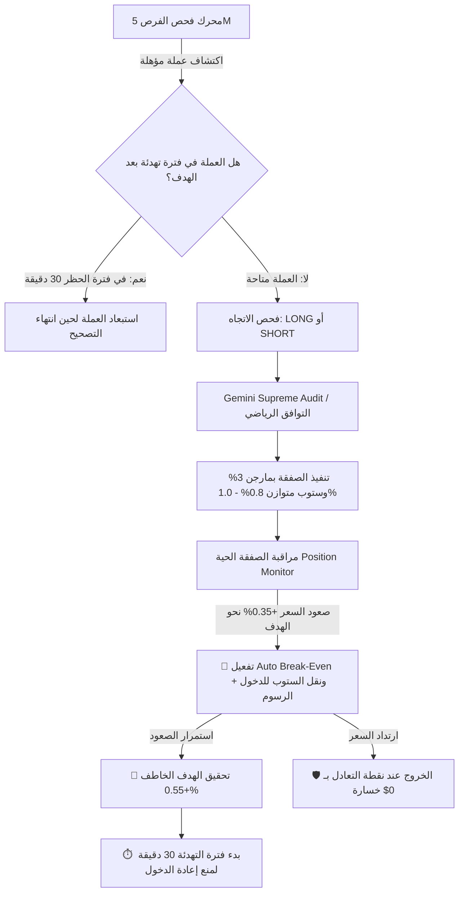

# خطة تطوير منظومة التداول الآلي: التأمين الفوري، موازنة المخاطر، ومنع تكرار الدخول

---

## 📌 تقييم الوضع الحالي والمحركات

### 1. تقييم دقة التحليل واختيار العملات:
* **التحليل واختيار العملات ممتاز وناجح بدليل قاطع:** نسبة الفوز قفزت إلى **`62.1%`** (18 صفقة رابحة مقابل 11 خاسرة).
* العملات التي اختارها البوت حققت أهدافاً متتالية وسريعة جداً مثل:
  * `TAO` (حققت 3 أهداف متتالية بربح إجمالي تجاوز +50% على المارجن).
  * `ICP` (حققت هدفين متتاليين).
  * `MANA`, `XRP`, `FIL`, `IMX`, `HBAR` (حققت جميعها أهدافها الخاطفة بنجاح).

### 2. العيبان الوحيدان اللذان تسببا في الخسارة البسيطة (-2.58$):
1. **تكرار الدخول بعد ضرب الهدف مباشرة (Re-Entry at the Peak):** 
   * بمجرد أن تصعد العملة وتضرب الهدف، يفرغ شاغر في المحفظة، فيقوم البوت في الشمعة التالية بإعادة فحص نفس العملة ويرى زخماً فيدخل شراء مرة أخرى في قمة الحركة، وعندها يبدأ التصحيح الطبيعي فتضرب الستوب!
2. **الستوب أوسع من الهدف بكثير (Risk/Reward Inbalance):**
   * الهدف كان **+0.55%** (ربح ~0.45$) بينما الستوب كان **-2.0%** (خسارة ~1.50$)، فكانت صفقة خاسرة واحدة تمحو أرباح 3 صفقات رابحة.

### 3. تقييم المحركات:
* **الأعلى أداءً في السكالبينج:** **V18** (كتاب الأوامر L2) + **V6** (الزخم اللحظي) + **V1** (فلتر VWAP المؤسساتي).
* **محرك الهارمونيك (HARMONIC):** يعطي مناطق انعكاس دقيقة، لكن يجب منعه من الدخول في نفس العملة بعد استنفاد موجة الهدف.
* **نقطة الضعف:** الاعتماد على الشراء فقط (LONG Only) وقت التصحيح العام للسوق، ويجب إعطاء فرص متكافئة لصفقات البيع (SHORT).

---

## 🏗️ محاور الخطة التنفيذية

---

### المحور الأول: التأمين الفوري ونقل الستوب لنقطة الدخول (Auto Break-Even)
* **الملف المعني:** [`src/services/PaperTradingEngine.ts`](file:///e:/webProject/BotTrading_BingX/src/services/PaperTradingEngine.ts) و [`src/services/PositionMonitor.ts`](file:///e:/webProject/BotTrading_BingX/src/services/PositionMonitor.ts)
* **القاعدة البرمجية:**
  * الهدف الخاطف هو `+0.55%`.
  * بمجرد وصول ربح الصفقة العائم (Unrealized Profit) إلى **`+0.35%`** (أو 60% من مسافة الهدف):
    * يتم فوراً تعديل `stopLoss` ليصبح مساوياً لـ `entryPrice` (أو بربح طفيف يغطي رسوم التداول 0.05%).
    * وضع علامة `isBreakEvenSet = true`.
  * **النتيجة:** حماية 100% من الصفقات التي تبدأ بالربح من أن تتحول إلى خسارة.

---

### المحور الثاني: موازنة وقف الخسارة لنمط السكالبينج التيربو (0.8% - 1.0%)
* **الملفات المعنية:**
  - [`src/core/analysis/EngineConfluenceArbiter.ts`](file:///e:/webProject/BotTrading_BingX/src/core/analysis/EngineConfluenceArbiter.ts)
  - [`src/services/PaperTradingEngine.ts`](file:///e:/webProject/BotTrading_BingX/src/services/PaperTradingEngine.ts)
* **القاعدة البرمجية:**
  * في وضع `SCALP_TURBO`، يتم تحديد سقف وقف الخسارة ليكون بين **0.8% إلى 1.0%** من سعر الدخول (بدلاً من 2% السابقة).
  * مع رافعة 20x: خسارة الستوب ستكون فقط **0.50$** (مساوية تماماً لربح الهدف 0.50$).
  * بنسبة نجاح 62%، ستصبح المحفظة رابحة باستمرار وبمنحنى نمو تصاعدي قوي.

---

### المحور الثالث: منع تكرار الدخول بعد ضرب الهدف (Post-TP Symbol Cooldown)
* **الملفات المعنية:**
  - [`src/services/AutonomousOrchestrator.ts`](file:///e:/webProject/BotTrading_BingX/src/services/AutonomousOrchestrator.ts)
  - [`src/services/PaperTradingEngine.ts`](file:///e:/webProject/BotTrading_BingX/src/services/PaperTradingEngine.ts)
* **القاعدة البرمجية:**
  * إضافة سجل تتبع: `recentTpSymbols: Map<string, { direction: string; timestamp: number }>`
  * عندما تغلق صفقة بضرب الهدف (`CLOSED_PROFIT` / `Target 1 reached`):
    * يتم تسجيل العملة والاتجاه مع وقت الإغلاق.
    * تُمنع العملة من الدخول في نفس الاتجاه لمدة **30 دقيقة (قابلة للتعديل)**.
    * في تقرير الفحص يظهر بجانبها: `[تهدئة بعد الهدف ⏳ (باقي 18 دقيقة)]`.

---

### المحور الرابع: تفعيل صفقات البيع (SHORT) عند هبوط السوق
* **الملفات المعنية:**
  - [`src/services/AutonomousOrchestrator.ts`](file:///e:/webProject/BotTrading_BingX/src/services/AutonomousOrchestrator.ts)
  - [`src/core/analysis/EngineConfluenceArbiter.ts`](file:///e:/webProject/BotTrading_BingX/src/core/analysis/EngineConfluenceArbiter.ts)
* **القاعدة البرمجية:**
  * إزالة أي قيد يمنع أو يفضل الشراء على البيع.
  * عندما يكون السوق العام (أو مؤشر البيتكوين) أسفل الـ VWAP المؤسساتي مع مؤشرات هابطة في V18 و V6، يتم فتح صفقات SHORT فوراً للأهداف القريبة السريعة (-0.55%).

---

### المحور الخامس: لوحة تحكم تفاعلية متكاملة في تيليجرام (Autonomous Settings Hub)
* **الملف المعني:** [`src/bot/handlers/autonomousHandlers.ts`](file:///e:/webProject/BotTrading_BingX/src/bot/handlers/autonomousHandlers.ts)
* إضافة قائمة إعدادات متقدمة تتيح للمستخدم بالضغط على الأزرار:
  1. 🛡️ **نقل الستوب للدخول (Auto Break-Even):** [ تفعيل 🟢 | تعطيل ⚪ ]
  2. 🛑 **مسافة وقف الخسارة للتيربو:** [ 0.8% | 1.0% | 1.5% ]
  3. ⏱️ **مدة حظر العملة بعد الهدف:** [ 15 دقيقة | 30 دقيقة | 45 دقيقة | بدون ]
  4. 🧭 **الاتجاه المسموح:** [ 🔄 كلا الاتجاهين (LONG & SHORT) | 🟢 شراء فقط | 🔴 بيع فقط ]
  5. 🎯 **حجم الهدف الخاطف:** [ 0.4% | 0.55% | 0.8% ]

---

## 🚦 جدول المقارنة قبل وبعد التحديث

| الخاصية | الوضع السابق | الوضع الجديد بعد التحديث |
| :--- | :--- | :--- |
| **تأمين الأرباح (Break-Even)** | غير مفعل (الستوب يظل ثابتاً) | **تأمين فوري للدخول عند تحقيق +0.35%** |
| **مسافة وقف الخسارة** | 1.8% إلى 2.4% (خسارة ~1.5$) | **0.8% إلى 1.0% متوازنة (خسارة ~0.5$)** |
| **إعادة الدخول بعد الهدف** | فوري (شراء من القمة) | **حظر لمدة 30 دقيقة لحين انتهاء التصحيح** |
| **صفقات البيع (SHORT)** | شراء فقط (100% LONG) | **شراء وبيع ديناميكي حسب اتجاه السوق** |
| **التحكم بالإعدادات** | ثابت بالكود | **لوحة تحكم تفاعلية كاملة بأزرار تيليجرام** |

---

يرجى مراجعة الخطة وإبداء موافقتك لنبدأ في تطبيقها فوراً خطوة بخطوة.
